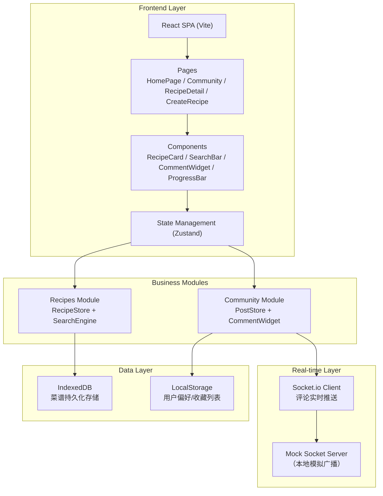
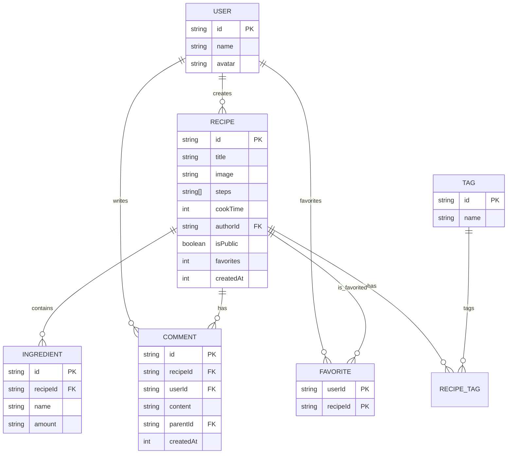

## 1. 架构设计



## 2. 技术说明

- **前端框架**：React@18 + TypeScript + Vite
- **状态管理**：Zustand（轻量、简洁、支持中间件）
- **路由**：React Router DOM@6
- **样式方案**：TailwindCSS 3（设计Token化）+ 自定义CSS变量
- **图标库**：Lucide React（线性风格，与温馨家庭风匹配）
- **本地数据库**：IndexedDB（通过自定义封装层操作）
- **实时通信**：Socket.io Client（本地Mock服务模拟广播）
- **ID生成**：uuid
- **表情选择**：emoji-mart

## 3. 路由定义

| 路由 | 页面 | 用途 |
|------|------|------|
| `/` | HomePage | 首页：食材搜索 + 我的菜谱管理 |
| `/community` | CommunityPage | 社区广场：公开菜谱瀑布流 |
| `/recipe/:id` | RecipeDetailPage | 菜谱详情：原料、步骤、评论、收藏 |
| `/create` | CreateRecipePage | 创建/编辑菜谱表单 |

## 4. 类型定义

```typescript
interface Ingredient {
  name: string;
  amount: string;
}

interface Recipe {
  id: string;
  title: string;
  image: string;
  ingredients: Ingredient[];
  steps: string[];
  tags: string[];
  cookTime: number;
  authorId: string;
  authorName: string;
  isPublic: boolean;
  createdAt: number;
  favorites: number;
}

interface Comment {
  id: string;
  recipeId: string;
  userId: string;
  userName: string;
  content: string;
  parentId: string | null;
  replyToUser?: string;
  createdAt: number;
}

interface User {
  id: string;
  name: string;
  avatar: string;
}

interface SearchResult {
  recipe: Recipe;
  matchScore: number;
  matchedIngredients: string[];
  missingIngredients: string[];
}
```

## 5. 数据模型

### 5.1 ER 图



### 5.2 IndexedDB 存储结构

**数据库名**：FamilyRecipesDB（版本 1）

| 对象仓库 | Key Path | 索引 |
|----------|----------|------|
| `recipes` | `id` | `byAuthor`(authorId), `byPublic`(isPublic), `byTag`(tags, multiEntry), `byCookTime`(cookTime) |
| `ingredients` | `id` | `byRecipe`(recipeId), `byName`(name) |
| `comments` | `id` | `byRecipe`(recipeId), `byUser`(userId), `byParent`(parentId) |
| `favorites` | `[userId, recipeId]` | `byUser`(userId), `byRecipe`(recipeId) |

## 6. 性能优化策略

### 6.1 搜索性能（目标 < 200ms）

1. **食材名称索引**：IndexedDB 建立 `ingredients.byName` 索引，避免全表扫描
2. **交集算法优化**：使用 Set 数据结构计算食材交集，O(n+m) 复杂度
3. **结果缓存**：相同食材搜索命中 LRU 缓存（10条）
4. **懒加载评分**：仅前20条结果计算详细匹配度

### 6.2 社区卡片加载（目标 < 500ms）

1. **分页查询**：每次加载20张卡片，IntersectionObserver 触发加载更多
2. **图片懒加载**：loading="lazy" + 模糊占位符渐入
3. **骨架屏**：初始加载展示骨架占位，避免布局抖动
4. **虚拟列表**：卡片超过100条时启用虚拟滚动

### 6.3 渲染优化

1. **React.memo**：RecipeCard、CommentItem 等频繁渲染组件记忆化
2. **useMemo/useCallback**：搜索结果计算、事件处理函数缓存
3. **CSS 硬件加速**：transform/opacity 动画走 GPU 合成层
4. **防抖节流**：搜索输入防抖 150ms，滚动事件节流 16ms
