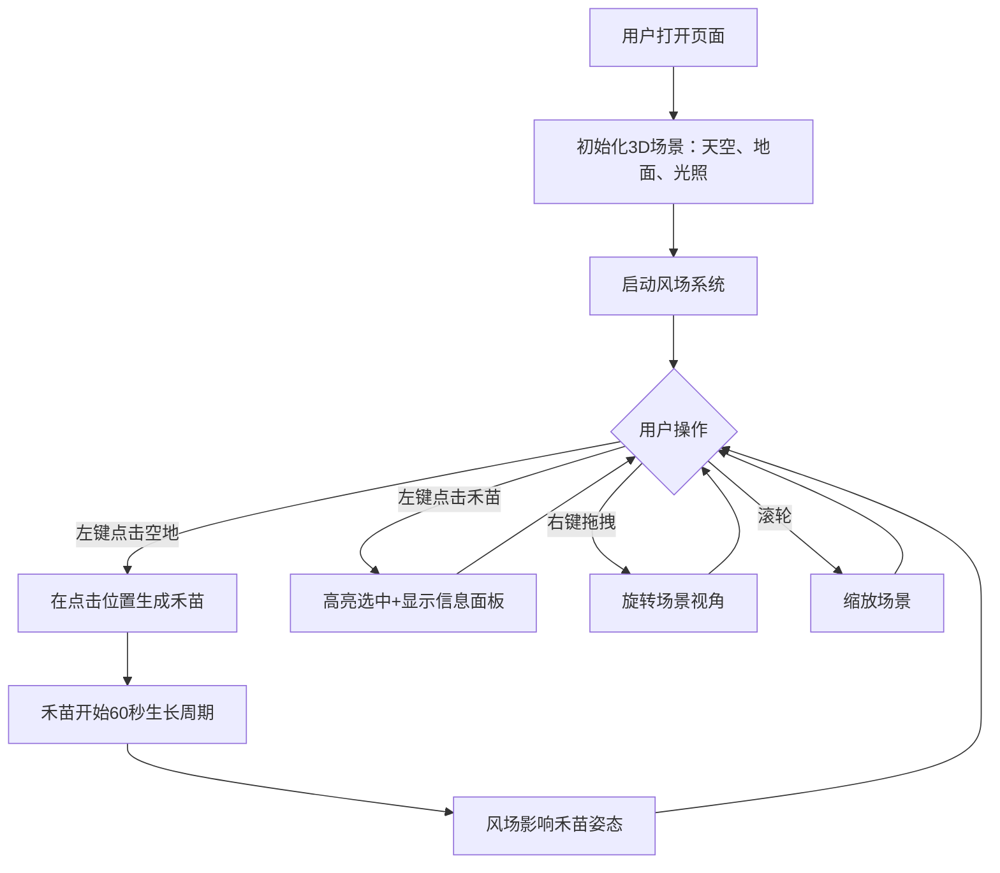

## 1. 产品概述

一款基于 Three.js 的交互式3D禾苗生长与微风摇曳可视化应用，解决在浏览器中无法直观感受植物在环境作用下动态行为和生长过程的问题。用户可点击场景生成禾苗，观察其在风场作用下的实时弯曲摇摆与渐进生长，通过多视角交互和详细信息面板深入了解植物状态。

- 目标用户：农业科研人员、植物学爱好者、3D可视化开发者
- 核心价值：将抽象的植物-风场物理交互以直观、沉浸的3D形式呈现

## 2. 核心功能

### 2.1 功能模块

1. **3D场景页面**：天空渐变背景、地面网格纹理、禾苗生成与生长、风场物理模拟、多视角交互、信息面板

### 2.2 页面详情

| 页面名称 | 模块名称 | 功能描述 |
|---------|---------|---------|
| 3D场景页面 | 植物生成与生长 | 左键点击空地生成禾苗（茎+叶+穗），60秒内持续生长：茎高增至1.2倍，叶片2→6片，穗粒子10→60，平滑插值无突变 |
| 3D场景页面 | 风场物理模拟 | 周期性风场，风向0-360°、风力0-5级每8秒随机变化，茎弯曲与风力正相关，叶片摆动频率与强度相关，方向平滑过渡 |
| 3D场景页面 | 多视角交互 | 鼠标拖拽旋转场景（围绕中心点），滚轮缩放，点击禾苗高亮+信息面板 |
| 3D场景页面 | 风场状态指示器 | 页面顶部显示风向箭头（旋转）和风力等级（1-5级彩色圆点，蓝→红渐变） |
| 3D场景页面 | 操作提示面板 | 左侧半透明毛玻璃面板，列出操作说明，圆角12px |
| 3D场景页面 | 选中植物信息面板 | 左上角半透明深色背景面板，圆角8px，显示年龄/高度/叶片数/穗粒子数，数据淡入动画 |

## 3. 核心流程

## 4. 界面设计

### 4.1 设计风格

- **主色调**：自然田园风格，茎为 #4CAF50 渐变，叶为亮绿到深绿，穗为 #FFD700 金色
- **背景**：淡蓝色渐变天空，浅绿色地面带轻微网格纹理
- **光照**：自然光，柔和阴影
- **视觉风格**：卡通写实
- **圆角**：信息面板8px，操作提示面板12px
- **字体**：系统默认无衬线字体，白色文字

### 4.2 页面设计概览

| 页面名称 | 模块名称 | UI元素 |
|---------|---------|--------|
| 3D场景页面 | 天空背景 | 淡蓝色垂直渐变，从顶部浅蓝到地平线白色 |
| 3D场景页面 | 地面 | 浅绿色平面，轻微网格纹理 |
| 3D场景页面 | 风场指示器 | 顶部居中，风向箭头图标旋转，风力1-5级彩色圆点（蓝→红） |
| 3D场景页面 | 操作提示面板 | 左侧垂直居中，半透明毛玻璃背景，圆角12px，白色文字 |
| 3D场景页面 | 选中信息面板 | 左上角，半透明深色背景，圆角8px，白色文字，数据淡入动画 |
| 3D场景页面 | 禾苗高亮 | 选中植株外发光效果 |

### 4.3 响应式设计

- 桌面优先设计，适配 1280px+ 分辨率
- 平板适配 768px+ 分辨率，UI面板自适应缩放
- Canvas 全屏自适应容器

### 4.4 3D场景指引

- **环境**：淡蓝色渐变天空，浅绿色地面
- **光照**：DirectionalLight 模拟自然光 + AmbientLight 环境光，启用柔和阴影
- **相机**：PerspectiveCamera，OrbitControls 围绕中心点旋转
- **交互**：Raycaster 检测点击，OrbitControls 视角控制
- **性能**：最多100株禾苗，帧率≥55FPS，使用 InstancedMesh 或合理几何体复用

## 5. 性能要求

- 场景最多100株禾苗同时存在
- 整体帧率不低于55FPS
- 风场变化时平滑过渡，无抖动
- 生长过程平滑插值，无突变
