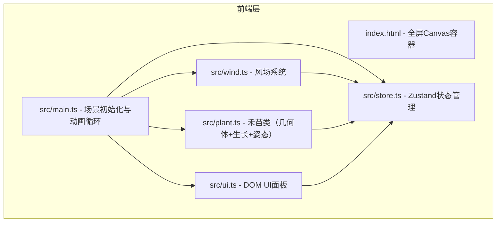

## 1. 架构设计



## 2. 技术说明

- **前端**：TypeScript + Three.js@0.160 + Zustand
- **构建工具**：Vite
- **状态管理**：Zustand（管理植物数据、风场参数、选中状态）
- **后端**：无
- **ID生成**：uuid

## 3. 文件结构

```
├── package.json           # 依赖：three@0.160, zustand, uuid, vite
├── vite.config.js         # 构建配置，支持TypeScript，resolve alias
├── tsconfig.json          # 严格模式，ES2020模块
├── index.html             # 入口，全屏canvas容器
└── src/
    ├── main.ts            # 应用入口，初始化场景/相机/渲染器，动画循环
    ├── store.ts           # Zustand store，植物数据/风场参数/选中ID
    ├── plant.ts           # Plant类，几何体生成/生长更新/姿态更新
    ├── wind.ts            # 风场系统，8秒周期更新，getter方法
    └── ui.ts              # DOM UI：操作提示/风场指示器/信息面板
```

## 4. 数据模型

### 4.1 PlantData

```typescript
interface PlantData {
  id: string;
  position: { x: number; z: number };
  createdAt: number;           // 创建时间戳
  initialHeight: number;       // 初始高度
  targetHeight: number;        // 最终高度 = initialHeight * 1.2
  currentHeight: number;       // 当前高度
  leafCount: number;           // 当前叶片数（2→6）
  earParticleCount: number;    // 穗粒子数（10→60）
  earParticleScale: number;    // 穗粒子缩放
}
```

### 4.2 WindState

```typescript
interface WindState {
  direction: number;   // 风向 0-360度
  strength: number;    // 风力 0-5级
  targetDirection: number;
  targetStrength: number;
}
```

### 4.3 Store结构

```typescript
interface AppStore {
  plants: PlantData[];
  wind: WindState;
  selectedPlantId: string | null;
  addPlant: (position: { x: number; z: number }) => void;
  updatePlant: (id: string, data: Partial<PlantData>) => void;
  setWind: (wind: Partial<WindState>) => void;
  selectPlant: (id: string | null) => void;
}
```

## 5. 核心模块职责与数据流

### 5.1 main.ts

- 初始化 Three.js 场景、PerspectiveCamera、WebGLRenderer
- 配置 OrbitControls（右键旋转、滚轮缩放）
- 添加 DirectionalLight + AmbientLight，启用阴影
- 创建天空背景和地面
- 监听鼠标点击，Raycaster 检测地面/禾苗
- 动画循环中：调用 wind.update()、遍历 plants 更新生长和姿态、渲染场景

### 5.2 store.ts

- Zustand store 管理全局状态
- plants 数组：所有禾苗数据
- wind：当前风场状态（含插值目标值）
- selectedPlantId：当前选中禾苗ID
- 提供增删改查 action

### 5.3 plant.ts

- Plant 类：持有 Three.js Group（茎Mesh + 叶片Mesh数组 + 穗Points）
- createGeometry()：创建茎（CylinderGeometry）、叶（自定义弧形曲面）、穗（BufferGeometry + Points）
- updateGrowth(deltaTime)：60秒内平滑更新高度、叶片数、穗粒子数
- updatePose(wind)：根据风向和风力更新茎弯曲和叶片摇摆

### 5.4 wind.ts

- 每8秒随机生成新的目标风向和风力
- 当前值平滑插值到目标值（lerp）
- 提供 getDirection() 和 getStrength() getter

### 5.5 ui.ts

- 创建操作提示面板（左侧，毛玻璃效果）
- 创建风场状态指示器（顶部，箭头+圆点）
- 创建选中植物信息面板（左上角，半透明深色）
- 监听 store 变化，更新 DOM 内容和动画

## 6. 性能策略

- 每株禾苗使用少量几何体（1圆柱 + 2-6叶片 + 1粒子系统）
- 穗粒子使用 Points 而非独立 Mesh
- 风场插值在动画帧中增量计算，避免突变
- 100株禾苗场景预估：~600个Mesh + 100个Points系统，在现代GPU上可达55+FPS
