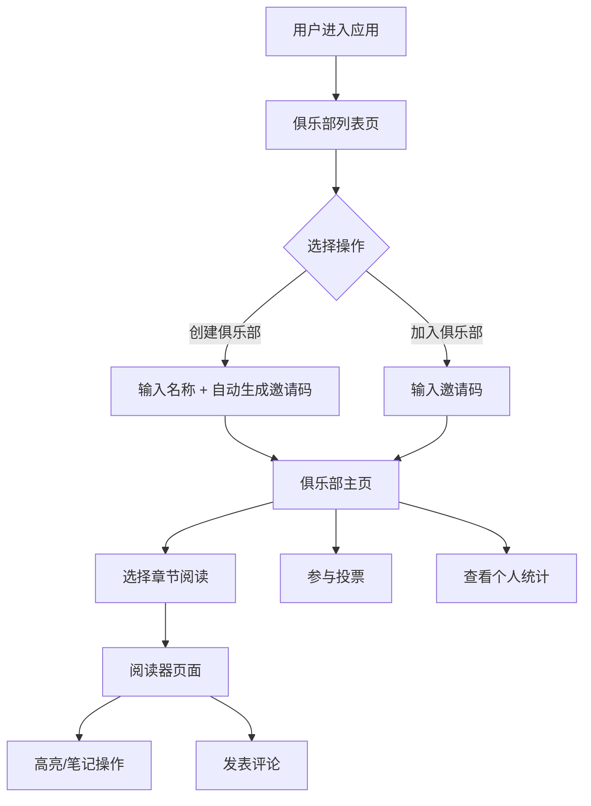

# PagePal 在线共读与章节讨论应用 - 产品需求文档

## 1. 产品概述

PagePal 是一款面向线上读书会俱乐部的数字共读空间应用，让成员能够实时讨论指定章节、做高亮笔记并投票决定下一本共读书籍。应用以温暖的书卷气质为设计基调，提供沉浸式的共读体验。

- **核心目标**：打造一个无后端依赖、纯前端实现的高质量共读讨论平台
- **目标用户**：线上读书会成员、读书爱好者
- **市场价值**：填补轻量级共读社群工具的空白，提供"即开即用"的数字共读空间

## 2. 核心功能

### 2.1 用户角色

| 角色 | 注册方式 | 核心权限 |
|------|----------|----------|
| 俱乐部成员 | 匿名加入（自动生成用户名） | 阅读、高亮、评论、投票 |
| 俱乐部发起人 | 创建俱乐部 | 管理书籍、发起投票、更新进度 |

### 2.2 功能模块

1. **俱乐部管理**：创建/加入俱乐部、成员列表、章节进度同步
2. **阅读器**：章节文本展示、高亮笔记、侧栏目录
3. **社交讨论**：章节评论、回复层级、时间线展示
4. **投票系统**：候选书籍、单选投票、实时计票、结果排名
5. **个人统计**：高亮数、评论数、投票次数、日历热力图

### 2.3 页面详情

| 页面名称 | 模块名称 | 功能描述 |
|----------|----------|----------|
| 俱乐部列表页 | 俱乐部卡片网格 | 展示所有俱乐部，支持创建/加入入口，响应式三栏布局 |
| 俱乐部主页 | 投票区 + 书籍信息 + 成员列表 | 显示当前共读书籍、投票活动、章节进度、成员信息 |
| 阅读器页面 | 目录侧栏 + 阅读区 + 评论区 | 章节阅读、高亮笔记、底部评论时间线 |
| 个人统计面板 | 数据统计组件 | 侧边栏展示高亮数、评论趋势、投票星级、热力图 |

## 3. 核心流程

### 3.1 用户共读主流程

用户打开应用 → 浏览/创建/加入俱乐部 → 进入俱乐部主页 → 选择章节进入阅读 → 阅读并高亮/做笔记 → 参与章节讨论 → 参与书籍投票 → 查看个人统计

### 3.2 流程图

## 4. 用户界面设计

### 4.1 设计风格

- **整体基调**：温暖的书卷气质，文艺清新
- **主背景色**：浅米色（#f8f5f0）
- **卡片样式**：透明白色（rgba(255,255,255,0.85)）+ 2px 柔和灰边框 + 16px 圆角
- **按钮样式**：深蓝灰（#2c3e50）字体，悬停时背景变为浅蓝绿（#ecf0f1），过渡平滑
- **字体选择**：标题使用衬线字体（如 Noto Serif SC），正文使用易读的无衬线字体
- **布局风格**：卡片式布局，充足留白，舒适的阅读节奏
- **图标风格**：线性简洁图标，配合书卷气质

### 4.2 页面设计概览

| 页面名称 | 模块名称 | UI元素 |
|----------|----------|--------|
| 俱乐部列表页 | 俱乐部卡片 | 抽象书封（几何色块）、俱乐部名称、成员数、当前书籍、加入按钮 |
| 俱乐部主页 | 投票区 | 候选书籍卡片、彩色进度条（红橙黄绿循环）、投票按钮 |
| 俱乐部主页 | 章节进度 | 进度条动画、当前章节标记、更新按钮 |
| 阅读器页面 | 目录侧栏 | 可折叠（300px宽）、章节列表、高亮标记、跳转功能 |
| 阅读器页面 | 阅读区 | 章节文本、选中文本浮动工具栏、高亮颜色选择、便签笔记 |
| 阅读器页面 | 评论区 | 时间线布局、匿名用户名、相对时间、两层回复、淡入动画 |
| 个人统计面板 | 数据展示 | 闪烁数字、趋势折线图、星级评级、日历热力图 |

### 4.3 响应式设计

- **桌面端**：俱乐部列表三栏 grid，阅读器左右分栏（侧栏300px + 主内容区）
- **平板端**：俱乐部列表两栏 grid，阅读器侧栏可折叠
- **手机端**：俱乐部列表单栏，阅读器全屏阅读，评论区底部弹出

### 4.4 动画与交互

- **章节切换**：向左滑动推入动画（0.3s），保持60fps
- **评论发布**：底部飘入提示条 + 评论顶部淡入效果
- **进度更新**：平滑动画过渡到最新位置
- **投票结果**：进度条1秒内完成过渡动画
- **Toast提示**：右下角飞入，2秒后淡出
- **高亮数字**：闪烁动效
- **投票胜出**：奖杯图标 + 书名动画特效

## 5. 性能要求

- 高亮和笔记操作响应时间 < 30ms
- 章节切换动画保持 60fps
- 评论列表滚动加载（30条分页），无卡顿
- 投票统计更新后进度条动画 1秒内完成
