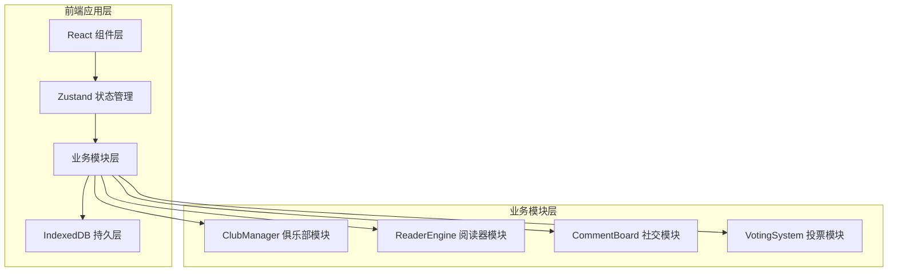
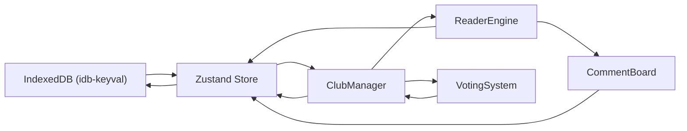
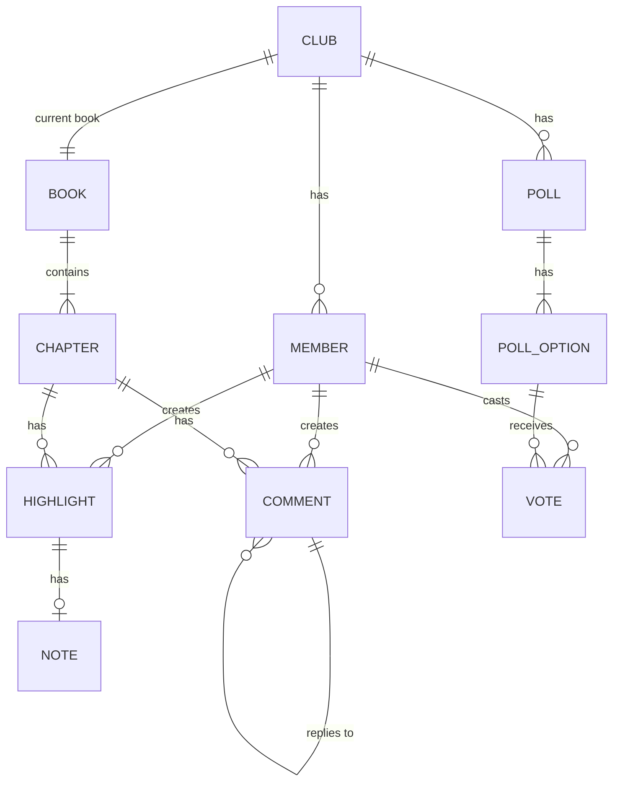

# PagePal 在线共读应用 - 技术架构文档

## 1. 架构设计

### 1.1 整体架构图



### 1.2 数据流向图



## 2. 技术描述

- **前端框架**：React 18 + TypeScript
- **构建工具**：Vite
- **状态管理**：Zustand
- **路由管理**：react-router-dom v6
- **数据持久化**：IndexedDB (idb-keyval)
- **唯一标识**：uuid
- **图标库**：lucide-react
- **样式方案**：CSS Modules + 全局CSS变量
- **无后端依赖**：纯前端应用，数据全部本地存储

## 3. 路由定义

| 路由路径 | 页面组件 | 功能描述 |
|----------|----------|----------|
| `/` | ClubListPage | 俱乐部列表首页 |
| `/club/:clubId` | ClubHomePage | 俱乐部主页（投票、进度、成员） |
| `/club/:clubId/read/:chapterId` | ReaderPage | 阅读器页面 |
| `/stats` | StatsPage | 个人统计面板 |

## 4. 数据模型

### 4.1 ER图



### 4.2 核心类型定义

```typescript
// 俱乐部
interface Club {
  id: string;
  name: string;
  inviteCode: string;
  createdAt: number;
  currentBookId: string | null;
  currentChapter: number;
  memberIds: string[];
}

// 书籍
interface Book {
  id: string;
  title: string;
  totalChapters: number;
  description: string;
  coverSeed: number;
}

// 章节
interface Chapter {
  id: string;
  bookId: string;
  chapterNumber: number;
  title: string;
  content: string;
}

// 成员
interface Member {
  id: string;
  name: string;
  clubId: string;
  joinedAt: number;
  isHost: boolean;
}

// 高亮
interface Highlight {
  id: string;
  chapterId: string;
  memberId: string;
  startOffset: number;
  endOffset: number;
  color: HighlightColor;
  text: string;
  createdAt: number;
}

// 笔记
interface Note {
  id: string;
  highlightId: string;
  memberId: string;
  content: string;
  createdAt: number;
}

// 评论
interface Comment {
  id: string;
  chapterId: string;
  memberId: string;
  highlightId: string | null;
  parentId: string | null;
  content: string;
  createdAt: number;
}

// 投票
interface Poll {
  id: string;
  clubId: string;
  title: string;
  options: PollOption[];
  status: 'active' | 'ended';
  createdBy: string;
  createdAt: number;
  endsAt: number;
}

// 投票选项
interface PollOption {
  id: string;
  bookTitle: string;
  description: string;
  voteCount: number;
  colorIndex: number;
}

// 投票记录
interface Vote {
  id: string;
  pollId: string;
  memberId: string;
  optionId: string;
  votedAt: number;
}
```

## 5. 模块结构与调用关系

### 5.1 目录结构

```
src/
├── main.tsx                 # 应用入口
├── types.ts                 # 全局类型定义
├── store/
│   └── useAppStore.ts       # Zustand store
├── modules/
│   ├── club/
│   │   └── ClubManager.ts   # 俱乐部管理模块
│   ├── reader/
│   │   └── ReaderEngine.ts  # 阅读器引擎模块
│   ├── social/
│   │   └── CommentBoard.ts  # 评论社交模块
│   └── voting/
│       └── VotingSystem.ts  # 投票系统模块
├── components/              # 通用UI组件
├── pages/                   # 页面组件
├── hooks/                   # 自定义hooks
├── utils/                   # 工具函数
└── styles/                  # 全局样式
```

### 5.2 模块调用关系

1. **ClubManager**（俱乐部模块）
   - 职责：创建/加入俱乐部、管理成员、同步章节进度
   - 数据流向：读取 IndexedDB → 缓存到 Store → 通知 Reader 和 Comment 模块
   - 被依赖：ReaderEngine、CommentBoard、VotingSystem

2. **ReaderEngine**（阅读器模块）
   - 职责：展示章节文本、记录高亮位置与笔记
   - 数据流向：接收 ClubManager 的当前章节 id → 从 Store 获取文本 → 高亮操作反馈到 Store → Comment 模块读取高亮位置
   - 依赖：ClubManager（章节信息）

3. **CommentBoard**（社交模块）
   - 职责：显示按章节和高亮分组的短评、管理回复
   - 数据流向：从 Store 获取当前章节所有评论 → 提交新评论写入 Store → 高亮关联评论同步到 Reader
   - 依赖：ReaderEngine（高亮位置）、ClubManager（成员信息）

4. **VotingSystem**（投票模块）
   - 职责：创建投票、提交选项、实时计票、最终排名
   - 数据流向：从 Store 读取候选书单 → 用户投票更新 Store → 触发 ClubManager 更新投票状态
   - 依赖：ClubManager（俱乐部信息）

## 6. 性能优化策略

1. **高亮性能**：使用 DocumentFragment 批量更新 DOM，操作延迟 < 30ms
2. **动画流畅**：使用 CSS transform 和 will-change 提升渲染性能，保持 60fps
3. **评论分页**：虚拟滚动 + 30条分页加载，避免长列表卡顿
4. **状态更新**：Zustand 选择器优化，避免不必要的重渲染
5. **IndexedDB 操作**：异步批量写入，减少阻塞主线程
6. **章节预加载**：预加载相邻章节文本，切换时无延迟
