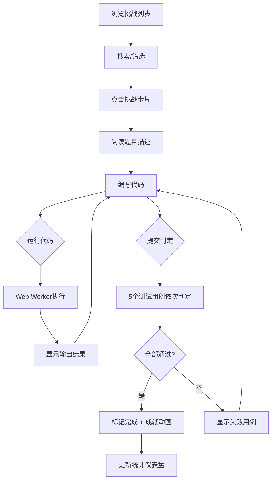

## 1. 产品概述

CodeQuest 是一款面向编程学习者的在线编程挑战与解题进度追踪应用，用户可以在浏览器中浏览不同难度的编程题目、使用内嵌代码编辑器编写并运行代码、提交答案并获得即时判定结果，同时追踪个人解题统计和成就徽章。纯前端实现，无后端依赖，所有数据持久化于浏览器 IndexedDB 中。

## 2. 核心功能

### 2.1 用户角色
无角色区分，所有功能面向单一用户。

### 2.2 功能模块
1. **主页**：挑战卡片网格展示、搜索筛选、统计仪表盘
2. **挑战详情页**：题目描述、代码编辑器、运行输出、提交判定

### 2.3 页面详情

| 页面名称 | 模块名称 | 功能描述 |
|---------|---------|---------|
| 主页 | 搜索与筛选栏 | 搜索输入框实时按标题过滤，难度筛选下拉框切换全部/简单/中等/困难 |
| 主页 | 挑战卡片网格 | 以卡片网格形式展示挑战列表，卡片显示标题、难度标签、通过率、标签，hover上浮阴影动画 |
| 主页 | 统计仪表盘 | 解题总数、通过率、当前等级、Canvas折线图、成就徽章展示 |
| 挑战详情页 | 题目描述区 | 左侧展示题目详细描述（Markdown段落）、输入输出示例，支持平滑滚动 |
| 挑战详情页 | 代码编辑器 | 右侧CodeMirror编辑器，支持语言切换（JavaScript/Python），显示初始代码模板 |
| 挑战详情页 | 运行输出区 | 编辑器下方输出区域，显示运行结果或错误信息，滑入淡入动画 |
| 挑战详情页 | 提交判定区 | 5个测试用例依次点亮，绿色通过/红色失败，全部通过标记完成并触发成就动画 |

## 3. 核心流程

1. 用户打开主页，浏览挑战卡片列表，可通过搜索框和难度筛选定位题目
2. 点击任意挑战卡片进入详情页，左侧阅读题目描述，右侧在代码编辑器中编写代码
3. 点击"运行代码"按钮，代码发送到Web Worker沙箱执行，输出结果显示在下方输出区
4. 点击"提交"按钮，系统随机抽取5个测试用例依次判定，展示进度动画
5. 全部通过后挑战标记为"已完成"，触发成就解锁动画
6. 主页统计仪表盘实时更新解题数据和折线图

## 4. 用户界面设计

### 4.1 设计风格
- 主背景色 #1e1e2e，卡片背景 #2b2b3d，文字主色 #cdd6f4
- 主题强调色 #89b4fa（亮蓝色），成功绿色 #a6e3a1，错误红色 #f38ba8
- 难度标签：简单绿色、中等橙色、困难红色
- 按钮风格：圆角，hover颜色微变，0.2s ease-out过渡
- 字体：主UI使用JetBrains Mono / Fira Code等编程字体
- 布局：左右分栏（左侧固定380px挑战列表，右侧自适应详情区）

### 4.2 页面设计概览

| 页面名称 | 模块名称 | UI元素 |
|---------|---------|--------|
| 主页 | 搜索与筛选栏 | 圆角边框输入框，输入时边框变蓝；下拉筛选框 |
| 主页 | 挑战卡片网格 | 16px圆角卡片，左上角难度颜色标签，hover上浮阴影变换 |
| 主页 | 统计仪表盘 | Canvas折线图（数据点带圆点，hover显示数值），解题统计数字 |
| 主页 | 成就徽章区 | 6个徽章，未解锁灰色，解锁后彩色+旋转光晕动画 |
| 挑战详情页 | 左侧题目描述 | 380px宽，平滑滚动，Markdown渲染 |
| 挑战详情页 | 右侧代码编辑器 | CodeMirror编辑器，顶部工具栏（语言切换+运行按钮） |
| 挑战详情页 | 输出区域 | 等宽字体Fira Code，底部浅灰色分隔线，滑入淡入动画 |
| 挑战详情页 | 提交判定进度 | 5个圆点依次点亮，绿色通过/红色失败，进度动画 |

### 4.3 响应式设计
桌面优先设计，固定左右分栏布局。左侧380px固定宽度支持纵向滚动（隐藏滚动条），右侧自适应展示编辑器和题目详情。

### 4.4 动画设计
- 卡片hover：上浮阴影变换
- 卡片列表筛选：网格交错淡入动画
- 输出区域：从左到右滑入淡入
- 测试用例判定：圆点依次点亮
- 成就解锁：徽章从中央旋转飞出放大至消失
- 已解锁成就：旋转光晕动画
