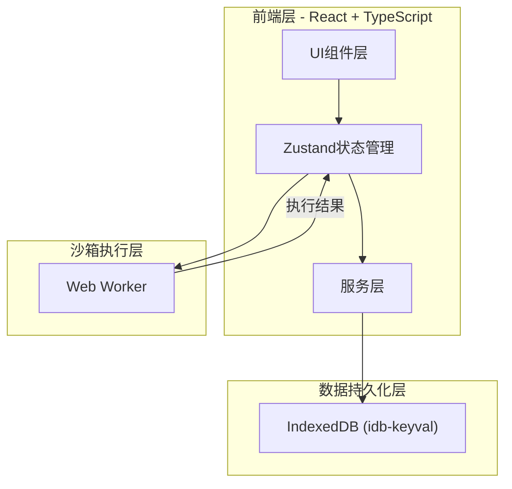

## 1. 架构设计



纯前端架构，无后端依赖。React组件通过Zustand hooks读取全局状态，Zustand store内部调用services层与IndexedDB交互，代码执行通过Web Worker沙箱隔离。

## 2. 技术说明
- 前端框架：React@18 + TypeScript（严格模式）
- 构建工具：Vite（含Worker配置）
- 状态管理：Zustand
- 代码编辑器：CodeMirror（@codemirror/view, @codemirror/state, @codemirror/lang-javascript, @codemirror/lang-python）
- 数据持久化：IndexedDB（通过idb-keyval库）
- 代码执行：Web Worker沙箱
- 唯一标识：uuid
- 初始化工具：vite-init（react-ts模板）

## 3. 路由定义

| 路由 | 用途 |
|------|------|
| / | 主页，展示挑战卡片列表、搜索筛选、统计仪表盘、成就徽章 |
| /challenge/:id | 挑战详情页，展示题目描述、代码编辑器、运行输出、提交判定 |

## 4. 数据模型

### 4.1 数据模型定义

```mermaid
erDiagram
    Challenge ||--o{ Submission : "has"
    UserStats ||--o{ Achievement : "has"

    Challenge {
        string id PK
        string title
        string description
        string difficulty
        string[] tags
        number passRate
        string initialCodeJS
        string initialCodePY
        TestCase[] testCases
    }

    Submission {
        string id PK
        string challengeId FK
        string code
        string language
        boolean passed
        number timestamp
        TestResult[] results
    }

    UserStats {
        number totalSolved
        number totalSubmissions
        number passRate
        DailyRecord[] dailyRecords
    }

    Achievement {
        string id PK
        string name
        string description
        string icon
        boolean unlocked
        number unlockedAt
    }
```



### 4.2 核心类型定义

- **Challenge**：id, title, description, difficulty('easy'|'medium'|'hard'), tags, passRate, initialCodeJS, initialCodePY, testCases({input, expectedOutput}[])
- **Submission**：id, challengeId, code, language('javascript'|'python'), passed, timestamp, results({passed, input, expected, actual}[])
- **UserStats**：totalSolved, totalSubmissions, passRate, dailyRecords({date, count}[])
- **Achievement**：id, name, description, icon, unlocked, unlockedAt

### 4.3 预置数据
- 10道编程题（3简单 + 5中等 + 2困难）
- 6个预设成就徽章（初出茅庐、渐入佳境、解题达人、全通简单、中等突破、终极挑战）

## 5. 文件结构

```
├── package.json
├── vite.config.js
├── tsconfig.json
├── index.html
├── src/
│   ├── main.tsx              # React应用入口
│   ├── App.tsx               # 路由配置与布局
│   ├── types.ts              # 所有接口类型定义
│   ├── store.ts              # Zustand状态管理
│   ├── data/
│   │   └── challenges.ts     # 预置10道编程题数据
│   ├── components/
│   │   ├── ChallengeCard.tsx  # 挑战卡片组件
│   │   ├── CodeEditorPanel.tsx # 代码编辑器组件
│   │   ├── StatsDashboard.tsx # 统计仪表盘组件
│   │   ├── AchievementBadge.tsx # 成就徽章组件
│   │   └── SubmissionResult.tsx # 提交判定结果组件
│   ├── pages/
│   │   ├── HomePage.tsx      # 主页
│   │   └── ChallengePage.tsx # 挑战详情页
│   └── utils/
│       ├── sandbox.ts        # Web Worker封装
│       └── sandbox.worker.ts # Web Worker执行脚本
```
