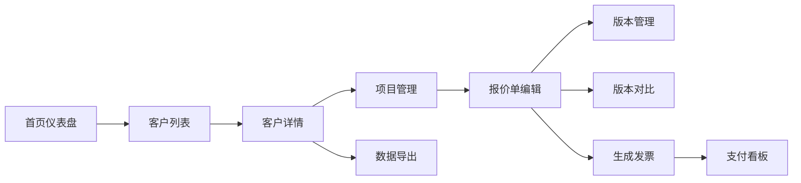

## 1. 产品概述

自由职业者项目管理应用，帮助自由职业者高效管理多个客户项目的报价、合同、发票和支付状态。解决手工做报价单易出错、合同与发票信息不一致以及收款进度难跟踪的问题。

- 目标用户：独立自由职业者、小型工作室
- 核心价值：提升业务流程效率、减少人为错误、清晰追踪财务状态

## 2. 核心功能

### 2.1 用户角色

| 角色 | 注册方式 | 核心权限 |
|------|----------|----------|
| 自由职业者 | 本地使用，无需注册 | 客户管理、项目管理、报价单管理、发票管理、数据导出 |

### 2.2 功能模块

1. **首页仪表盘**：统计概览、支付看板时间线
2. **客户与项目管理**：客户增删改查、项目增删改查、卡片式展示
3. **报价单管理**：报价单编辑、版本管理、版本对比、明细行计算
4. **发票与支付管理**：发票生成、支付状态追踪、支付看板
5. **数据导出**：客户数据导出为JSON文件

### 2.3 页面详情

| 页面名称 | 模块名称 | 功能描述 |
|----------|----------|----------|
| 首页 | 统计卡片 | 总报价金额、待收款金额、已结清金额、进行中项目数，数字滚动动画 |
| 首页 | 支付看板 | 横向时间线展示最近5笔发票支付事件，脉冲动画 |
| 客户列表 | 客户卡片 | 彩色首字母头像、项目列表平铺、悬停操作按钮、展开详情动画 |
| 客户详情 | 项目管理 | 项目增删改查、创建发票、查看合同入口 |
| 报价编辑 | 明细行编辑 | 自动计算小计、税率可修改、实时总金额计算 |
| 报价编辑 | 版本管理 | 多版本保存、版本状态切换、版本对比差异高亮 |
| 发票面板 | 发票生成 | 从报价单一键生成、支持部分开票、自动关联合同与报价版本 |
| 发票面板 | 支付状态 | 未发送/已发送/部分付款/已结清状态管理 |
| 数据导出 | 导出功能 | 客户详情页导出按钮、确认对话框、下载动画 |

## 3. 核心流程

### 3.1 主要用户流程

用户打开应用后，在首页查看统计概览和最近支付动态。点击客户卡片展开查看项目列表，可对项目进行编辑或删除。进入项目详情后可创建报价单，报价单支持多版本管理和版本对比。确认后的报价单可一键生成发票，支持部分开票。发票生成后可在支付看板追踪收款进度。用户可随时导出客户的所有数据为JSON文件进行备份。

### 3.2 流程图

## 4. 用户界面设计

### 4.1 设计风格

- **设计理念**：专业商务风格，简洁高效，突出数据可视化
- **主背景色**：极浅灰色 #f5f7fa
- **主色调**：深蓝色 #1e3a5f（用于标题、导航、重要文字）
- **辅助色**：橙色 #f28c28（用于操作按钮、高亮元素）
- **卡片样式**：米白色 #ffffff，圆角 12px，1px 实线边框 #e0e4e8
- **按钮效果**：0.2秒 hover 背景色渐变，轻微上移 1px 动画
- **输入框效果**：聚焦时边框从 #d0d5dd 过渡到主蓝色，0.3秒 宽度微扩展动画

### 4.2 页面设计概览

| 页面名称 | 模块名称 | UI元素 |
|----------|----------|--------|
| 首页 | 统计卡片 | 渐变背景（浅蓝到浅紫），圆角16px，数字滚动动画，四列布局 |
| 首页 | 支付看板 | 横向时间线，圆形节点，状态色区分，脉冲动画，浅灰连线 |
| 客户列表 | 客户卡片 | 彩色首字母圆形头像，项目卡片平铺，悬停浮现操作按钮 |
| 客户列表 | 项目卡片 | 高度平滑过渡（100px→400px），底部操作栏 |
| 报价编辑 | 明细行表格 | 数量×单价自动计算，税率输入，差异高亮（绿/红/黄） |
| 报价编辑 | 版本列表 | 版本号、创建时间、状态标签、对比选择器 |
| 发票面板 | 发票状态 | 状态标签颜色区分，支付时间线节点 |
| 通用 | 对话框 | 居中弹出，遮罩层淡入，确认/取消按钮 |

### 4.3 响应式设计

- **桌面端**（>768px）：客户卡片三列布局，统计卡片四列布局
- **平板端**（≤768px）：客户卡片两列布局，统计卡片保持四列
- **手机端**（≤480px）：统计卡片两行两列，项目卡片全宽排列

### 4.4 性能优化

- 点击按钮到弹出对话框或切换页面响应时间 ≤ 200ms
- 列表渲染超过50项时使用虚拟滚动
- 使用 IndexedDB 进行本地数据持久化
- 状态管理使用 Zustand，避免不必要的重渲染
