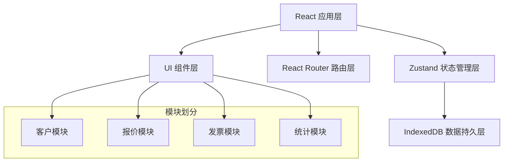
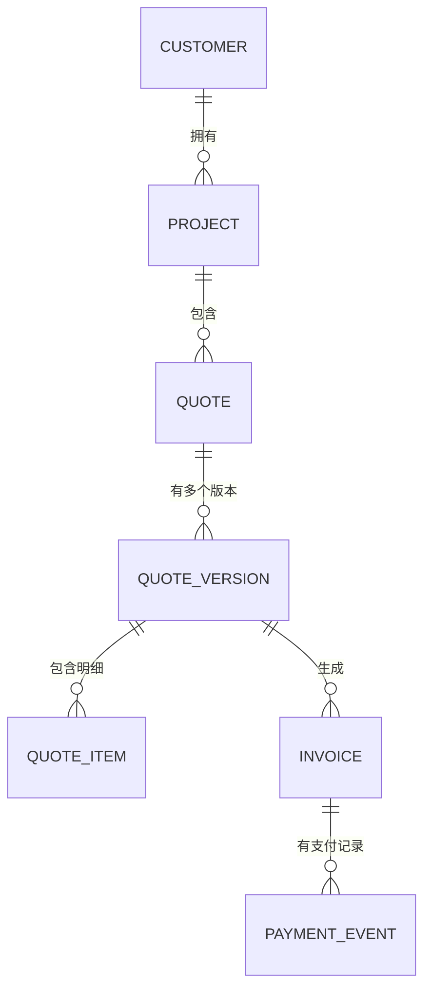

## 1. 架构设计



## 2. 技术描述

- **前端框架**：React@18 + TypeScript
- **构建工具**：Vite
- **状态管理**：Zustand
- **路由管理**：react-router-dom@6
- **数据持久化**：idb-keyval（IndexedDB 封装库）
- **唯一 ID 生成**：uuid
- **样式方案**：CSS Modules + 内联样式（动画效果）
- **后端**：无后端，纯前端应用
- **数据库**：IndexedDB（浏览器本地存储）

## 3. 路由定义

| 路由 | 页面 | 说明 |
|------|------|------|
| `/` | 首页仪表盘 | 统计卡片 + 支付看板 + 客户列表概览 |
| `/client/:clientId` | 客户详情页 | 客户信息 + 项目列表 + 导出按钮 |
| `/quote/:projectId` | 报价编辑页 | 报价单编辑 + 版本管理 + 发票生成 |

## 4. 数据模型

### 4.1 实体关系图



### 4.2 数据类型定义

#### 客户与项目类型

```typescript
interface Client {
  id: string;
  name: string;
  email: string;
  phone: string;
  notes: string;
  createdAt: string;
}

interface Project {
  id: string;
  clientId: string;
  name: string;
  description: string;
  startDate: string;
  endDate: string;
  createdAt: string;
}
```

#### 报价单与发票类型

```typescript
interface QuoteItem {
  id: string;
  description: string;
  quantity: number;
  unitPrice: number;
  taxRate: number;
}

interface QuoteVersion {
  id: string;
  version: number;
  createdAt: string;
  status: 'draft' | 'sent' | 'accepted' | 'rejected';
  items: QuoteItem[];
  totalAmount: number;
}

interface Quote {
  id: string;
  projectId: string;
  projectName: string;
  quoteDate: string;
  versions: QuoteVersion[];
  currentVersionId: string;
}

interface Invoice {
  id: string;
  quoteId: string;
  quoteVersionId: string;
  projectId: string;
  contractNumber: string;
  invoiceNumber: string;
  invoiceDate: string;
  items: QuoteItem[];
  totalAmount: number;
  paidAmount: number;
  status: 'unsent' | 'sent' | 'partial' | 'paid';
  paymentEvents: PaymentEvent[];
}

interface PaymentEvent {
  id: string;
  invoiceId: string;
  amount: number;
  date: string;
  status: 'sent' | 'partial' | 'paid';
  note?: string;
}
```

## 5. 文件结构

```
src/
├── modules/
│   ├── client/
│   │   ├── types.ts          # 客户与项目类型定义
│   │   ├── store.ts          # 客户与项目状态管理
│   │   └── components/
│   │       └── ClientCard.tsx  # 客户卡片组件
│   └── quote/
│       ├── types.ts          # 报价单与发票类型定义
│       ├── store.ts          # 报价单与发票状态管理
│       └── components/
│           ├── QuoteEditor.tsx   # 报价单编辑器
│           └── InvoicePanel.tsx  # 发票面板
├── App.tsx                 # 应用根组件
├── main.tsx               # 应用入口
└── index.css              # 全局样式
```

## 6. 状态管理设计

### 6.1 Client Store

- `clients: Client[]` - 客户列表
- `projects: Project[]` - 项目列表
- `addClient(client: Omit<Client, 'id' | 'createdAt'>): void`
- `updateClient(id: string, data: Partial<Client>): void`
- `deleteClient(id: string): void`
- `addProject(project: Omit<Project, 'id' | 'createdAt'>): void`
- `updateProject(id: string, data: Partial<Project>): void`
- `deleteProject(id: string): void`
- `getProjectsByClient(clientId: string): Project[]`

### 6.2 Quote Store

- `quotes: Quote[]` - 报价单列表
- `invoices: Invoice[]` - 发票列表
- `createQuote(projectId: string, projectName: string): Quote`
- `saveVersion(quoteId: string, items: QuoteItem[], status?: QuoteStatus): QuoteVersion`
- `compareVersions(quoteId: string, version1Id: string, version2Id: string): DiffResult`
- `createInvoice(quoteId: string, versionId: string, itemIds?: string[]): Invoice`
- `updateInvoiceStatus(invoiceId: string, status: InvoiceStatus, amount?: number): void`
- `exportClientData(clientId: string): string` - 导出JSON

## 7. 性能优化策略

1. **虚拟滚动**：列表超过50项时启用虚拟滚动
2. **状态选择器**：使用 Zustand 的 selector 避免不必要重渲染
3. **Memo 优化**：对频繁渲染的列表项使用 React.memo
4. **懒加载**：路由级别代码分割
5. **IndexedDB**：数据持久化使用异步存储，不阻塞主线程
6. **CSS 动画**：优先使用 transform 和 opacity 动画，触发 GPU 加速

## 8. 关键组件实现要点

### 8.1 ClientCard
- 首字母彩色头像（颜色根据首字母哈希固定）
- 项目卡片悬停显示编辑/删除按钮
- 点击展开详情，高度 100px → 400px 平滑过渡
- 底部操作栏：编辑、创建发票、查看合同

### 8.2 QuoteEditor
- 明细行表格：数量×单价自动计算小计
- 税率默认 13%，可手动修改
- 版本列表：版本号、创建时间、状态标签
- 版本对比：差异行高亮（新增绿色、删除红色、修改黄色）

### 8.3 InvoicePanel
- 从报价单一键生成发票
- 支持部分开票（选择明细行）
- 支付看板：横向时间线，最近5笔支付事件
- 节点颜色：已发送灰色、部分付款蓝色、已结清绿色
- 最新节点脉冲放大动画

### 8.4 统计卡片
- 数字滚动动画（从0增长到目标值）
- 渐变背景（浅蓝到浅紫）
- 圆角 16px
