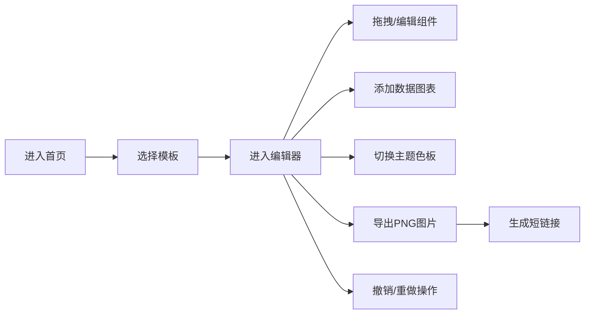

## 1. 产品概述

Infographic Studio 是一款轻量级在线信息图表编辑工具，专为非设计背景的运营和内容创作者打造，帮助用户快速制作具有统一视觉风格、数据与排版兼顾的精美信息图表。

- 核心价值：降低信息图制作门槛，提供模板化、组件化的编辑体验，支持数据可视化与主题一键切换
- 目标用户：运营人员、内容创作者、市场人员、教育工作者

## 2. 核心功能

### 2.1 功能模块

1. **模板选择页**：预设模板库展示、模板预览与选择
2. **编辑器主界面**：画布编辑区、顶部工具栏、右侧属性面板、主题色板
3. **组件系统**：文本块、图片占位符、数据图表、形状组件，支持拖拽与属性调整
4. **数据图表生成**：柱状图、折线图、饼图，支持数据编辑与主题色适配
5. **主题色板管理**：5套预设主题、自定义色值、一键切换全局配色
6. **导出与分享**：PNG导出、短链接生成、导出历史记录
7. **撤销与重做**：无限级操作历史记录，支持键盘快捷键

### 2.2 页面详情

| 页面名称 | 模块名称 | 功能描述 |
|-----------|-------------|---------------------|
| 模板选择页 | 模板画廊 | 展示5种预设模板（双栏对比、水平时间线、垂直流程图、数据卡片、人物介绍），点击进入编辑 |
| 编辑器页面 | 顶部工具栏 | 撤销/重做按钮、添加图表按钮、导出按钮、缩放控制 |
| 编辑器页面 | 画布编辑区 | 组件渲染、拖拽移动、滚轮缩放、鼠标平移、选中交互 |
| 编辑器页面 | 右侧属性面板 | 选中组件属性编辑（字体、字号、颜色、透明度、旋转、圆角）、主题色板模块 |
| 编辑器页面 | 图表编辑弹窗 | 输入图表标题、系列名称和数值，生成SVG图表 |
| 编辑器页面 | 导出进度指示器 | 圆形旋转虚线圆环动画，完成后显示toast提示 |

## 3. 核心流程

用户从模板选择页面开始，选择一个模板后进入编辑器。在编辑器中可以拖拽调整组件位置、通过右侧面板修改属性、添加数据图表、切换主题配色。编辑完成后可导出为PNG图片并生成分享短链接。整个过程支持无限级撤销与重做。

## 4. 用户界面设计

### 4.1 设计风格

- **设计方向**：浅色极简主义，干净清爽的专业工具感
- **主背景色**：#f5f7fa
- **卡片/画布背景**：#ffffff
- **分割线色**：#e0e0e0
- **主操作区**：1200px × 750px，8px圆角
- **右侧面板**：宽300px，左侧16px浅灰竖线分隔
- **顶部工具栏**：高52px，底部1px分割线
- **图标按钮悬浮态**：背景 #e8f0fe
- **图标按钮选中态**：背景 #d0e4ff
- **选中框样式**：2px虚线 #2196f3，半透明
- **过渡动画**：主题切换0.3秒渐变过渡
- **字体**：现代无衬线字体，清晰易读

### 4.2 页面设计概览

| 页面名称 | 模块名称 | UI元素 |
|-----------|-------------|-------------|
| 模板选择页 | 模板画廊 | 卡片式布局、悬停效果、模板名称标签、平滑过渡 |
| 编辑器页面 | 顶部工具栏 | 图标按钮组、分隔线、下拉菜单、悬浮提示 |
| 编辑器页面 | 画布区域 | 白色底板、网格背景感、组件阴影、选中虚线框 |
| 编辑器页面 | 属性面板 | 分组折叠、颜色选择器、滑块控件、输入框 |
| 编辑器页面 | 主题色板 | 圆形色卡、选中描边、颜色拾取器、预设方案切换 |
| 编辑器页面 | 导出弹窗 | 圆形进度环、toast提示、历史记录列表 |

### 4.3 响应式设计

- **桌面优先**设计，主适配分辨率 ≥ 1280px
- 当视口宽度 < 1280px 时，右侧属性面板折叠为底部抽屉（高度260px）
- 提供展开/收起切换按钮
- 触控设备优化拖拽体验

### 4.4 动效与交互

- 主题切换：所有组件颜色0.3秒平滑过渡
- 按钮悬浮：背景色渐变过渡
- 组件拖拽：半透明蓝色虚框跟随
- 导出进度：旋转虚线圆环动画（最长3秒）
- 缩放/平移：平滑过渡
- Toast提示：淡入淡出效果
