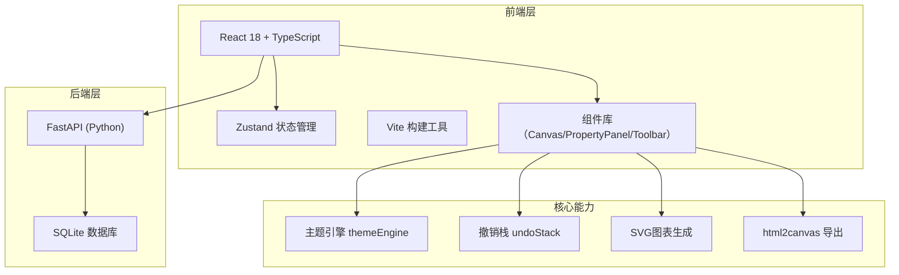
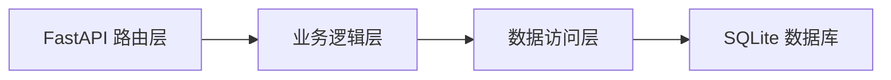

## 1. 架构设计



## 2. 技术栈说明

- **前端框架**：React 18 + TypeScript
- **构建工具**：Vite
- **状态管理**：Zustand + Immer
- **路由**：react-router-dom
- **HTTP客户端**：axios
- **颜色选择器**：react-color
- **图片导出**：html2canvas + file-saver
- **唯一ID**：uuid
- **后端框架**：FastAPI (Python)
- **数据库**：SQLite
- **图标**：lucide-react

## 3. 路由定义

| 路由 | 页面/用途 |
|-------|---------|
| / | 模板选择页 |
| /editor/:templateId | 编辑器页面 |

## 4. API 定义

### 4.1 类型定义

```typescript
interface Template {
  id: string;
  name: string;
  category: string;
  thumbnail: string;
  components: Component[];
}

interface Component {
  id: string;
  type: 'text' | 'image' | 'chart' | 'shape';
  x: number;
  y: number;
  width: number;
  height: number;
  rotation: number;
  opacity: number;
  borderRadius: number;
  style: ComponentStyle;
  data?: any;
}

interface ComponentStyle {
  fillColor?: string;
  strokeColor?: string;
  strokeWidth?: number;
  textColor?: string;
  fontSize?: number;
  fontFamily?: string;
  fontWeight?: string;
}

interface ThemePalette {
  id: string;
  name: string;
  colors: string[];
}

interface ExportRecord {
  id: string;
  fileName: string;
  timestamp: number;
  thumbnail: string;
  shortLink: string;
}

interface ChartData {
  title: string;
  type: 'bar' | 'line' | 'pie';
  series: { name: string; value: number }[];
}
```

### 4.2 接口列表

| 方法 | 路径 | 描述 | 请求参数 | 返回值 |
|------|------|------|----------|--------|
| GET | /api/templates | 获取模板列表 | - | Template[] |
| GET | /api/templates/:id | 获取单个模板详情 | templateId | Template |
| POST | /api/export | 记录导出并生成短链接 | { imageData, fileName } | { shortLink, id } |
| GET | /api/exports | 获取导出记录列表 | - | ExportRecord[] |

## 5. 后端架构



### 5.1 文件结构
```
src/server/
└── backend.py          # FastAPI 应用入口，包含所有路由与数据库操作
```

### 5.2 数据库表

**templates 表**
- id (TEXT, PK)
- name (TEXT)
- category (TEXT)
- thumbnail (TEXT)
- components_json (TEXT)

**exports 表**
- id (TEXT, PK)
- file_name (TEXT)
- timestamp (INTEGER)
- thumbnail (TEXT)
- short_link (TEXT)
- image_data (TEXT)

## 6. 前端数据模型

### 6.1 Store 状态 (Zustand)

```typescript
interface EditorState {
  components: Component[];
  selectedId: string | null;
  theme: ThemePalette;
  themes: ThemePalette[];
  zoom: number;
  pan: { x: number; y: number };
  
  // Actions
  selectComponent: (id: string | null) => void;
  updateComponent: (id: string, updates: Partial<Component>) => void;
  addComponent: (component: Component) => void;
  deleteComponent: (id: string) => void;
  setTheme: (themeId: string) => void;
  updateThemeColor: (index: number, color: string) => void;
  setZoom: (zoom: number) => void;
  setPan: (pan: { x: number; y: number }) => void;
  loadTemplate: (template: Template) => void;
  
  // Undo/Redo
  undo: () => void;
  redo: () => void;
  canUndo: boolean;
  canRedo: boolean;
}
```

### 6.2 项目目录结构

```
src/
├── editor/
│   ├── store/
│   │   └── editorStore.ts       # Zustand 状态管理
│   ├── components/
│   │   ├── EditorCanvas.tsx     # 画布主组件
│   │   ├── PropertyPanel.tsx    # 右侧属性面板
│   │   ├── Toolbar.tsx          # 顶部工具栏
│   │   ├── ChartDialog.tsx      # 图表编辑弹窗
│   │   └── ExportPanel.tsx      # 导出面板
│   └── utils/
│       ├── themeEngine.ts       # 主题切换引擎
│       └── undoStack.ts         # 撤销栈工具
├── pages/
│   ├── Home.tsx                 # 模板选择页
│   └── Editor.tsx               # 编辑器页面
├── App.tsx
├── main.tsx
└── index.css
```

## 7. 核心模块设计

### 7.1 主题引擎 (themeEngine)
- 维护组件颜色与色板索引的映射关系
- 主题切换时遍历所有组件，按索引替换为新色板对应颜色
- 支持填充色、边框色、文字色的映射
- 返回更新后的组件数组供 store 更新

### 7.2 撤销栈 (undoStack)
- 基于 Immer 实现状态快照
- 提供 push、undo、redo、peek 方法
- 栈深度限制 200，超出时丢弃最早记录
- 记录组件增删、移动、属性变更、主题切换等操作

### 7.3 SVG图表生成
- 纯前端实现柱状图、折线图、饼图
- 数据从主题色板获取颜色
- 支持随容器缩放自适应
- 以组件形式插入画布

### 7.4 画布交互
- 鼠标拖拽移动组件
- 滚轮缩放（0.5x - 2.0x，步进 0.1）
- 按住空格/中键拖拽平移视口
- 点击选中组件，显示属性面板
