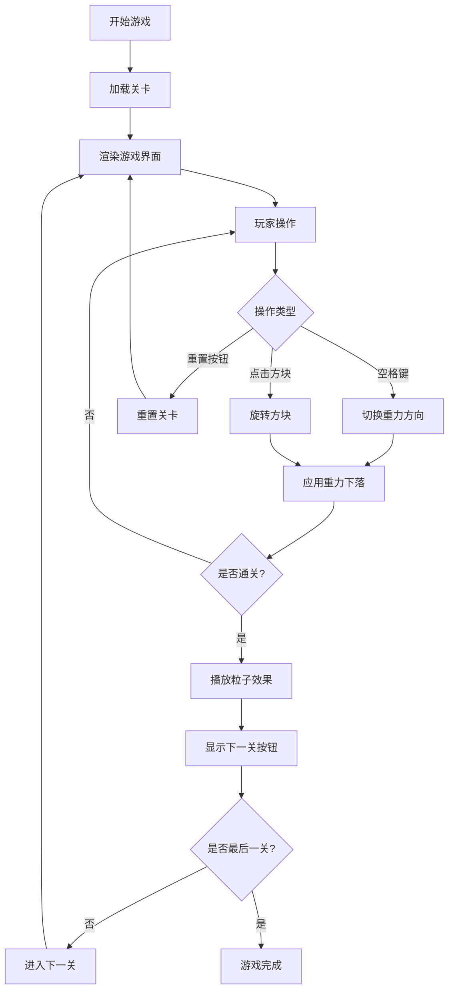

## 1. 产品概述
在线重力方块拼图解谜游戏，玩家在8x8网格上操作不同形状的方块，通过切换重力方向和旋转方块，将所有方块送入目标区域以通关。
- 核心玩法：利用重力物理机制，结合方块旋转，解决空间谜题
- 目标用户：休闲益智游戏爱好者，喜欢挑战空间思维的玩家
- 产品价值：提供独特的重力机制解谜体验，锻炼玩家的空间想象和逻辑思维能力

## 2. 核心功能

### 2.1 用户角色
| 角色 | 注册方式 | 核心权限 |
|------|----------|----------|
| 玩家 | 无需注册，直接进入游戏 | 游玩所有关卡、重置关卡、查看操作提示 |

### 2.2 功能模块
1. **游戏主界面**：8x8网格游戏区域、信息面板、控制按钮
2. **关卡系统**：15个预设关卡，包含障碍物布局和目标区域
3. **方块系统**：7种不同形状方块，支持旋转操作
4. **重力引擎**：四方向重力切换，方块物理下落
5. **通关效果**：粒子爆炸动画、关卡切换

### 2.3 页面详情
| 页面名称 | 模块名称 | 功能描述 |
|---------|----------|----------|
| 游戏主页面 | 游戏区域 | 渲染网格、方块、障碍物、目标区域，处理点击旋转事件 |
| 游戏主页面 | 信息面板 | 显示关卡编号、操作步数、提示按钮、重置按钮 |
| 游戏主页面 | 通关弹窗 | 显示通关粒子效果、下一关按钮 |

## 3. 核心流程
玩家进入游戏后，从第一关开始，通过空格键切换重力方向使方块下落，点击方块可旋转90度。当所有方块都进入目标区域时，触发通关效果，点击下一关按钮进入下一关。玩家可随时点击重置按钮重新开始当前关卡。

## 4. 用户界面设计

### 4.1 设计风格
- **主题风格**：像素复古风格
- **主背景**：深灰色 #1a1a2e
- **信息面板**：背景 #16213e，半透明毛玻璃效果 rgba(22,33,62,0.85)，圆角 12px，边框 1px #0f3460
- **按钮样式**：渐变蓝紫色（#533483 到 #3b82f6），悬浮时向上移动 2px 并增加阴影深度
- **网格线**：深灰色 #333333，1px
- **目标区域**：闪烁金色边框，动画周期 0.8 秒
- **方块颜色**：红色#ff4444、蓝色#4488ff、绿色#44cc44、黄色#ffcc00、紫色#aa44ff、青色#00cccc、橙色#ff8844

### 4.2 页面设计概述
| 页面名称 | 模块名称 | UI 元素 |
|---------|----------|---------|
| 游戏主页面 | 游戏区域 | 8x8 网格、彩色方块、深色障碍物、金色目标区域、像素风渲染 |
| 游戏主页面 | 信息面板 | 关卡编号（大号像素字体）、操作步数、渐变色按钮（提示/重置） |
| 游戏主页面 | 通关效果 | 30 个金色粒子爆炸扩散（持续 1 秒）、下一关按钮 |

### 4.3 响应性
- 桌面端优先设计，游戏主区域居中，最小尺寸 400x400px，支持自适应缩放
- 信息面板固定宽度 200px，位于右侧
- 键盘操作支持（空格键切换重力）
- 鼠标点击操作（点击方块旋转、点击按钮）

### 4.4 动效设计
- **方块下落**：流畅动画，30fps 以上
- **目标区域**：金色边框闪烁动画，周期 0.8 秒
- **按钮悬浮**：向上移动 2px，阴影加深
- **通关效果**：30 个金色粒子从中心向随机方向扩散，持续 1 秒
- **关卡切换**：淡入淡出过渡，响应时间不超过 200ms
