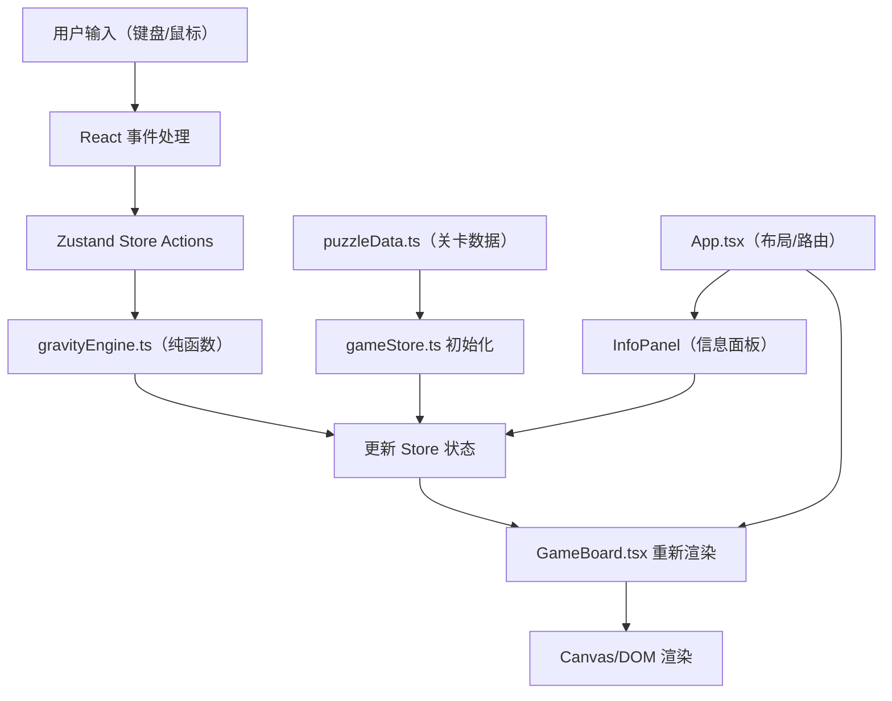

## 1. 架构设计



## 2. 技术描述
- **前端框架**：React@18 + TypeScript
- **构建工具**：Vite@5 + @vitejs/plugin-react
- **状态管理**：Zustand@4 + Immer@10
- **路由**：react-router-dom@6
- **样式方案**：原生 CSS + CSS 变量（像素复古风格）
- **动画**：CSS Animations + requestAnimationFrame

## 3. 项目结构
```
auto53/
├── index.html
├── package.json
├── tsconfig.json
├── vite.config.js
└── src/
    ├── main.tsx
    ├── App.tsx
    ├── game/
    │   ├── GameBoard.tsx      # 游戏主区域渲染组件
    │   ├── gravityEngine.ts   # 重力引擎纯函数
    │   └── puzzleData.ts      # 15个关卡数据
    └── store/
        └── gameStore.ts       # Zustand 状态管理
```

## 4. 数据模型

### 4.1 核心类型定义
```typescript
// 方块类型
type BlockType = 'I4' | 'L4' | 'T4' | 'Z4' | 'SQUARE' | 'I3' | 'L3';

// 重力方向
type GravityDirection = 'down' | 'left' | 'up' | 'right';

// 位置坐标
interface Position {
  x: number;
  y: number;
}

// 方块实例
interface Block {
  id: string;
  type: BlockType;
  position: Position;  // 方块锚点位置
  rotation: number;    // 0, 90, 180, 270
  color: string;
}

// 目标区域
interface TargetArea {
  x: number;
  y: number;
  width: number;
  height: number;
}

// 关卡数据
interface LevelData {
  gridSize: number;
  obstacles: Position[];
  blocks: { type: BlockType; position: Position; rotation: number }[];
  targetArea: TargetArea;
}

// 游戏状态
interface GameState {
  currentLevel: number;
  blocks: Block[];
  obstacles: Position[];
  targetArea: TargetArea;
  steps: number;
  gravityDirection: GravityDirection;
  isComplete: boolean;
  isAnimating: boolean;
}
```

### 4.2 方块形状定义
| 类型 | 形状（相对坐标） | 颜色 |
|------|------------------|------|
| I4 | [(0,0), (1,0), (2,0), (3,0)] | #ff4444 |
| L4 | [(0,0), (0,1), (0,2), (1,2)] | #4488ff |
| T4 | [(0,0), (1,0), (2,0), (1,1)] | #44cc44 |
| Z4 | [(0,0), (1,0), (1,1), (2,1)] | #ffcc00 |
| SQUARE | [(0,0), (1,0), (0,1), (1,1)] | #aa44ff |
| I3 | [(0,0), (1,0), (2,0)] | #00cccc |
| L3 | [(0,0), (0,1), (1,1)] | #ff8844 |

## 5. Store Actions 定义
```typescript
interface GameActions {
  reset: () => void;                    // 重置当前关卡
  nextLevel: () => void;                // 进入下一关
  setGravity: (dir: GravityDirection) => void;  // 设置重力方向
  rotateBlock: (blockId: string) => void;        // 旋转方块
  applyGravity: () => void;             // 应用重力（触发下落）
  checkComplete: () => boolean;         // 检查是否通关
}
```

## 6. 性能优化点
1. **重力引擎纯函数化**：所有计算无副作用，便于缓存和测试
2. **按需渲染**：使用 Zustand 的 selector 避免不必要的重渲染
3. **动画优化**：使用 CSS transform 进行位移动画，开启硬件加速
4. **状态批量更新**：使用 Immer 保证不可变更新的性能
5. **requestAnimationFrame**：方块下落动画使用 RAF 保证 30fps+
