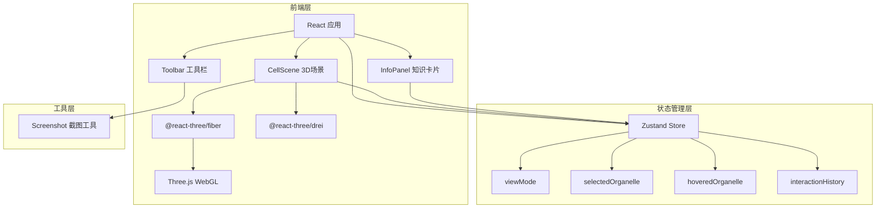

## 1. 架构设计



## 2. 技术说明

- **前端框架**：React 18 + TypeScript + Vite
- **3D 渲染**：Three.js + @react-three/fiber + @react-three/drei
- **状态管理**：Zustand
- **样式方案**：CSS-in-JS（内联样式 + CSS 模块），无 Tailwind
- **构建工具**：Vite（支持 wasm 和 gltf）
- **后端**：无（纯前端应用）

## 3. 路由定义

| 路由 | 用途 |
|------|------|
| / | 单页应用，3D 细胞探索主页面 |

## 4. 文件结构

```
├── package.json
├── index.html
├── tsconfig.json
├── vite.config.js
├── src/
│   ├── main.tsx
│   ├── App.tsx
│   ├── store/
│   │   └── useAppStore.ts
│   ├── components/
│   │   ├── CellScene.tsx
│   │   ├── Organelles.tsx
│   │   ├── InfoPanel.tsx
│   │   └── Toolbar.tsx
│   └── utils/
│       └── Screenshot.ts
```

## 5. 组件架构

### 5.1 CellScene.tsx
- Canvas 容器，配置摄像机、光照、OrbitControls
- 管理剖面图的 clipping plane
- 射线检测（onPointerOver / onPointerOut / onClick）
- 渲染所有细胞器子组件

### 5.2 Organelles.tsx
- 各细胞器组件：CellMembrane、Nucleus、Mitochondria、ER、Golgi、Lysosome
- 每个组件使用 useFrame 实现漂浮旋转动画
- 悬浮/选中状态视觉效果（缩放、发光）

### 5.3 InfoPanel.tsx
- 读取 store 中 selectedOrganelle
- 知识卡片数据映射
- 滑入/滑出动画

### 5.4 Toolbar.tsx
- 模式切换按钮
- 截图按钮
- 调用 Screenshot 工具

## 6. 数据模型

### 6.1 Zustand Store 状态定义

```typescript
interface AppState {
  viewMode: 'structure' | 'section'
  selectedOrganelle: string | null
  hoveredOrganelle: string | null
  interactionHistory: Array<{
    organelle: string
    timestamp: number
  }>
  setViewMode: (mode: 'structure' | 'section') => void
  selectOrganelle: (name: string | null) => void
  hoverOrganelle: (name: string | null) => void
  addHistory: (entry: { organelle: string; timestamp: number }) => void
}
```

### 6.2 细胞器知识数据

```typescript
interface OrganelleInfo {
  name: string
  icon: string
  description: string
  detailUrl: string
}
```

六种细胞器：cellMembrane、nucleus、mitochondria、er、golgi、lysosome
