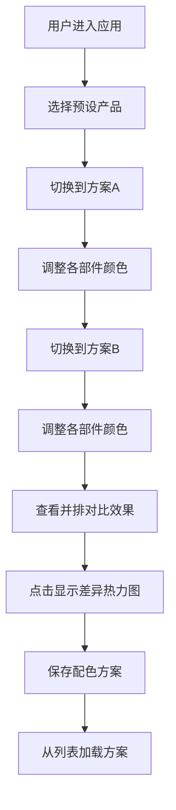

## 1. 产品概述
在线交互式商品颜色配置器与视觉对比应用，解决电商购物中商品图片与实物色差导致的用户不满问题。用户可实时调整产品各部件颜色，并排对比两种配色方案，并通过色差热力图直观识别差异。

- 目标用户：电商消费者、产品设计师、品牌运营人员
- 核心价值：减少因色差导致的退货率，提升用户购物决策效率

## 2. 核心 Features

### 2.1 Feature Modules
1. **产品配置器页面**：产品选择、部件颜色独立调节、色板与HSL滑块控制
2. **对比视图**：双方案并排展示、色差热力图叠加、差异高亮显示
3. **方案管理**：配色方案保存（最多10个）、本地存储、快速加载

### 2.3 Page Details
| 页面名称 | 模块名称 | Feature description |
|-----------|-------------|---------------------|
| 主页面 | 产品选择器 | 预设产品（运动鞋、耳机、背包）切换 |
| 主页面 | 颜色控制面板 | 4个部件（主体、饰边、内衬、缝线）独立颜色调节，支持色板和HSL滑块 |
| 主页面 | 对比视图 | 左右两栏展示方案A和方案B，支持切换差异热力图模式 |
| 主页面 | 方案管理抽屉 | 保存命名配色方案，从列表加载已有方案 |

## 3. Core Process
用户选择预设产品 → 分别为方案A和方案B调整各部件颜色 → 实时查看双方案对比效果 → 点击"显示差异"查看色差热力图 → 保存满意的配色方案 → 后续可快速加载已有方案继续编辑

## 4. User Interface Design

### 4.1 Design Style
- **主色调**：#4A90D9（淡蓝色），用于选中状态高亮和主按钮
- **背景**：#f5f5f7 到 #e8e8ec 的垂直渐变
- **卡片样式**：白色背景，16px圆角，2px #e0e0e0边框，浅阴影 0 4px 12px rgba(0,0,0,0.06)
- **按钮**：悬停背景轻微变深（0.02s过渡），点击缩放0.98
- **字体**：现代无衬线字体，标题18px-600，正文14px-400，辅助文字12px-400
- **布局风格**：卡片式布局，左右分栏（桌面）/上下布局（移动端）

### 4.2 Page Design Overview
| 页面名称 | 模块名称 | UI Elements |
|-----------|-------------|-------------|
| 主页面 | 整体布局 | 居中容器，最大宽度1280px，左右内边距24px |
| 主页面 | 颜色控制卡片 | 部件名称标签，色板调色器，HSL滑块组，选中状态2px #4A90D9边框 |
| 主页面 | 对比视图 | 左右两栏（方案A/方案B），每栏独立产品渲染，淡入过渡动画0.3s |
| 主页面 | 热力图叠加 | mix-blend-mode: multiply，红色到白色渐变表示差异程度 |

### 4.3 Responsiveness
- **桌面端（≥768px）**：左右分栏布局，左方案A右方案B，控制面板在左侧
- **移动端（<768px）**：上下布局，方案A在上方案B在下，控制面板折叠为可展开抽屉
- **触摸优化**：滑块和按钮最小触控区域48px，色板格子增大尺寸

## 5. Performance Requirements
- 颜色切换渲染：≤16ms（60FPS）
- 色差热力图计算：≤5ms（含Delta-E公式运算）
- 方案保存/加载：≤50ms
- 所有过渡动画：0.3s淡入效果
