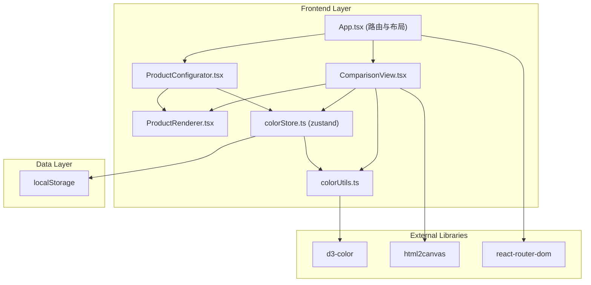

## 1. Architecture Design


## 2. Technology Description
- **Frontend Framework**: React@18.2.0 + TypeScript@5.0.0
- **Build Tool**: Vite@5.0.0 (启用React热更新和TypeScript支持)
- **State Management**: zustand@4.4.0 (轻量级状态管理)
- **Color Processing**: d3-color@3.1.0 (颜色格式转换与操作)
- **Screenshot**: html2canvas@1.4.1 (可选，用于导出配色方案)
- **Routing**: react-router-dom@6.20.0 (单页路由)
- **Styling**: 原生CSS + CSS变量 (无需Tailwind，按需求自定义样式)
- **Storage**: localStorage (持久化配色方案)

## 3. File Structure & Data Flow

| 文件路径 | 职责描述 | 调用关系 |
|----------|----------|----------|
| [package.json](file:///d:/P/tasks/auto55/package.json) | 项目依赖与脚本配置 | 根配置 |
| [index.html](file:///d:/P/tasks/auto55/index.html) | 入口页面，挂载应用容器 | 加载 main.tsx |
| [vite.config.js](file:///d:/P/tasks/auto55/vite.config.js) | Vite构建配置 | 启用TypeScript + React HMR |
| [tsconfig.json](file:///d:/P/tasks/auto55/tsconfig.json) | TypeScript配置 | 严格模式，ES2020目标 |
| [src/App.tsx](file:///d:/P/tasks/auto55/src/App.tsx) | 主路由与布局 | 调用 ProductConfigurator, ComparisonView |
| [src/components/ProductConfigurator.tsx](file:///d:/P/tasks/auto55/src/components/ProductConfigurator.tsx) | 产品配置器 | 调用 colorStore.updateColor, 渲染 ProductRenderer |
| [src/components/ProductRenderer.tsx](file:///d:/P/tasks/auto55/src/components/ProductRenderer.tsx) | 产品SVG渲染器 | 输入：colorConfig，输出：带颜色的SVG |
| [src/components/ComparisonView.tsx](file:///d:/P/tasks/auto55/src/components/ComparisonView.tsx) | 双方案对比视图 | 读取 colorStore.schemeA/schemeB，调用 colorUtils.calculateDeltaE |
| [src/store/colorStore.ts](file:///d:/P/tasks/auto55/src/store/colorStore.ts) | 状态管理 | 存储方案A/B，调用 colorUtils，读写 localStorage |
| [src/utils/colorUtils.ts](file:///d:/P/tasks/auto55/src/utils/colorUtils.ts) | 颜色工具模块 | 颜色转换、Delta-E计算、相似度判定 |
| [src/main.tsx](file:///d:/P/tasks/auto55/src/main.tsx) | 应用入口 | 挂载 App 到 DOM |

**数据流向**:
1. 用户交互 → ProductConfigurator → colorStore.updateColor() → 触发重渲染
2. colorStore 状态变化 → ProductRenderer 接收新 colorConfig → 生成带色SVG
3. ComparisonView 订阅 schemeA/schemeB → 传递给两个 ProductRenderer
4. 点击"显示差异" → ComparisonView 调用 colorUtils.calculateDeltaE() → 生成热力图
5. 保存方案 → colorStore.saveScheme() → 写入 localStorage
6. 加载方案 → colorStore.loadScheme() → 从 localStorage 读取并更新状态

## 4. Type Definitions

```typescript
// 产品部件类型
type ProductPart = 'body' | 'trim' | 'lining' | 'stitching';

// 产品类型
type ProductType = 'shoe' | 'headphone' | 'backpack';

// HSL颜色对象
interface HSLColor {
  h: number; // 0-360
  s: number; // 0-100
  l: number; // 0-100
}

// 颜色配置对象
interface ColorConfig {
  body: string;     // hex格式
  trim: string;     // hex格式
  lining: string;   // hex格式
  stitching: string;// hex格式
}

// 保存的方案
interface SavedScheme {
  id: string;
  name: string;
  productType: ProductType;
  schemeA: ColorConfig;
  schemeB: ColorConfig;
  createdAt: number;
}

// Store状态
interface ColorStore {
  // 当前产品
  productType: ProductType;
  // 当前编辑的方案
  activeScheme: 'A' | 'B';
  // 方案A颜色配置
  schemeA: ColorConfig;
  // 方案B颜色配置
  schemeB: ColorConfig;
  // 已保存的方案列表（最多10个）
  savedSchemes: SavedScheme[];
  // 是否显示差异热力图
  showDifference: boolean;
  // Actions
  setProductType: (type: ProductType) => void;
  setActiveScheme: (scheme: 'A' | 'B') => void;
  updateColor: (part: ProductPart, color: string, scheme?: 'A' | 'B') => void;
  updateColorHSL: (part: ProductPart, hsl: HSLColor, scheme?: 'A' | 'B') => void;
  toggleDifference: () => void;
  saveScheme: (name: string) => boolean;
  loadScheme: (id: string) => void;
  deleteScheme: (id: string) => void;
  getColorDifference: () => Record<ProductPart, number>;
}
```

## 5. Core Algorithm - Delta E Color Difference

使用 CIE76 Delta-E 公式计算颜色差异：

```
ΔE* = √[(ΔL*)² + (Δa*)² + (Δb*)²]

其中：
- ΔL*: 明度差异
- Δa*: 绿红色度差异
- Δb*: 蓝黄色度差异

差异等级：
- 0-1: 几乎不可察觉
- 1-2: 仅经验丰富的观察者可察觉
- 2-3.5: 普通观察者可察觉
- 3.5-5: 明显可察觉
- >5: 较大差异
```

## 6. Performance Optimization

1. **状态分片订阅**：使用 zustand 的选择器只订阅必要状态，避免不必要重渲染
2. **SVG 缓存**：产品 SVG 模板静态化，仅动态更新 fill 属性
3. **计算缓存**：Delta-E 计算结果使用 useMemo 缓存，依赖变化时才重新计算
4. **requestAnimationFrame**：热力图渲染使用 rAF 确保平滑过渡
5. **localStorage 防抖**：保存操作使用 50ms 防抖，避免频繁写入

## 7. Route Definitions

| Route | Purpose |
|-------|---------|
| / | 主页面，包含产品配置器和对比视图 |
| /:productType | 指定产品类型的快捷入口（可选） |
