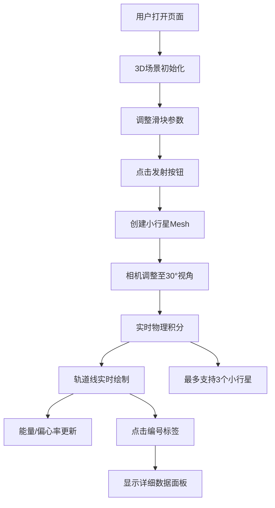

## 1. 产品概述

引力弹弓模拟器是一款基于WebGL的3D交互式天体物理可视化工具，用户可在浏览器中实时观察小行星在恒星引力场中的轨道演化与引力弹弓效应。
- 面向天文爱好者、物理学习者和教育工作者，提供直观的引力场模拟体验
- 通过实时物理计算与3D可视化，降低抽象物理概念的理解门槛

## 2. 核心特性

### 2.1 功能模块
1. **主场景页面**：3D宇宙场景、恒星、小行星实时模拟、轨道线可视化
2. **控制面板**：小行星参数配置（质量、速度、角度）、发射按钮
3. **信息显示**：轨道能量、偏心率、小行星详细数据面板

### 2.2 页面详情
| 页面名称 | 模块名称 | 功能描述 |
|---------|---------|---------|
| 主场景 | 3D渲染区 | 显示恒星、小行星、轨道线、网格辅助线 |
| 主场景 | 浮动信息栏 | 实时显示轨道能量、偏心率数值 |
| 控制面板 | 参数滑块 | 调整小行星质量(1-50)、速度(0.5-5)、角度(0-360°) |
| 控制面板 | 发射按钮 | 按配置参数发射小行星 |
| 信息面板 | 详情展示 | 显示选中小行星的速度向量、位置、距离、轨道周期 |

## 3. 核心流程
用户打开页面 → 调整控制面板参数 → 点击发射按钮 → 小行星出现在场景中 → 相机自动调整视角 → 实时物理计算与轨道绘制 → 点击小行星编号查看详情 → 可继续发射最多3个小行星

## 4. 用户界面设计

### 4.1 设计风格
- **主色调**：深空蓝黑渐变背景(#030814 → #0b1325)，高亮蓝(#4488ff/#88ccff)
- **按钮风格**：圆角8px，蓝色渐变(#3366ff → #88ccff)，悬浮亮度+20%
- **字体**：细黑体标题带发光描边，16px白色细字体编号标签
- **布局**：左上角标题 + 右侧320px控制面板 + 右下角信息面板 + 顶部浮动数据
- **视觉效果**：毛玻璃面板、发光阴影、0.15秒ease-out过渡动画

### 4.2 页面设计概览
| 页面名称 | 模块名称 | UI元素 |
|---------|---------|-------|
| 主场景 | 3D区域 | 黄色发光恒星(半径2)、灰色小行星球体、彩色轨道线、网格辅助线 |
| 主场景 | 浮动信息 | 能量(绿色#44ff88/白色)、偏心率(白色) |
| 控制面板 | 容器 | 320px宽，rgba(10,20,40,0.7)，2px边框#4488ff50，圆角16px |
| 控制面板 | 滑块 | 轨道#1a2a4a，手柄蓝色渐变，1.2倍放大+3px发光阴影 |
| 信息面板 | 容器 | 毛玻璃rgba(255,255,255,0.05)，12px模糊，圆角12px |

### 4.3 响应式
- 桌面端优先，保证≥1280px宽度下最佳体验
- 控制面板固定右侧，信息面板固定右下角

### 4.4 3D场景指南
- **环境**：纯深空背景，径向渐变，无HDRI
- **光照**：恒星为黄色点光源，位置在场景中心
- **相机**：透视相机，发射后自动调整至轨道平面30°仰角
- **交互**：编号标签始终面向相机(Billboard)，点击选中高亮
- **特效**：小行星靠近恒星时黄→红渐变光晕，选中小行星1.5倍半透明发光圈
- **性能**：轨道点最多300个，超出后最早点1秒淡出；低于20FPS自动降采样
