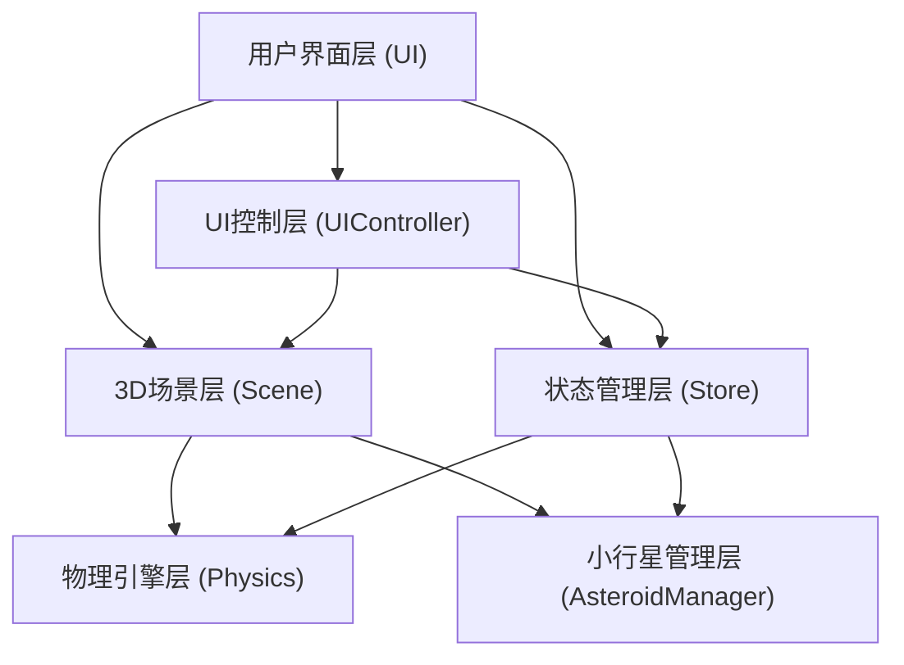
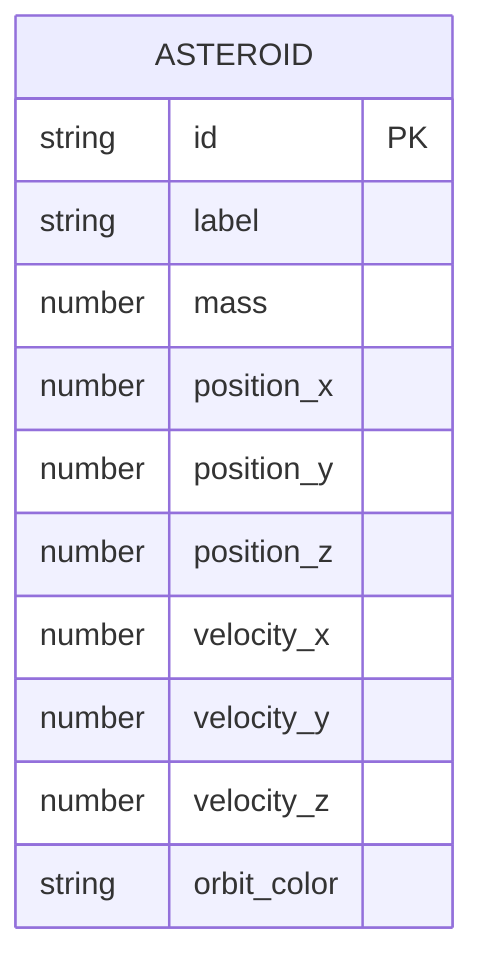

## 1. 架构设计



## 2. 技术描述
- **前端**：TypeScript + Three.js + Vite
- **状态管理**：Zustand
- **无后端**：纯前端WebGL应用
- **初始化工具**：Vite (自定义配置，非React/Vue模板)

## 3. 项目文件结构
| 文件 | 目的 |
|-----|------|
| package.json | 依赖：three, @types/three, typescript, vite, zustand |
| index.html | 入口HTML，包含基本样式和挂载点 |
| tsconfig.json | 严格模式，ES2020模块 |
| vite.config.js | 基础配置，开发服务器端口3000 |
| src/main.ts | 应用入口，初始化场景、相机、渲染器，启动主循环 |
| src/physicsEngine.ts | 引力计算模块 |
| src/store.ts | Zustand状态管理 |
| src/uiController.ts | UI控制模块 |
| src/sceneSetup.ts | 3D场景搭建模块 |
| src/asteroidManager.ts | 小行星管理模块 |

## 4. 模块接口定义

### 4.1 physicsEngine.ts
```typescript
export interface Vector3 { x: number; y: number; z: number; }

export function calcGravityAcceleration(
  asteroidPos: Vector3,
  starPos: Vector3,
  starMass: number
): Vector3;

export function integrateOrbitStep(
  position: Vector3,
  velocity: Vector3,
  acceleration: Vector3,
  dt: number
): { position: Vector3; velocity: Vector3 };

export function calcOrbitalEnergy(
  position: Vector3,
  velocity: Vector3,
  starMass: number
): { kinetic: number; potential: number; total: number };
```

### 4.2 store.ts
```typescript
export interface Asteroid {
  id: string;
  label: string; // A01, A02, A03
  mass: number;
  position: Vector3;
  velocity: Vector3;
  orbitColor: string;
}

export interface StoreState {
  asteroids: Asteroid[];
  selectedId: string | null;
  params: {
    mass: number;
    speed: number;
    angle: number;
  };
  addAsteroid: (asteroid: Asteroid) => void;
  updateAsteroid: (id: string, data: Partial<Asteroid>) => void;
  removeAsteroid: (id: string) => void;
  selectAsteroid: (id: string | null) => void;
  setParam: <K extends keyof StoreState['params']>(key: K, value: StoreState['params'][K]) => void;
}
```

### 4.3 sceneSetup.ts
```typescript
export function setupScene(): {
  scene: THREE.Scene;
  camera: THREE.PerspectiveCamera;
  renderer: THREE.WebGLRenderer;
  star: THREE.Mesh;
  starLight: THREE.PointLight;
  gridHelper: THREE.GridHelper;
};

export function updateOrbitLines(
  scene: THREE.Scene,
  orbitLines: Map<string, THREE.Line>,
  asteroidData: { id: string; points: THREE.Vector3[]; color: string }[]
): void;
```

### 4.4 asteroidManager.ts
```typescript
export interface AsteroidObject {
  mesh: THREE.Mesh;
  glowMesh: THREE.Mesh;
  label: HTMLDivElement;
  orbitPoints: THREE.Vector3[];
  orbitLine: THREE.Line;
  highlightRing: THREE.Mesh;
}

export function createAsteroid(
  scene: THREE.Scene,
  id: string,
  label: string,
  mass: number,
  position: THREE.Vector3,
  velocity: THREE.Vector3,
  orbitColor: string
): AsteroidObject;

export function updateAsteroidPosition(
  obj: AsteroidObject,
  position: THREE.Vector3,
  starPosition: THREE.Vector3,
  camera: THREE.Camera
): void;

export function removeAsteroid(
  scene: THREE.Scene,
  obj: AsteroidObject
): void;
```

## 5. 数据模型

### 5.1 小行星数据结构


## 6. 性能优化策略
- 轨道点上限300个，FIFO淘汰+1秒淡出动画
- FPS低于20时自动降采样（每2帧采1个轨道点）
- 小行星编号使用CSS2DRenderer实现Billboard效果
- 物理计算使用简单欧拉积分，每帧执行
