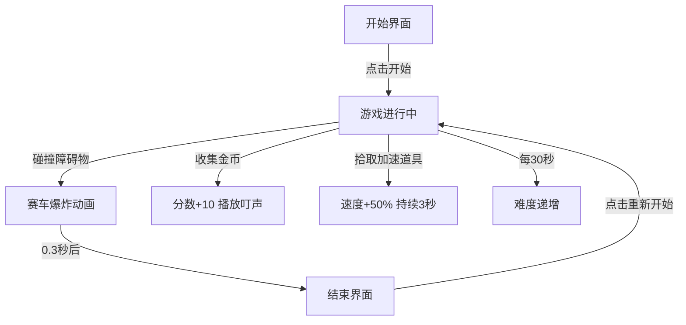

## 1. 产品概述
像素风无限跑酷赛车游戏——"极速像素"，玩家控制蓝色赛车在随机生成的无限赛道上躲避障碍物、收集金币与加速道具，随时间推移难度递增，提升重玩性和挑战性。目标用户为休闲游戏玩家和像素风格爱好者。

## 2. 核心功能

### 2.1 功能模块
1. **游戏界面**：800x600 Canvas 游戏画布，赛道无限滚动，赛车左右移动躲避障碍物
2. **开始界面**：像素风格标题"极速像素"与"开始游戏"按钮
3. **结束界面**：显示"游戏结束"、最终得分与"重新开始"按钮

### 2.2 页面详情
| 页面名称 | 模块名称 | 功能描述 |
|----------|----------|----------|
| 开始界面 | 标题区 | 像素风格标题"极速像素"，深蓝色背景#1a1a2e，字体"Press Start 2P"，字号36，白色带蓝色发光描边 |
| 开始界面 | 按钮区 | "开始游戏"按钮，宽150px高40px，渐变色#667eea→#764ba2，圆角4px，悬停亮度1.2倍 |
| 游戏界面 | Canvas画布 | 800x600居中画布，边框2px实线#2a2a4e，渲染赛道/赛车/障碍物/金币/道具 |
| 游戏界面 | HUD状态栏 | 顶部显示分数（白色像素字体24px）、已玩时间（秒）、加速道具剩余时间（绿色进度条100x8px） |
| 结束界面 | 结果区 | "游戏结束"标题、"最终得分：XXX"、"重新开始"按钮（样式同开始按钮） |

## 3. 核心流程

1. 玩家打开页面 → 显示开始界面
2. 点击"开始游戏" → 进入游戏，赛道开始滚动
3. 玩家用左右方向键控制赛车水平移动，躲避障碍物，收集金币和加速道具
4. 赛道持续生成，每30秒速度提升10%、障碍物密度增加15%，3分钟达到最大难度
5. 碰撞障碍物 → 赛车爆炸（6个橙色方块粒子，0.3秒） → 游戏结束
6. 显示结束界面 → 点击"重新开始" → 回到步骤2

## 4. 用户界面设计

### 4.1 设计风格
- 主色调：深蓝色#0f0f23（背景）、#1a1a2e（开始界面背景）
- 赛车：蓝色#4488ff（宽40px高60px）
- 障碍物：油桶红色#cc3333（圆形半径15px）、路障橙色#ff8844（矩形20x30px）、尖刺灰色#666688（三角形底20高20px）
- 金币：黄色#ffcc00（五角星半径12px）
- 加速道具：绿色#44cc44（闪电图标20x20px）
- 按钮：渐变色#667eea→#764ba2，圆角4px
- 字体："Press Start 2P"像素风格字体
- 布局：居中布局，Canvas画布居中显示

### 4.2 页面设计概览
| 页面名称 | 模块名称 | UI元素 |
|----------|----------|--------|
| 开始界面 | 标题 | "极速像素"，Press Start 2P字体，36px，白色，蓝色发光描边 |
| 开始界面 | 按钮 | "开始游戏"，150x40px，渐变背景，白色文字16px |
| 游戏界面 | Canvas | 800x600，深色背景，2px边框#2a2a4e |
| 游戏界面 | HUD | 分数/时间/加速进度条，白色像素字体24px |
| 结束界面 | 结果 | "游戏结束"+得分+重新开始按钮，深灰到浅灰渐变按钮 |

### 4.3 响应式
- 桌面优先设计，移动设备自动居中缩放
- 最小支持宽度320px
- Canvas使用CSS transform缩放适配屏幕

### 4.4 音效
- 金币收集：Web Audio API生成440Hz正弦波，持续0.1秒，模拟"叮"声
