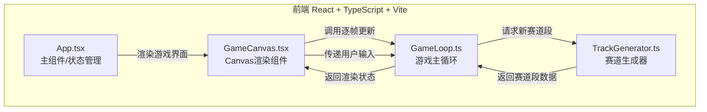

## 1. 架构设计



## 2. 技术说明
- 前端：React@18 + TypeScript + Vite
- 初始化工具：vite-init (react-ts 模板)
- 后端：无
- 数据库：无

## 3. 路由定义
无路由，单页面应用通过状态切换界面（未开始/进行中/结束）

## 4. 文件结构与调用关系

| 文件 | 职责 | 调用关系 |
|------|------|----------|
| `package.json` | 项目依赖与脚本 | - |
| `vite.config.js` | 构建配置 | - |
| `tsconfig.json` | TypeScript严格模式配置 | - |
| `index.html` | 入口页面，引入"Press Start 2P"字体 | - |
| `src/main.tsx` | React入口，挂载App | 引用App.tsx |
| `src/App.tsx` | 主组件，管理游戏状态，渲染三个界面 | 引用GameCanvas.tsx |
| `src/GameCanvas.tsx` | Canvas渲染组件，监听键盘，逐帧绘制 | 调用GameLoop.ts |
| `src/GameLoop.ts` | 游戏主循环，帧率控制/碰撞检测/计分 | 调用TrackGenerator.ts |
| `src/TrackGenerator.ts` | 赛道生成器，根据难度生成赛道段 | 被GameLoop调用 |

### 数据流向
1. **用户输入**：键盘方向键 → GameCanvas监听 → 传递给GameLoop
2. **游戏更新**：GameLoop更新赛车坐标 → 检测碰撞 → 更新分数/状态
3. **赛道生成**：GameLoop请求新段 → TrackGenerator生成并返回段数据 → GameLoop加入渲染队列
4. **渲染**：GameCanvas从GameLoop获取状态 → Canvas绘制赛道/赛车/障碍物/金币/道具/HUD

## 5. 核心数据结构

### 5.1 赛道段
```typescript
interface TrackSegment {
  y: number;
  obstacles: Obstacle[];
  coins: Coin[];
  powerups: Powerup[];
}

interface Obstacle {
  type: 'barrel' | 'barrier' | 'spike';
  x: number;
  y: number;
}

interface Coin {
  x: number;
  y: number;
  collected: boolean;
}

interface Powerup {
  type: 'speed';
  x: number;
  y: number;
  collected: boolean;
}
```

### 5.2 游戏状态
```typescript
interface GameState {
  car: { x: number; y: number };
  score: number;
  time: number;
  speedBoostRemaining: number;
  scrollSpeed: number;
  segments: TrackSegment[];
  particles: Particle[];
  gameOver: boolean;
}
```
