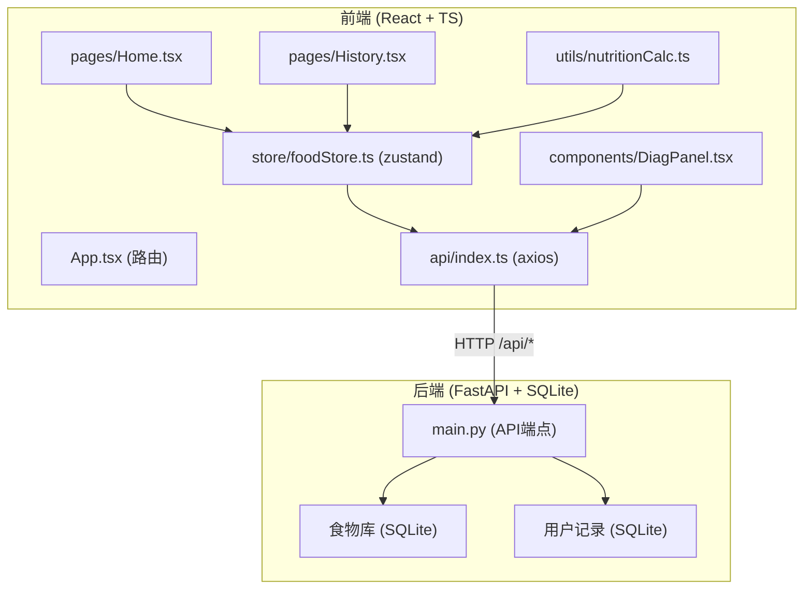
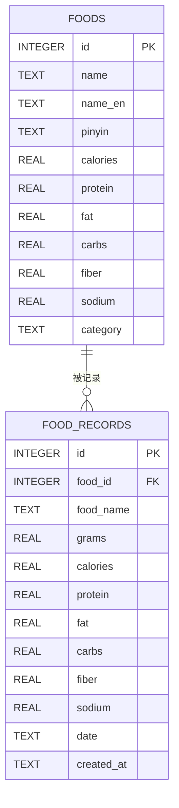

## 1. 架构设计

前后端分离架构，前端使用 React + TypeScript + Vite，后端使用 FastAPI + SQLite。前端通过 axios 调用后端 API，状态管理使用 zustand。



## 2. 技术说明

- **前端框架**：React 18 + TypeScript
- **构建工具**：Vite 5
- **状态管理**：zustand 4
- **路由**：react-router-dom 6
- **HTTP客户端**：axios 1
- **图表库**：chart.js 4 + react-chartjs-2 5
- **PDF生成**：jspdf 2
- **后端框架**：FastAPI 0.100+
- **ASGI服务器**：uvicorn
- **数据库**：SQLite（本地文件）
- **路径别名**：@/ 映射到 src/

## 3. 路由定义

| 路由 | 页面 | 说明 |
|------|------|------|
| / | Home | 首页，食物记录与当日营养概览 |
| /history | History | 历史页面，30天趋势与周报 |
| /food-search | Home | 食物搜索（重定向到首页） |

## 4. API 定义

### 4.1 类型定义（TypeScript）
```typescript
// 食物信息
interface FoodItem {
  id: number;
  name: string;
  nameEn: string;
  pinyin: string;
  calories: number;      // kcal/100g
  protein: number;       // g/100g
  fat: number;           // g/100g
  carbs: number;         // g/100g
  fiber: number;         // g/100g
  sodium: number;        // mg/100g
  category: string;
}

// 记录项
interface FoodRecord {
  id: number;
  foodId: number;
  foodName: string;
  grams: number;
  calories: number;
  protein: number;
  fat: number;
  carbs: number;
  fiber: number;
  sodium: number;
  createdAt: string;
}

// 当日汇总
interface DailySummary {
  date: string;
  totalCalories: number;
  totalProtein: number;
  totalFat: number;
  totalCarbs: number;
  totalFiber: number;
  totalSodium: number;
  records: FoodRecord[];
}

// 诊断建议
interface DiagnosisAdvice {
  id: string;
  title: string;
  description: string;
  severity: 'low' | 'medium' | 'high';
  category: 'protein' | 'fat' | 'carbs' | 'fiber' | 'sodium' | 'calories';
  alternatives: FoodItem[];
}

// 分析响应
interface AnalysisResponse {
  period: string;
  avgCalories: number;
  advices: DiagnosisAdvice[];
  macroRatio: { protein: number; fat: number; carbs: number };
}
```

### 4.2 端点列表

| 方法 | 路径 | 说明 | 请求参数 | 响应 |
|------|------|------|----------|------|
| GET | /api/food/search | 模糊搜索食物 | q: string | FoodItem[] |
| GET | /api/food/list | 获取食物列表（分页） | page, pageSize | {items, total} |
| POST | /api/food/record | 添加食物记录 | {foodId, grams, date?} | FoodRecord |
| GET | /api/food/record | 获取某日记录 | date: string | DailySummary |
| DELETE | /api/food/record/:id | 删除记录 | id | {success} |
| GET | /api/analysis | 获取营养分析 | days: number (默认7) | AnalysisResponse |
| GET | /api/history | 获取历史数据 | startDate, endDate | DailySummary[] |
| GET | /api/report/weekly | 生成周报 | weekStart | {pdfUrl} |

## 5. 后端架构


- **API路由层**：定义端点、请求校验、响应格式化
- **业务逻辑层**：营养计算、诊断分析、报告生成
- **数据访问层**：SQLite CRUD 操作

## 6. 数据模型

### 6.1 ER图


### 6.2 推荐摄入量（WHO标准）
| 营养素 | 成年女性推荐 | 成年男性推荐 | 单位 |
|--------|-------------|-------------|------|
| 热量 | 1800 | 2250 | kcal/天 |
| 蛋白质 | 50 | 60 | g/天 |
| 脂肪 | 60 | 75 | g/天 |
| 碳水化合物 | 250 | 320 | g/天 |
| 膳食纤维 | 25 | 30 | g/天 |
| 钠 | 2000 | 2000 | mg/天 |

### 6.3 初始数据
- 预置至少100种常见食材与市售食品
- 分类：主食、蔬菜、水果、肉类、蛋奶、豆制品、坚果、饮料、零食、调味品
- 包含中英文名称与拼音用于搜索

## 7. 项目文件结构

```
auto60/
├── package.json
├── index.html
├── tsconfig.json
├── vite.config.js
├── src/
│   ├── App.tsx
│   ├── main.tsx
│   ├── index.css
│   ├── store/
│   │   └── foodStore.ts
│   ├── api/
│   │   └── index.ts
│   ├── pages/
│   │   ├── Home.tsx
│   │   └── History.tsx
│   ├── components/
│   │   ├── DiagPanel.tsx
│   │   ├── Sidebar.tsx
│   │   ├── FoodSearch.tsx
│   │   ├── MacroChart.tsx
│   │   ├── RadarChart.tsx
│   │   ├── Timeline.tsx
│   │   ├── FoodModal.tsx
│   │   └── LineChart.tsx
│   ├── utils/
│   │   └── nutritionCalc.ts
│   └── types/
│       └── index.ts
└── src/backend/
    ├── main.py
    ├── food_data.py
    └── nutrition.db (运行时生成)
```
