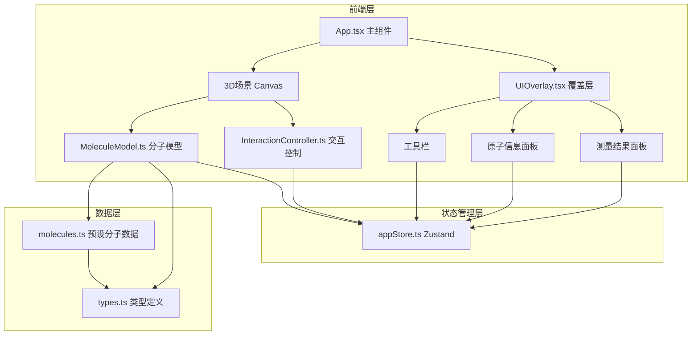
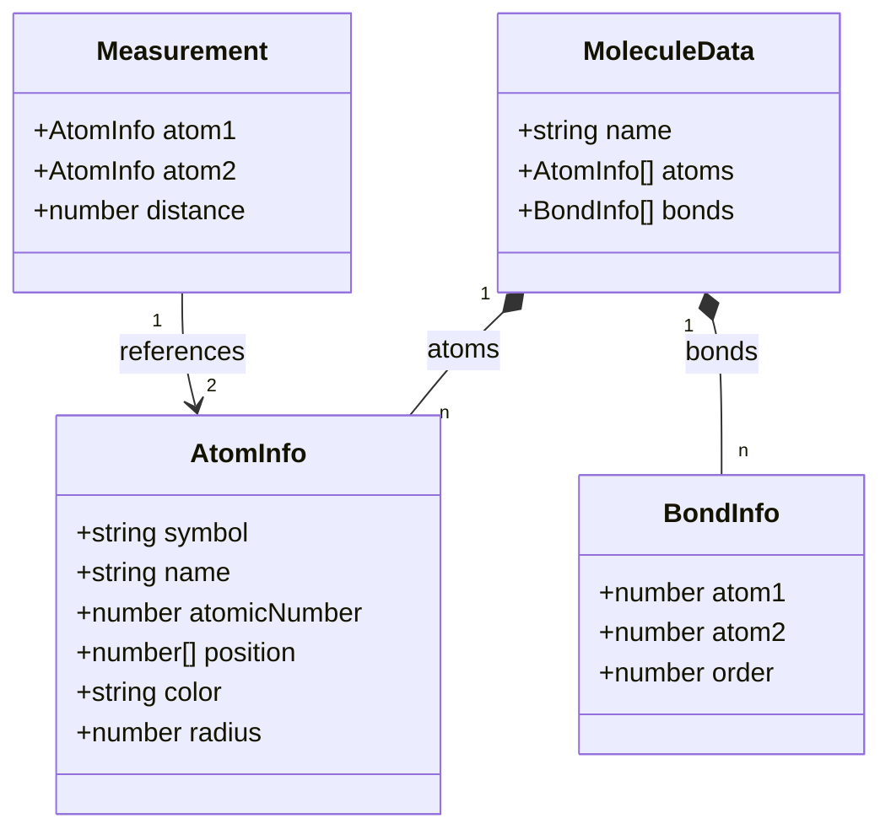

## 1. 架构设计

## 2. 技术说明
- 前端：React 18 + TypeScript + Vite
- 3D渲染：Three.js + @react-three/fiber + @react-three/drei
- 状态管理：Zustand
- 初始化工具：vite-init (react-ts模板)
- 后端：无
- 数据库：无（使用预设分子数据）

## 3. 路由定义
| 路由 | 用途 |
|------|------|
| / | 主页面，3D分子查看器 |

## 4. API定义
无后端API，所有数据为前端预设。

## 5. 服务器架构图
无后端服务。

## 6. 数据模型

### 6.1 数据模型定义

### 6.2 数据定义
预设分子数据：
- H2O（水）：1个氧原子 + 2个氢原子，2条单键
- CO2（二氧化碳）：1个碳原子 + 2个氧原子，2条双键
- CH4（甲烷）：1个碳原子 + 4个氢原子，4条单键
- C6H6（苯环）：6个碳原子 + 6个氢原子，6条C-C键 + 3条双键 + 6条C-H键

原子序数映射：H=1, C=6, N=7, O=8
