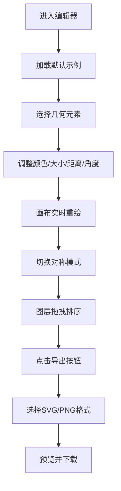

## 1. 产品概述

曼陀罗图案在线编辑器，一个基于Web的创意设计工具，用户通过组合几何元素和自定义参数，实时生成对称美观的曼陀罗艺术作品，支持导出矢量SVG和高清PNG。

- 面向创意设计爱好者、艺术家、冥想用户，提供零门槛的曼陀罗创作体验
- 通过直观的参数调整和实时预览，降低对称图案设计的技术门槛，提升创作效率

## 2. 核心功能

### 2.1 功能模块

1. **元素控制面板**：10种基础几何形状选择、填充/描边颜色设置、大小/距离/角度参数调节
2. **画布渲染区**：SVG实时渲染曼陀罗图案，支持对称变换
3. **图层面板**：多图层管理、拖拽排序、选中高亮、删除操作
4. **对称模式控制**：镜像对称/旋转对称切换、份数设置、角度微调
5. **导出功能**：SVG矢量导出、2048x2048 PNG导出、预览模态框

### 2.2 页面详情

| 页面名称 | 模块名称 | 功能描述 |
|---------|---------|---------|
| 主编辑器 | 元素面板 | 10种几何形状选择器、颜色拾取器、滑块参数控件 |
| 主编辑器 | 中央画布 | SVG曼陀罗实时渲染、选中元素高亮、响应式缩放 |
| 主编辑器 | 图层面板 | 图层列表、拖拽排序、缩略图预览、选中/删除操作 |
| 主编辑器 | 顶部工具栏 | 对称模式切换、份数设置、角度微调、导出按钮 |
| 主编辑器 | 导出模态框 | SVG/PNG预览、下载按钮、缩略图展示 |
| 主编辑器 | Toast提示 | 操作反馈、3秒自动消失、下滑入动画 |

## 3. 核心流程

用户进入页面 → 默认加载示例图层 → 选择/添加几何元素 → 调整颜色和参数（画布实时更新）→ 切换对称模式/份数 → 通过图层面板调整堆叠顺序 → 点击导出 → 选择SVG/PNG格式 → 预览并下载

## 4. 用户界面设计

### 4.1 设计风格

- **主色调**：暖色渐变背景（#fdefd6 → #f9c69b），柔光白色面板（#fffaf4）
- **按钮样式**：圆角12px，悬停微阴影（0 4px 12px rgba(0,0,0,0.08)），过渡动画0.2秒
- **字体**：Google Fonts - 'Playfair Display'（标题） + 'DM Sans'（正文）
- **布局风格**：三栏卡片式布局，柔和阴影，圆角16px，留白充足
- **动画效果**：对称模式切换0.3秒淡入淡出，Toast提示下滑入，滑块拖动实时反馈

### 4.2 页面设计概览

| 页面名称 | 模块名称 | UI元素 |
|---------|---------|---------|
| 主编辑器 | 元素面板 | 形状网格选择器、色环取色器、数值滑块、HEX/RGB输入框 |
| 主编辑器 | 中央画布 | SVG viewBox自适应、元素hover高亮、选中描边 |
| 主编辑器 | 图层面板 | react-beautiful-dnd拖拽列表、图层缩略图、参数摘要标签、删除图标 |
| 主编辑器 | 顶部工具栏 | 分段控件（对称模式）、数字步进器（份数）、滑块（角度偏移）、主按钮（导出） |
| 主编辑器 | 导出模态框 | 居中遮罩、预览卡片、双下载按钮、关闭图标 |

### 4.3 响应式

- 桌面端（≥1200px）：三栏布局（左280px + 中自适应 + 右280px），主面板1200px居中
- 平板（768-1199px）：两栏布局（画布自适应 + 右侧合并面板）
- 移动端（<768px）：单列布局，元素面板变为顶部可收起抽屉，图层面板变为底部抽屉，触控区域≥44px

### 4.4 性能要求

- 参数修改到画布重绘延迟 < 50ms
- 交互帧率 ≥ 55fps
- SVG元素使用memo优化避免不必要重渲染
- zustand选择器精确订阅，减少组件无效渲染
