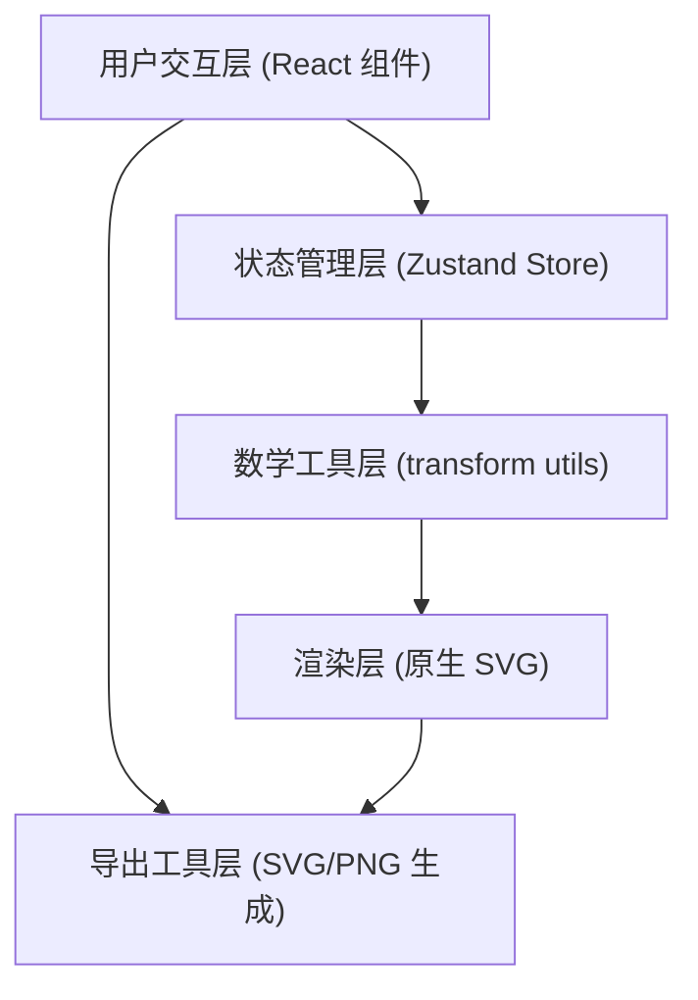

## 1. 架构设计



## 2. 技术描述

- **前端框架**：React 18 + TypeScript（严格模式，target ES2020）
- **构建工具**：Vite 5
- **状态管理**：zustand 4（轻量级、immutable更新）
- **拖拽库**：react-beautiful-dnd（图层面板排序）
- **渲染方式**：原生SVG元素（无外部图形库）
- **样式方案**：CSS Modules + CSS Variables（暖色主题）
- **后端**：无（纯前端单页应用）

## 3. 项目结构

```
src/
├── main.tsx              # ReactDOM 渲染入口
├── App.tsx               # 主应用组件，组合面板和画布
├── store.ts              # zustand 全局状态
├── utils/
│   └── transform.ts      # 对称变换和坐标计算（纯函数）
└── components/
    ├── ElementPanel.tsx  # 左侧元素选择和参数面板
    ├── Canvas.tsx        # 中央SVG画布
    ├── LayerPanel.tsx    # 右侧图层管理面板
    └── ExportModal.tsx   # 导出模态框
```

## 4. 核心数据模型

```typescript
type ShapeType = 'circle' | 'ellipse' | 'diamond' | 'hexagon' | 'triangle' | 
                 'star' | 'petal' | 'ring' | 'stripe' | 'zigzag';

interface Layer {
  id: string;
  shape: ShapeType;
  fillColor: string;      // HEX格式
  strokeColor: string;
  strokeWidth: number;    // 1-8px
  scale: number;          // 0.5-2.0
  radialDistance: number; // 0-200px
  rotation: number;       // 0-360度
}

interface CanvasConfig {
  symmetryMode: 'mirror' | 'rotational';
  symmetryCount: 4 | 6 | 8 | 12;
  angleOffset: number;    // -30 到 +30 度
}

interface EditorState {
  layers: Layer[];
  selectedLayerId: string | null;
  canvasConfig: CanvasConfig;
  // actions
  addLayer: (shape: ShapeType) => void;
  updateLayer: (id: string, patch: Partial<Layer>) => void;
  removeLayer: (id: string) => void;
  reorderLayers: (fromIndex: number, toIndex: number) => void;
  selectLayer: (id: string | null) => void;
  setCanvasConfig: (patch: Partial<CanvasConfig>) => void;
}
```

## 5. 核心算法

### 5.1 旋转变换
- 根据 `symmetryCount` 将元素复制 N 份
- 每份旋转角度 = (360° / N) × 索引 + angleOffset
- 所有变换围绕画布中心 (cx, cy) 进行

### 5.2 镜像变换
- 沿垂直轴线 x = cx 镜像
- 使用 SVG `<use>` + `scale(-1, 1)` 实现
- 元素同时绘制原始位置和镜像位置

### 5.3 坐标映射
- 径向距离 `radialDistance` 沿 0°方向（右侧）偏移
- `rotation` 为元素自身旋转
- 最终变换：translate(cx, cy) → rotate(angleOffset) → translate(radialDistance, 0) → rotate(rotation) → scale(scale)

## 6. 导出实现

### SVG导出
- 序列化画布根SVG元素（保留完整DOM结构和defs）
- 添加XML声明和命名空间
- Blob URL触发下载

### PNG导出
- 创建离屏 `<canvas>` 2048×2048
- 构造ImageData或使用 `new Image()` 加载 SVG Blob
- `canvas.toBlob()` 生成 PNG 并下载

## 7. 性能优化策略

1. **zustand选择器**：组件仅订阅所需state切片，避免全量re-render
2. **React.memo**：Shape子组件包裹memo，props浅比较
3. **useMemo缓存**：对称变换矩阵计算结果缓存
4. **requestAnimationFrame**：高频参数变化合并到下一帧渲染
5. **SVG defs复用**：相同元素定义使用 `<use>` 引用，减少DOM节点
