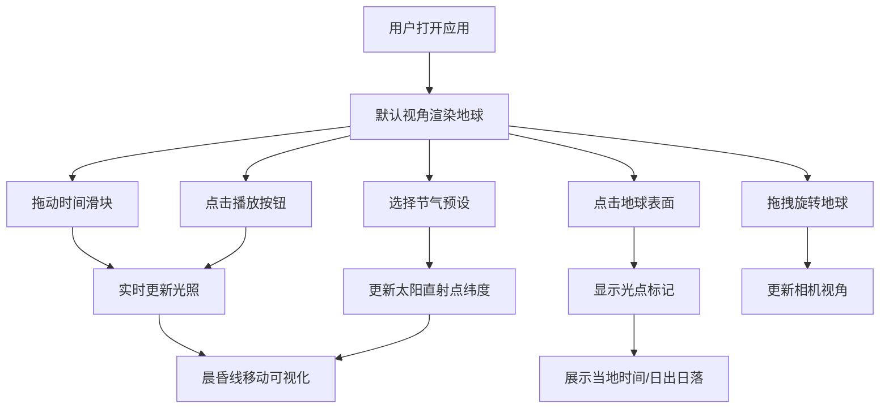

## 1. 产品概述

3D地球昼夜模拟器是一款面向在线地理教学场景的交互式可视化工具，帮助学生直观理解经纬度与昼夜更替的关系。通过拖拽旋转地球、调整时间滑块，用户可以实时观察全球光照变化、晨昏线移动，并查询任意地点的当地时间与日出日落信息。

- **核心价值**：将抽象的地理概念转化为可交互的3D可视化体验，提升教学效果
- **目标用户**：地理教师、学生、地理爱好者

## 2. 核心功能

### 2.1 用户角色

| 角色 | 注册方式 | 核心权限 |
|------|----------|----------|
| 访客用户 | 无需注册 | 浏览、交互、查询地理信息 |

### 2.2 功能模块

1. **3D地球场景**：带纹理地球渲染、半透明云层、动态光照系统、晨昏线渐变过渡、赤道与回归线标记
2. **时间控制面板**：24小时时间滑块（精度到分钟）、播放/暂停动画、日期预设（春分/夏至/秋分/冬至）
3. **经纬度交互**：点击地球表面获取位置信息、显示当地时间、日出日落时间、光点标记动画
4. **视角控制**：鼠标拖拽旋转、重置视角按钮

### 2.3 页面详情

| 页面名称 | 模块名称 | 功能描述 |
|----------|----------|----------|
| 主页面 | 3D地球场景 | Three.js渲染带纹理地球、云层、光照、晨昏线、赤道/回归线 |
| 主页面 | 控制面板 | 时间滑块、播放/暂停、日期预设、重置视角、位置信息显示 |
| 主页面 | 星场背景 | Canvas生成随机星空背景 |

## 3. 核心流程

用户打开应用→默认视角观察地球→拖拽旋转查看不同区域→拖动时间滑块观察昼夜变化→点击播放自动演示时间流逝→选择不同节气预设观察太阳直射点变化→点击地球表面查看当地时间与日出日落信息→重置视角回到初始状态

## 4. 用户界面设计

### 4.1 设计风格

- **主题**：深空科技风格，模拟宇宙环境
- **主背景**：径向渐变 `#0a0e1a` → `#141e30`
- **控制面板**：半透明深色毛玻璃 `rgba(10,14,26,0.85)`，模糊8px，边框 `rgba(255,255,255,0.1)`
- **主色调**：亮蓝色 `#66ccff`（交互元素）、渐变蓝 `#4488ff→#2a5fff`（按钮）
- **强调色**：发光绿色 `#88ff88`（数据显示）、红色（回归线）
- **字体**：系统无衬线字体 + 等宽字体（Monospace用于数字显示）
- **控件圆角**：8px
- **动效**：按钮hover变亮、点击缩小0.95倍（0.2s ease）、滑块光晕扩散（0.3s）

### 4.2 页面设计概述

| 页面名称 | 模块名称 | UI元素 |
|----------|----------|--------|
| 主页面 | 3D场景区 | 居中占70%宽度、全高、可交互地球、星空背景 |
| 主页面 | 控制面板 | 右侧280px宽、毛玻璃背景、时间滑块、按钮组、数据显示区 |
| 主页面 | 响应式布局 | ≤1024px时面板变为底部固定条（高120px，横向滚动） |

### 4.3 响应式设计

- 桌面端（≥1280px）：3D场景居中70%宽度，右侧280px控制面板
- 中等屏幕（1024-1279px）：自适应布局，保持完整显示
- 小屏幕（<1024px）：控制面板变为底部固定条，高度120px，横向滚动，3D场景填充剩余空间

### 4.4 3D场景指导

- **环境**：深空背景，Canvas生成随机星点（亮度0.3-0.6）
- **光照**：平行光模拟太阳光（方向随时间动态变化），深蓝色环境光（亮度0.1）补光夜晚面
- **地球**：带高清纹理贴图的球体，半径1单位
- **云层**：半透明球体包裹地球，旋转速度为地球的50%
- **晨昏线**：径向渐变过渡带，宽度为地球周长的5%
- **标记线**：赤道（白色半透明虚线）、南北回归线（红色虚线，±23.5°）
- **相机**：默认距离地球2.5单位，正面赤道视角，OrbitControls控制旋转
- **交互**：点击地球显示光点标记（持续2秒）
- **性能**：保证拖拽响应<50ms，滑块更新≥30fps，播放动画≥60fps，低帧率时自动降级云层纹理
