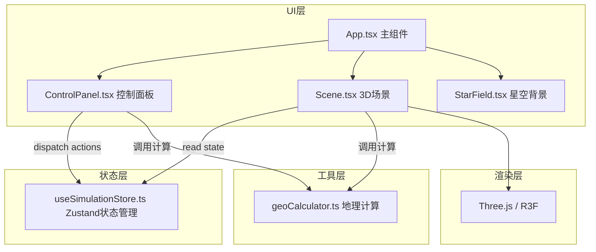

## 1. 架构设计



## 2. 技术说明

- **前端框架**：React 18 + TypeScript
- **构建工具**：Vite
- **3D渲染**：Three.js + @react-three/fiber + @react-three/drei
- **状态管理**：Zustand
- **样式方案**：原生CSS（配合CSS变量）
- **无后端**：纯前端应用，所有计算在浏览器端完成

## 3. 文件结构与调用关系

```
src/
├── App.tsx                    # 主组件，组合Scene和ControlPanel
├── components/
│   ├── Scene.tsx              # 3D场景渲染（读取store更新3D对象）
│   ├── ControlPanel.tsx       # 控制面板UI（dispatch action更新store）
│   └── StarField.tsx          # Canvas星空背景
├── store/
│   └── useSimulationStore.ts  # Zustand状态管理（时间/视角/选中位置/播放状态）
└── utils/
    └── geoCalculator.ts       # 地理计算纯函数（太阳位置/当地时间/日出日落）
```

**数据流向**：
- 用户操作 → ControlPanel触发action → Zustand store更新 → Scene读取新状态 → 更新3D可视化
- 用户点击地球 → Scene获取经纬度 → dispatch更新store → ControlPanel显示位置信息
- 时间变化 → Scene调用geoCalculator计算太阳位置 → 更新光照方向

## 4. 核心数据模型

### Zustand Store 状态

```typescript
interface SimulationState {
  time: number              // 分钟级整数 0-1439
  cameraPosition: [number, number, number]  // 相机位置[x,y,z]
  selectedLat: number | null
  selectedLon: number | null
  isPlaying: boolean
  seasonPreset: 'vernal' | 'summer' | 'autumnal' | 'winter'
  sunDeclination: number    // 太阳直射点纬度（由seasonPreset计算）
  
  // Actions
  setTime: (t: number) => void
  setCameraPosition: (pos: [number, number, number]) => void
  setSelectedPosition: (lat: number | null, lon: number | null) => void
  play: () => void
  pause: () => void
  togglePlay: () => void
  resetCamera: () => void
  setSeasonPreset: (preset: 'vernal' | 'summer' | 'autumnal' | 'winter') => void
}
```

### 地理计算输出

```typescript
interface SunPosition {
  lat: number   // 太阳直射点纬度
  lon: number   // 太阳直射点经度
}

interface SunriseSunset {
  sunrise: string  // "HH:MM"
  sunset: string   // "HH:MM"
}
```

## 5. 关键技术实现要点

### 5.1 3D光照系统
- 使用`DirectionalLight`模拟太阳光，位置由太阳直射点经纬度转换为3D坐标
- 地球材质使用`MeshStandardMaterial`，支持光照计算
- 晨昏线渐变通过自定义Shader或多层半透明渐变网格实现

### 5.2 经纬度拾取
- 使用Three.js Raycaster进行射线拾取
- 将拾取点的3D坐标转换为经纬度（球面坐标转换）

### 5.3 时间动画
- `requestAnimationFrame`驱动，每100ms增加6分钟（10倍速）
- 使用Zustand store的setTime方法更新状态

### 5.4 性能优化
- 云层纹理动态降级（帧率<30时从1024x512降至512x256）
- 状态变更尽量减少3D对象重建，仅更新transform和uniform
