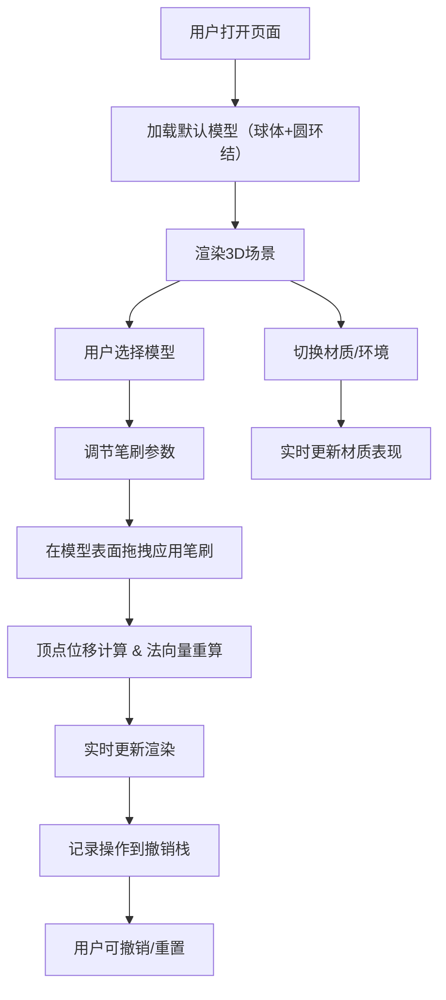

## 1. 产品概述

数字雕塑预览器是一款面向数字艺术家和游戏建模师的Web应用，允许用户在浏览器中实时查看和交互式调节3D模型表面细节，无需打开Blender、ZBrush等重型软件即可快速预览和微调模型的凹凸细节、平滑度及材质质感。

## 2. 核心功能

### 2.1 功能模块

1. **3D视口模块**：模型加载、实时渲染、视角控制
2. **笔刷工具模块**：推拉、平滑、膨胀三种笔刷类型，参数可调节
3. **材质系统模块**：四种预设材质，四种环境贴图
4. **历史操作模块**：撤销最近5次操作，一键重置

### 2.2 页面详情

| 页面名称 | 模块名称 | 功能描述 |
|-----------|-------------|---------------------|
| 主页面 | 3D视口 | 渲染球体和圆环结模型，支持OrbitControls旋转缩放，鼠标拖拽应用笔刷 |
| 主页面 | 控制面板-笔刷 | 调节笔刷大小(0.1-2.0)、强度(0.1-1.0)、硬度(0.0-1.0)，选择笔刷类型 |
| 主页面 | 控制面板-材质 | 切换材质类型（粘土/石材/塑料/金属），切换环境贴图 |
| 主页面 | 控制面板-操作 | 撤销按钮、重置按钮，顶点数实时显示 |

## 3. 核心流程

## 4. 用户界面设计

### 4.1 设计风格
- **主题配色**：深灰+藏青，主背景#1e1e2e，面板背景#252538，卡片背景#2a2a40
- **强调色**：#7f8cff（滑块填充、交互元素）
- **文字颜色**：#d0d0e0
- **边框颜色**：#3a3a55
- **按钮风格**：圆角8px，悬停状态带微动画
- **字体**：'Inter' 或系统无衬线字体

### 4.2 页面设计概览

| 页面名称 | 模块名称 | UI元素 |
|-----------|-------------|-------------|
| 主页面 | 3D视口 | 70%宽度，左侧显示，OrbitControls控制，粒子扩散反馈动画 |
| 主页面 | 控制面板 | 30%宽度（最小320px），右侧显示，分组卡片圆角12px，内边距16px |
| 主页面 | 滑块组件 | 自定义样式，轨道#3a3a55，滑块#7f8cff，圆角轨道 |
| 主页面 | 按钮组件 | 圆角8px，悬停态高亮，撤销动画0.2秒淡入 |

### 4.3 响应式设计
- **桌面端**（≥768px）：左侧3D视口70%，右侧控制面板30%
- **移动端**（<768px）：3D视口占满上部，控制面板移至下部占40%高度

### 4.4 3D场景设计
- **环境贴图**：4种HDRi风格渐变（暖黄昏、蓝色时刻、暗黑太空、中性灰）
- **灯光设置**：环境光#404060强度0.5，平行光#ffffff强度0.8
- **默认材质**：灰色粘土#b8b8b8，粗糙度0.8，金属感0.1
- **默认模型**：低面球体（分段32）、圆环结（分段48，环分段16）
- **交互反馈**：笔刷操作时四方向半透明圆形粒子扩散，持续0.3秒
