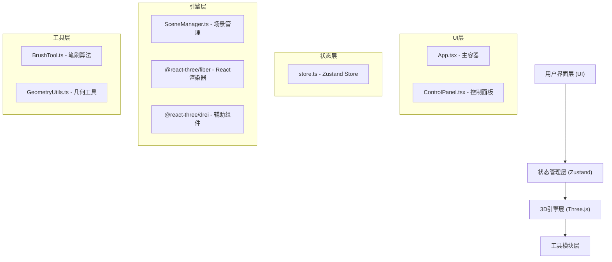

## 1. 架构设计



## 2. 技术栈说明

- **前端框架**：React 18 + TypeScript
- **构建工具**：Vite
- **3D渲染**：Three.js + @react-three/fiber + @react-three/drei
- **状态管理**：Zustand
- **样式方案**：CSS-in-JS / CSS Modules（自定义滑块样式）

## 3. 目录结构

```
auto66/
├── src/
│   ├── engine/                 # 核心3D引擎模块
│   │   ├── BrushTool.ts       # 笔刷算法（推拉/平滑/膨胀）
│   │   ├── GeometryUtils.ts   # 几何工具函数
│   │   └── SceneManager.ts    # 场景管理器
│   ├── ui/                     # UI与状态管理模块
│   │   ├── store.ts           # Zustand状态管理
│   │   ├── ControlPanel.tsx   # 控制面板组件
│   │   └── App.tsx            # 主应用组件
│   └── main.tsx               # 入口文件
├── package.json
├── tsconfig.json
├── vite.config.js
└── index.html
```

## 4. 数据模型定义

### 4.1 状态模型

```typescript
// 笔刷参数
interface BrushParams {
  size: number;        // 0.1 - 2.0
  intensity: number;   // 0.1 - 1.0
  hardness: number;    // 0.0 - 1.0
  type: 'pull' | 'smooth' | 'inflate';
}

// 材质类型
type MaterialType = 'clay' | 'stone' | 'plastic' | 'metal';

// 环境贴图类型
type EnvType = 'sunset' | 'bluehour' | 'space' | 'neutral';

// 应用状态
interface AppState {
  currentModel: 'sphere' | 'torusknot';
  brushParams: BrushParams;
  undoStack: Float32Array[];  // 顶点快照，最多5个
  materialType: MaterialType;
  envType: EnvType;
  vertexCount: number;
}

// 操作方法
interface AppActions {
  setBrushParam: <K extends keyof BrushParams>(key: K, value: BrushParams[K]) => void;
  setCurrentModel: (model: 'sphere' | 'torusknot') => void;
  pushUndoSnapshot: (snapshot: Float32Array) => void;
  undo: () => void;
  resetModel: () => void;
  setMaterial: (type: MaterialType) => void;
  setEnv: (type: EnvType) => void;
  setVertexCount: (count: number) => void;
}
```

## 5. 核心模块接口

### 5.1 BrushTool

```typescript
class BrushTool {
  static pull(
    positions: Float32Array,
    centerIndex: number,
    direction: 'out' | 'in',
    params: BrushParams
  ): Float32Array;
  
  static smooth(
    positions: Float32Array,
    centerIndex: number,
    params: BrushParams
  ): Float32Array;
  
  static inflate(
    positions: Float32Array,
    centerIndex: number,
    params: BrushParams
  ): Float32Array;
}
```

### 5.2 GeometryUtils

```typescript
class GeometryUtils {
  static computeNormals(positions: Float32Array, indices: Uint32Array): Float32Array;
  static cloneGeometrySnapshot(positions: Float32Array): Float32Array;
  static applyPositionsToGeometry(geometry: BufferGeometry, positions: Float32Array): void;
  static findNearestVertices(
    positions: Float32Array,
    centerPoint: Vector3,
    radius: number
  ): { index: number; distance: number }[];
}
```

### 5.3 SceneManager

```typescript
class SceneManager {
  addModel(type: 'sphere' | 'torusknot'): Mesh;
  applyBrush(
    modelId: string,
    hitPoint: Vector3,
    brushType: BrushType,
    params: BrushParams
  ): void;
  updateMaterial(modelId: string, materialType: MaterialType): void;
  updateEnvironment(envType: EnvType): void;
  getCurrentVertexCount(): number;
  resetModel(modelId: string): void;
}
```

## 6. 性能优化策略

1. **顶点计算优化**：使用TypedArray进行批量计算，避免频繁对象创建
2. **局部更新**：仅更新受影响区域的顶点，而非全量重算
3. **法向量增量更新**：笔刷操作后仅重算受影响区域的法向量
4. **渲染节流**：笔刷拖拽时使用requestAnimationFrame批量更新
5. **撤销栈优化**：存储差异快照而非完整顶点数据（可选高级优化）
