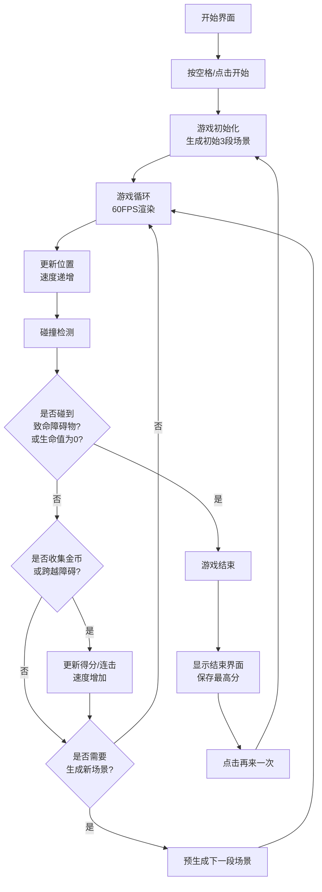

## 1. 产品概述

Night Roller 是一款赛博朋克风格的在线2D横版卷轴滑板跑酷游戏。玩家控制滑板少年在随机生成的城市屋顶、街道和障碍物之间连续跳跃滑行，收集金币并躲避陷阱，挑战最高分记录。

- **目标用户**：休闲游戏玩家，喜欢街机风格跑酷游戏的年轻群体
- **核心价值**：提供流畅、刺激、具有挑战性的无尽跑酷体验，配合赛博朋克视觉风格和动态音效反馈

## 2. 核心功能

### 2.1 用户角色

| 角色 | 注册方式 | 核心权限 |
|------|----------|----------|
| 玩家 | 无需注册 | 游戏游玩、本地最高分记录 |

### 2.2 功能模块

1. **游戏主场景**：无尽横版卷轴场景生成，包含建筑屋顶、街道、空中平台
2. **玩家操控系统**：跳跃、二段跳、触控支持
3. **碰撞检测系统**：障碍物碰撞、金币收集、陷阱检测
4. **难度递增系统**：速度递增、障碍物密度增加、加速带
5. **计分与连击系统**：得分、倍率、生命球、最高分记录
6. **视觉与音效系统**：赛博朋克UI、Web Audio音效、帧率监控
7. **响应式适配**：桌面端、移动端自适应布局

### 2.3 页面详情

| 页面名称 | 模块名称 | 功能描述 |
|---------|---------|----------|
| 开始界面 | 标题与提示 | 游戏标题"Night Roller"、闪烁开始提示、游戏说明 |
| 游戏界面 | Canvas渲染 | 游戏场景、玩家、障碍物、金币实时渲染 |
| 游戏界面 | HUD显示 | 得分、速度、连击数、生命值、倍率显示 |
| 结束界面 | 结果展示 | 最终得分、历史最高分、重新开始按钮 |

## 3. 核心流程

## 4. 用户界面设计

### 4.1 设计风格

- **主色调**：深紫色(#1a0a2e)到深蓝(#0a0a1a)径向渐变背景
- **强调色**：霓虹蓝(#00f0ff)、霓虹粉(#ff00aa)
- **按钮样式**：霓虹蓝到霓虹粉渐变，圆角12px，悬停缩放1.05倍，点击缩放0.95倍
- **字体**：无衬线字体，白色(#ffffff)文字加霓虹发光描边(text-shadow: 0 0 10px #00f0ff)
- **整体风格**：赛博朋克，暗色调，霓虹发光效果，科技感

### 4.2 页面设计概述

| 页面名称 | 模块名称 | UI元素 |
|---------|---------|--------|
| 开始界面 | 标题区 | 72px "Night Roller"标题，霓虹蓝描边，居中显示 |
| 开始界面 | 提示区 | 闪烁"按空格开始游戏"文字，500ms交替显示/隐藏 |
| 游戏界面 | Canvas区 | 1000x600px游戏区域，5px霓虹蓝到霓虹粉渐变发光边框 |
| 游戏界面 | HUD左上 | 得分、当前速度、连击数，20px白色霓虹文字 |
| 游戏界面 | HUD右上 | 3个红色心形生命值图标 |
| 结束界面 | 遮罩层 | 半透明黑色遮罩(rgba(0,0,0,0.7)) |
| 结束界面 | 结果区 | 最终得分、历史最高分显示 |
| 结束界面 | 按钮区 | "再来一次"渐变按钮 |

### 4.3 响应式

- **桌面端(≥1100px)**：Canvas 1000x600px居中，HUD字体20px
- **平板(600-1100px)**：Canvas等比例缩放，HUD字体16px
- **手机(<600px)**：垂直布局，游戏区域占上部80%高度，装饰元素隐藏，触控支持

### 4.4 视觉特效

- **玩家精灵**：16x24像素滑板少年，至少4帧跑动动画
- **场景元素**：5种建筑楼顶样式、路灯、垃圾桶、空中平台
- **障碍物**：绿色边框窗户、灰色空调外机、断裂楼顶缝隙
- **金币**：金色圆形，旋转动画
- **加速带**：蓝色光效地面
- **背景装饰**：远景建筑轮廓，霓虹灯光效果

