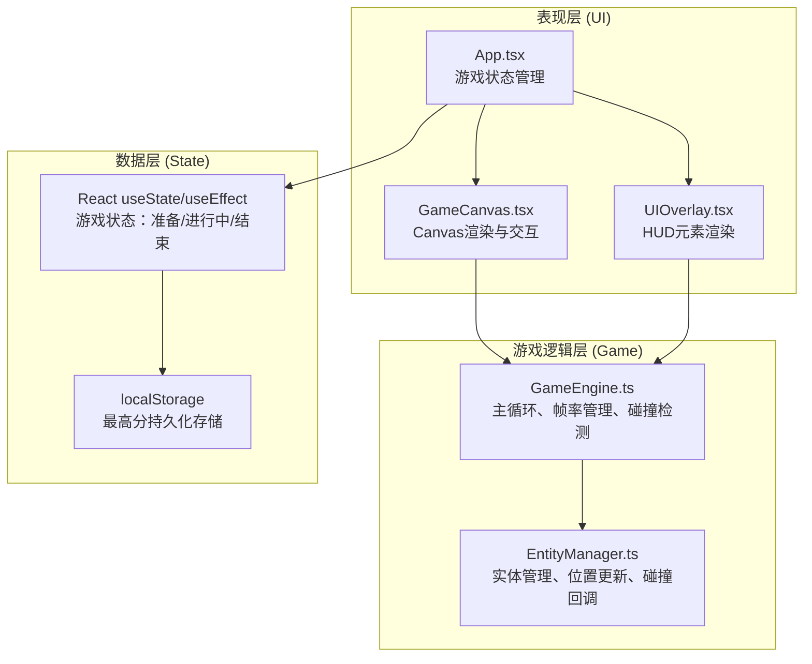

## 1. 架构设计



## 2. 技术描述

- **前端框架**：React@18 + TypeScript@5 + Vite@5
- **渲染技术**：HTML5 Canvas 2D API
- **状态管理**：React Hooks (useState, useEffect, useRef, useCallback)
- **构建工具**：Vite
- **类型检查**：TypeScript 严格模式
- **外部依赖**：react, react-dom
- **注意**：用户需求中提到的three.js实际上不需要（这是2D游戏），按照实际需求不引入不必要的依赖

## 3. 目录结构

```
d:\P\tasks\auto67
├── package.json
├── index.html
├── tsconfig.json
├── vite.config.js
└── src/
    ├── main.tsx
    ├── ui/
    │   ├── App.tsx
    │   ├── GameCanvas.tsx
    │   └── UIOverlay.tsx
    └── game/
        ├── GameEngine.ts
        └── EntityManager.ts
```

## 4. 核心模块说明

### 4.1 GameEngine.ts

**职责**：
- 封装 `requestAnimationFrame` 游戏主循环
- 管理帧率、场景更新频率
- 碰撞检测调度
- 对外提供 `start/stop/reset` 接口
- 订阅回调机制，通知UI更新

**核心属性**：
```typescript
interface GameState {
  score: number;
  speed: number;
  combo: number;
  lives: number;
  multiplier: number;
  multiplierTime: number;
  distance: number;
  isRunning: boolean;
  isGameOver: boolean;
  highScore: number;
  frameRate: number;
}
```

**核心方法**：
- `start()`: 启动游戏循环
- `stop()`: 停止游戏循环
- `reset()`: 重置游戏状态
- `subscribe(callback: (state: GameState) => void)`: 订阅状态更新
- `jump()`: 处理跳跃输入
- `doubleJump()`: 处理二段跳输入

### 4.2 EntityManager.ts

**职责**：
- 管理所有游戏实体：玩家、障碍物、金币、背景装饰物
- 维护位置、速度、碰撞盒列表
- 每帧更新所有实体位置
- 检测玩家与障碍物/金币的碰撞
- 触发碰撞回调
- 随机生成场景段

**实体类型**：
```typescript
type EntityType = 'player' | 'obstacle_window' | 'obstacle_ac' | 'obstacle_gap' | 'coin' | 'platform' | 'building' | 'street_decor' | 'speed_boost';

interface Entity {
  id: number;
  type: EntityType;
  x: number;
  y: number;
  width: number;
  height: number;
  velocityX: number;
  velocityY: number;
  collisionBox: { x: number; y: number; width: number; height: number };
  active: boolean;
  data?: Record<string, any>;
}
```

**场景生成规则**：
- 每段场景宽度约1200px
- 玩家视野内始终保持3段场景
- 5种建筑楼顶样式随机选择
- 障碍物：基础每段4个，每5秒密度+10%，最多每段8个
- 每10秒随机出现一个加速带

### 4.3 GameCanvas.tsx

**职责**：
- Canvas元素创建与尺寸管理
- 60FPS画面渲染
- 键盘/鼠标/触控事件绑定
- 调用GameEngine更新逻辑
- 精灵绘制与动画
- 帧率监控与质量调整

**渲染内容**：
- 背景渐变与远景装饰
- 建筑、街道、平台
- 玩家精灵动画（4帧跑动）
- 障碍物、金币、加速带
- 粒子效果（可选）

### 4.4 UIOverlay.tsx

**职责**：
- 渲染HUD元素（得分、速度、连击、生命值）
- 开始界面标题与提示
- 结束界面结果展示
- 帧率下降提示
- 接收GameEngine状态数据

### 4.5 App.tsx

**职责**：
- 组合GameCanvas和UIOverlay
- 管理游戏状态：准备/进行中/游戏结束
- 提供开始按钮和重玩功能
- 响应式布局适配
- 最高分localStorage管理

## 5. 音效系统（Web Audio API）

| 音效 | 参数 | 触发时机 |
|------|------|----------|
| 跳跃 | 频率400Hz→800Hz，持续200ms，上升音调 | 按空格/点击跳跃时 |
| 金币 | 频率800Hz，持续100ms，三角波 | 收集金币时 |
| 撞击 | 频率200Hz，持续300ms，方波 | 碰到障碍物时 |

## 6. 性能指标

- **帧率**：稳定60FPS，最低≥55FPS
- **帧率监控**：波动超过5%时自动降低渲染质量（背景精灵20→10个）
- **内存**：≤200MB
- **首屏加载**：≤2秒（带缓存）
- **碰撞检测优化**：空间分区，仅检测视野内实体

## 7. 碰撞检测算法

使用AABB（轴对齐包围盒）碰撞检测：
```typescript
function checkCollision(a: Entity, b: Entity): boolean {
  const boxA = a.collisionBox;
  const boxB = b.collisionBox;
  return (
    boxA.x < boxB.x + boxB.width &&
    boxA.x + boxA.width > boxB.x &&
    boxA.y < boxB.y + boxB.height &&
    boxA.y + boxA.height > boxB.y
  );
}
```

**碰撞结果处理**：
- 窗户/缝隙：直接游戏结束
- 空调外机：速度-50%，生命-1，生命为0时结束
- 金币：得分+100×倍率，连续5个触发×2倍率（5秒），连击+1
- 加速带：速度×2，持续2秒

