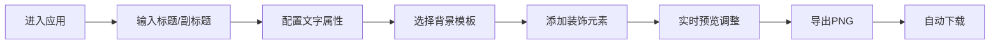

## 1. 产品概述

在线动态文字海报生成器是一款面向非设计背景运营人员的轻量级工具，帮助用户快速制作统一风格的社交媒体标题展示图。用户通过简单的文字输入和参数调整，即可生成专业的海报图片并一键导出高清PNG。

- **目标用户**：非设计背景的运营人员、自媒体创作者
- **核心价值**：降低设计门槛，提供灵活的动态调整能力，快速产出高质量海报
- **市场定位**：介于专业设计工具（PS）和在线模板生成器之间的轻量化工具

## 2. 核心功能

### 2.1 用户角色

| 角色 | 注册方式 | 核心权限 |
|------|----------|----------|
| 普通用户 | 无需注册，直接使用 | 海报编辑、模板选择、图片导出 |

### 2.2 功能模块

1. **文字属性配置**：标题/副标题输入、字体选择、字号调整、颜色设置、阴影效果、描边效果
2. **背景模板选择**：5种预设背景模板（纯色渐变、径向渐变、斜向条纹、多边形几何、颗粒纹理）
3. **几何装饰元素**：最多3个装饰元素（圆形、三角形、星形），支持大小、颜色、位置、旋转调整
4. **画布预览与导出**：实时预览、2x高清PNG导出

### 2.3 页面详情

| 页面名称 | 模块名称 | 功能描述 |
|---------|----------|----------|
| 主编辑页 | 画布预览区 | 640x480px实时海报预览，支持装饰元素拖拽 |
| 主编辑页 | 文字配置面板 | 标题/副标题输入、字体/字号/颜色/阴影/描边配置 |
| 主编辑页 | 背景模板区 | 5种背景模板选择，点击切换 |
| 主编辑页 | 装饰元素配置 | 添加/删除装饰元素，调整大小/颜色/位置/旋转 |
| 主编辑页 | 导出按钮 | 一键导出2x高清PNG图片 |

## 3. 核心流程

用户进入应用 → 输入标题和副标题文字 → 选择字体、字号、颜色 → 配置阴影和描边效果 → 选择背景模板 → 添加/调整装饰元素 → 实时预览效果 → 点击导出PNG → 自动下载高清图片

## 4. 用户界面设计

### 4.1 设计风格
- **整体风格**：极简清新，以功能性为主
- **主背景色**：#f8f9fa（浅灰白）
- **卡片背景**：#ffffff
- **边框颜色**：#dee2e6
- **强调色**：#74b9ff（浅蓝色，用于选中状态）
- **圆角**：12px（大容器）、8px（小标题栏）
- **阴影**：0 2px 8px rgba(0,0,0,0.06)（卡片）、0 4px 12px rgba(0,0,0,0.1)（悬停）

### 4.2 页面设计概述

| 页面名称 | 模块名称 | UI元素 |
|---------|----------|--------|
| 主编辑页 | 布局 | 左右分栏（左68%画布，右32%配置面板），响应式垂直堆叠 |
| 主编辑页 | 画布区域 | 640x480px画布，2px边框，圆角12px，悬停阴影上浮 |
| 主编辑页 | 配置面板 | 白色卡片，分区块展示，浅灰标题栏分隔 |
| 主编辑页 | 控件样式 | 圆角滑块、圆形色板按钮、平滑过渡动画 |

### 4.3 响应式

采用桌面端优先设计，当屏幕宽度小于900px时，左侧画布和右侧面板改为垂直堆叠布局，画布宽度自适应。

### 4.4 动画与交互

- **背景切换**：0.3秒淡入淡出过渡（opacity 1→0→1）
- **画布悬停**：box-shadow过渡0.2s
- **装饰元素拖拽**：浅蓝色半透明边框选中状态
- **文字参数修改**：几乎无闪烁直接更新（<150ms重绘）
