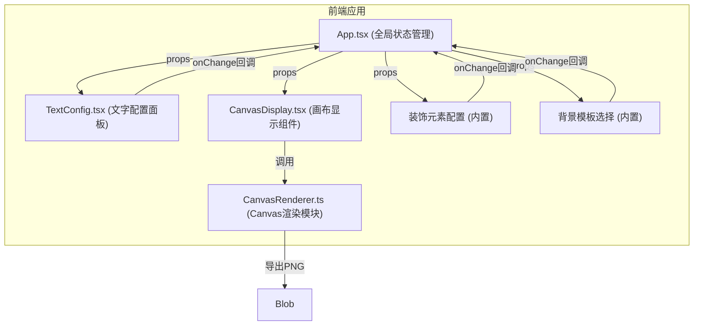

## 1. 架构设计



## 2. 技术描述

- **前端框架**：React 18 + TypeScript
- **构建工具**：Vite 5
- **语言标准**：ES2020
- **状态管理**：React useState（组件内状态，通过props和回调传递）
- **渲染技术**：Canvas 2D API（离屏Canvas合成 + 显示Canvas）
- **导出格式**：PNG（2x高清，1280x960px）

### 核心技术点
1. **Canvas渲染优化**：使用requestAnimationFrame节流，避免不必要的重绘
2. **高清导出**：scale(2,2) + imageSmoothingQuality: 'high'
3. **装饰元素拖拽**：基于Canvas坐标转换的拖拽实现
4. **模块化设计**：渲染逻辑与UI组件分离，CanvasRenderer为纯函数模块

## 3. 目录结构

```
src/
├── App.tsx              # 主应用组件，全局状态管理
├── TextConfig.tsx       # 文字属性配置面板
├── CanvasRenderer.ts    # Canvas渲染纯函数模块
├── CanvasDisplay.tsx    # 画布显示组件
└── main.tsx             # 应用入口
```

### 各文件职责与调用关系

| 文件 | 职责 | 输入 | 输出/调用 |
|------|------|------|-----------|
| `App.tsx` | 全局状态管理、组件组合 | - | 向子组件传递props，接收回调更新状态 |
| `TextConfig.tsx` | 文字属性配置UI | 文字状态对象、onChange回调 | 触发onChange回调更新文字配置 |
| `CanvasDisplay.tsx` | 画布显示与交互 | 全部配置参数 | 调用CanvasRenderer绘制，处理拖拽交互 |
| `CanvasRenderer.ts` | Canvas绘制与导出 | 配置参数 + Canvas上下文 | 绘制到Canvas，exportToPNG返回Blob |

### 数据流向

```
用户交互 → TextConfig/DecorConfig/TemplateSelector 
         → onChange回调 → App.tsx (useState更新) 
         → props传递 → CanvasDisplay 
         → 调用CanvasRenderer → 重绘画布
```

## 4. 数据模型

### 4.1 文字配置类型

```typescript
interface TextShadow {
  offsetX: number;     // -10 ~ 10
  offsetY: number;     // -10 ~ 10
  blur: number;        // 0 ~ 20
  color: string;       // HEX颜色
}

interface TextStroke {
  width: number;       // 1 ~ 5
  color: string;       // HEX颜色
}

interface TextConfig {
  title: string;       // 标题，最多20字
  subtitle: string;    // 副标题，最多40字
  fontFamily: string;  // Arial/Georgia/Courier New/Impact/Comic Sans MS
  titleSize: number;   // 16 ~ 72
  subtitleSize: number;// 12 ~ 48
  color: string;       // HEX颜色
  shadow: TextShadow;
  stroke: TextStroke;
}
```

### 4.2 背景模板类型

```typescript
type BackgroundTemplate = 
  | 'gradient-linear'    // 纯色渐变
  | 'gradient-radial'    // 径向渐变
  | 'stripes'            // 斜向条纹
  | 'polygons'           // 多边形几何
  | 'grain';             // 颗粒纹理
```

### 4.3 装饰元素类型

```typescript
type DecorShape = 'circle' | 'triangle' | 'star';

interface DecorElement {
  id: string;
  shape: DecorShape;
  size: number;         // 20 ~ 80
  color: string;        // HEX颜色
  x: number;            // 0 ~ 100 (百分比)
  y: number;            // 0 ~ 100 (百分比)
  rotation: number;     // 0 ~ 360
}
```

### 4.4 全局配置类型

```typescript
interface PosterConfig {
  text: TextConfig;
  background: BackgroundTemplate;
  decorations: DecorElement[];  // 最多3个
}
```

## 5. 性能约束

- **重绘响应时间**：< 150ms（普通笔记本Chrome浏览器）
- **优化策略**：
  1. 使用requestAnimationFrame批量重绘
  2. 离屏Canvas预渲染背景模板
  3. 仅在参数变化时触发重绘
  4. 装饰元素拖拽使用requestAnimationFrame节流
