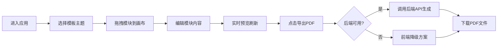

## 1. 产品概述

在线互动式简历生成与导出应用，用户通过拖拽组件模块构建个性化简历，实时预览效果，最终导出为PDF文件。

- 主要用途：帮助用户快速创建专业简历，支持拖拽式构建、模板切换、实时预览和PDF导出
- 目标用户：求职者、职场人士、学生
- 产品价值：降低简历制作门槛，提供美观模板，提升简历制作效率

## 2. 核心功能

### 2.1 功能模块

1. **简历构建工作台**：拖拽模块列表、画布预览区、模块编辑器
2. **模板切换**：4套预设模板（极简灰白、蓝调商务、暖橙创意、暗色科技）
3. **实时预览**：A4比例画布、缩放控制、防抖刷新
4. **PDF导出**：后端API优先、前端降级方案、导出进度显示
5. **草稿自动保存**：编辑内容自动调用后端保存接口

### 2.2 页面详情

| 页面名称 | 模块名称 | 功能描述 |
|---------|---------|---------|
| 简历构建页 | 左侧编辑面板 | 可拖拽模块列表、模板选择器、模块内容编辑器 |
| 简历构建页 | 右侧画布预览区 | A4比例简历预览、缩放控制、实时渲染 |
| 简历构建页 | 底部工具栏 | 导出PDF按钮、进度条 |

## 3. 核心流程

用户进入应用 → 选择模板主题 → 从左侧拖拽模块到画布 → 点击模块编辑内容 → 实时预览效果 → 点击导出PDF → 后端生成/前端降级 → 自动下载文件

## 4. 用户界面设计

### 4.1 设计风格

- 主背景色：#f4f6f8（柔和蓝灰色调）
- 编辑面板：#ffffff
- 画布区背景：#e6ecf0
- 模块标题：#2c3e50 深灰色，16px 粗体
- 强调色：#3498db 蓝色
- 导出按钮：渐变色 #3498db 到 #2980b9
- 字体：现代无衬线字体，清晰易读

### 4.2 页面设计概述

| 页面名称 | 模块名称 | UI元素 |
|---------|---------|-------|
| 简历构建页 | 编辑面板 | 模块卡片（拖拽）、模板切换按钮、展开式编辑器 |
| 简历构建页 | 画布预览 | A4比例容器、缩放滑块、模块渲染 |
| 简历构建页 | 底部工具栏 | 固定定位、渐变按钮、进度条 |

### 4.3 响应式

- 桌面端（≥1024px）：左右布局，编辑面板在左，预览在右
- 移动端（<1024px）：上下布局，编辑区在上，预览区在下
- 触控优化：拖拽区域足够大，按钮尺寸适中

### 4.4 交互动效

- 拖拽过程：半透明影子（opacity:0.4）+ 上升动画（translateY(-4px)，transition:0.2s）
- 放置动画：弹性缩放（scale从1.05过渡到1.0）
- 编辑项：悬停边框变蓝，点击蓝色脉冲光晕（0.3s）
- 导出按钮：悬停反光效果
