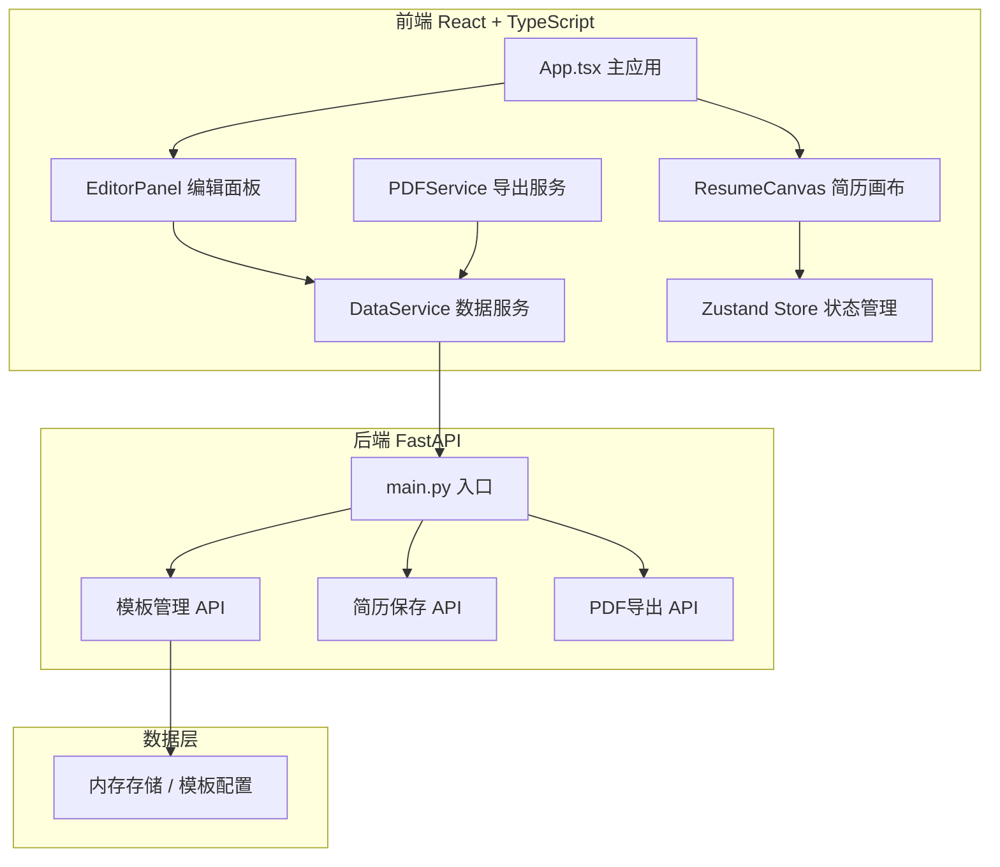
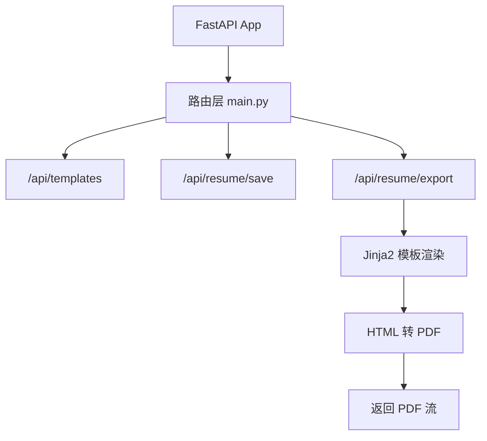

## 1. 架构设计



## 2. 技术描述

- 前端：React 18 + TypeScript + Vite
- 状态管理：Zustand
- 拖拽：react-beautiful-dnd
- HTTP请求：Axios
- PDF导出：后端优先（FastAPI + Jinja2 + PyPDF2），前端降级（html2canvas + jspdf）
- 后端：FastAPI + Uvicorn
- 模板引擎：Jinja2

## 3. 路由定义

| 路由 | 用途 |
|-----|------|
| / | 简历构建主页面 |

## 4. API 定义

### 4.1 获取模板列表
- GET /api/templates
- Response: `{ templates: Template[] }`

### 4.2 保存简历数据
- POST /api/resume/save
- Request: `ResumeData`
- Response: `{ success: boolean, id: string }`

### 4.3 导出PDF
- POST /api/resume/export
- Request: `ResumeData`
- Response: PDF文件流 (application/pdf)

### 4.4 TypeScript 类型定义

```typescript
interface Template {
  id: string;
  name: string;
  colors: {
    background: string;
    text: string;
    title: string;
    accent: string;
    divider: string;
  };
  fonts: {
    heading: string;
    body: string;
  };
}

interface PersonalInfo {
  name: string;
  email: string;
  phone: string;
  avatar: string;
  summary?: string;
}

interface Education {
  id: string;
  school: string;
  degree: string;
  major: string;
  startDate: string;
  endDate: string;
  description?: string;
}

interface WorkExperience {
  id: string;
  company: string;
  position: string;
  startDate: string;
  endDate: string;
  description?: string;
}

interface Skill {
  id: string;
  name: string;
  level?: number;
}

interface Project {
  id: string;
  name: string;
  role: string;
  startDate: string;
  endDate: string;
  description?: string;
  technologies?: string[];
}

interface CustomSection {
  id: string;
  title: string;
  content: string;
}

type ModuleType = 'personal' | 'education' | 'work' | 'skills' | 'projects' | 'custom';

interface ResumeModule {
  id: string;
  type: ModuleType;
  title: string;
  data: any;
}

interface ResumeData {
  id?: string;
  templateId: string;
  modules: ResumeModule[];
  personalInfo: PersonalInfo;
  education: Education[];
  workExperience: WorkExperience[];
  skills: Skill[];
  projects: Project[];
  customSections: CustomSection[];
}
```

## 5. 服务器架构图



## 6. 文件结构

```
project/
├── package.json
├── index.html
├── tsconfig.json
├── vite.config.js
├── src/
│   ├── App.tsx
│   ├── store/
│   │   └── useResumeStore.ts
│   ├── components/
│   │   └── EditorPanel.tsx
│   ├── features/
│   │   ├── builder/
│   │   │   └── ResumeCanvas.tsx
│   │   └── export/
│   │       └── PDFService.ts
│   ├── services/
│   │   └── DataService.ts
│   ├── types/
│   │   └── resume.ts
│   └── styles/
│       └── globals.css
└── backend/
    ├── main.py
    ├── requirements.txt
    └── templates/
        └── resume_template.html
```
