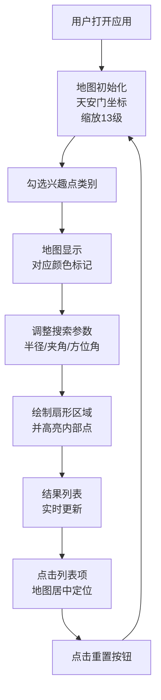

## 1. 产品概述

交互式兴趣点图层叠加地图应用，为城市通勤者提供快速查找附近公共设施的直观工具。用户可通过扇形搜索在指定范围内筛选公厕、便利店、咖啡馆、充电桩、药店等兴趣点，实时查看位置与距离信息。

### 目标用户与价值
- **目标用户**：城市通勤者、旅行者、户外活动爱好者
- **核心价值**：一键式多层兴趣点筛选、直观的扇形范围搜索、实时距离与方位显示
- **市场价值**：解决移动场景下快速查找周边设施的痛点，提升城市出行体验

## 2. 核心功能

### 2.1 用户角色
| 角色 | 注册方式 | 核心权限 |
|------|----------|----------|
| 普通用户 | 无需注册 | 使用所有地图浏览和搜索功能 |

### 2.2 功能模块
1. **地图主界面**：Leaflet地图渲染、兴趣点标记、扇形区域绘制、图例显示
2. **控制面板**：类别复选框、半径滑块、夹角滑块、方位角旋钮、重置按钮
3. **扇形搜索**：中心点为基准的扇形范围搜索、距离计算、方位角计算
4. **结果列表**：搜索结果展示、点击定位、距离与方位显示

### 2.3 页面详情
| 页面名称 | 模块名称 | 功能描述 |
|----------|----------|----------|
| 主页面 | 地图视图 | 初始化Leaflet地图，中心点设为北京天安门[39.9042, 116.4074]，缩放级别13 |
| 主页面 | 图层叠加 | 根据选中类别显示对应颜色的兴趣点标记，点击弹出详情Popup |
| 主页面 | 扇形绘制 | 以地图中心点为圆心绘制半透明扇形区域（填充#ffdd33，透明度0.25，边框#ffaa00） |
| 主页面 | 控制面板 | 5类兴趣点复选框（2列网格）、半径滑块(100-500m)、夹角滑块(45-360°)、方位角旋钮(0-360°) |
| 主页面 | 搜索结果 | 固定高度300px可滚动列表，显示名称、类别、距离、方位角，hover高亮 |
| 主页面 | 图例 | 右上角简易图例，显示各类别颜色对应关系 |
| 主页面 | 重置功能 | 清除所有图层、扇形、结果，恢复初始状态 |

## 3. 核心流程

用户打开应用 → 地图初始化至北京天安门 → 勾选兴趣点类别 → 地图显示对应标记 → 调整搜索半径/夹角/方位角 → 绘制扇形区域并高亮内部点 → 结果列表实时更新 → 点击列表项定位到地图 → 点击重置恢复初始状态

## 4. 用户界面设计

### 4.1 设计风格
- **设计基调**：浅色现代风格，简洁实用
- **主背景色**：#f8f9fa
- **主色调**：#4a90d9（滑块轨道、交互元素）
- **类别颜色**：公厕#3388ff、便利店#ff6633、咖啡馆#44bb44、充电桩#aa44ff、药店#ff4444
- **扇形样式**：填充#ffdd33（透明度0.25）、边框#ffaa00（线宽2px）
- **字体**：系统无衬线字体 -apple-system, BlinkMacSystemFont
- **交互效果**：所有控件变化带0.3s ease平滑过渡，hover背景#e9ecef

### 4.2 页面设计概述
| 页面名称 | 模块名称 | UI元素 |
|----------|----------|--------|
| 主页面 | 整体布局 | 左侧地图70%宽度，右侧控制面板30%宽度 |
| 主页面 | 类别选择 | 2列网格布局，复选框前带颜色小圆点色块 |
| 主页面 | 滑块控件 | 轨道色#4a90d9，手柄带阴影，数值实时显示 |
| 主页面 | 方位角旋钮 | 圆形可拖动旋钮，0-360度步进15度 |
| 主页面 | 搜索结果 | 固定300px高度，可滚动，hover高亮 |
| 主页面 | 图例 | 右上角浮动，5种类别颜色标识 |
| 主页面 | 重置按钮 | 醒目位置，点击恢复初始状态 |

### 4.3 响应式
- **桌面优先**：左侧地图70%，右侧面板30%
- **移动端适配**：上下布局，地图在上控制面板在下
- **触摸优化**：滑块和旋钮增大触控区域

### 4.4 性能约束
- 控件响应延迟：< 200ms
- 扇形绘制和列表刷新：< 100ms
- 兴趣点数据：每类30个随机点，共150个点
