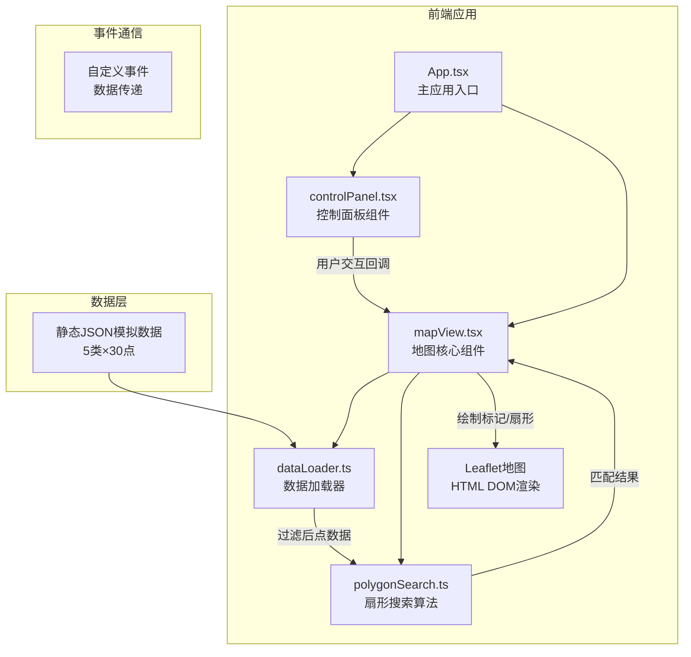

## 1. 架构设计



## 2. 技术描述

- **前端框架**：React 18 + TypeScript
- **构建工具**：Vite
- **地图渲染**：Leaflet 1.9（HTML DOM渲染，不涉及瓦片数据）
- **状态管理**：React useState/useCallback（组件内状态）
- **事件通信**：自定义事件（CustomEvent）
- **样式方案**：CSS Modules + 内联样式
- **无后端**：纯前端应用，使用静态模拟数据

## 3. 目录结构

```
auto71/
├── index.html              # 入口页面，加载Leaflet CSS
├── package.json            # 依赖配置
├── vite.config.js          # Vite配置，端口3000
├── tsconfig.json           # TypeScript配置，严格模式
└── src/
    ├── main.tsx            # React入口
    ├── App.tsx             # 主应用组件
    ├── mapView.tsx         # 地图核心组件
    ├── controlPanel.tsx    # 控制面板组件
    ├── dataLoader.ts       # 兴趣点数据加载器
    ├── polygonSearch.ts    # 扇形搜索算法
    ├── types.ts            # 类型定义
    └── index.css           # 全局样式
```

### 文件调用关系
1. `App.tsx` → 引用 `mapView.tsx` 和 `controlPanel.tsx`
2. `mapView.tsx` → 调用 `dataLoader.ts` 获取点数据 → 调用 `polygonSearch.ts` 执行扇形搜索
3. `controlPanel.tsx` → 通过props回调更新 `mapView.tsx` 状态
4. `types.ts` → 被所有模块引用，定义共享类型

### 数据流向
```
用户交互 → controlPanel → 回调更新状态 → mapView → dataLoader → polygonSearch → mapView → 地图绘制
```

## 4. 数据模型

### 4.1 类型定义

```typescript
// 兴趣点类别
type POICategory = 'toilet' | 'convenience' | 'cafe' | 'charging' | 'pharmacy';

// 兴趣点数据结构
interface POI {
  id: string;
  category: POICategory;
  name: string;
  address: string;
  lat: number;
  lng: number;
}

// 搜索参数
interface SearchParams {
  center: [number, number]; // [lat, lng]
  radius: number; // 米
  startAngle: number; // 度
  angleRange: number; // 度
}

// 搜索结果
interface SearchResult {
  poi: POI;
  distance: number; // 米，整数
  azimuth: number; // 度
  azimuthText: string; // N, NE, NNE等
}

// 类别配置
interface CategoryConfig {
  key: POICategory;
  label: string;
  color: string;
}
```

### 4.2 数据生成规则
- 中心点：北京天安门 [39.9042, 116.4074]
- 范围：中心点周围1公里内随机分布
- 每类30个点，共150个兴趣点
- 名称和地址采用中文真实场景命名

## 5. 核心算法

### 5.1 扇形搜索算法
1. 计算点到圆心的距离（Haversine公式）
2. 计算点相对于圆心的方位角
3. 判断距离是否≤搜索半径
4. 判断方位角是否在扇形角度范围内
5. 返回匹配结果，包含距离和方位角文本

### 5.2 方位角文本映射
```
0°: N, 22.5°: NNE, 45°: NE, 67.5°: ENE,
90°: E, 112.5°: ESE, 135°: SE, 157.5°: SSE,
180°: S, 202.5°: SSW, 225°: SW, 247.5°: WSW,
270°: W, 292.5°: WNW, 315°: NW, 337.5°: NNW
```

## 6. 性能优化策略

1. **数据缓存**：dataLoader加载后缓存数据，避免重复解析
2. **防抖处理**：滑块拖动时使用requestAnimationFrame优化渲染
3. **图层复用**：标记和扇形使用LayerGroup统一管理，避免重复创建
4. **事件委托**：地图事件使用委托模式，减少事件监听器
5. **批量更新**：状态变更批量处理，减少重渲染次数

## 7. 依赖清单

```json
{
  "dependencies": {
    "react": "^18.2.0",
    "react-dom": "^18.2.0",
    "leaflet": "^1.9.4"
  },
  "devDependencies": {
    "@types/react": "^18.2.0",
    "@types/react-dom": "^18.2.0",
    "@types/leaflet": "^1.9.0",
    "typescript": "^5.0.0",
    "vite": "^5.0.0",
    "@vitejs/plugin-react": "^4.2.0"
  }
}
```
