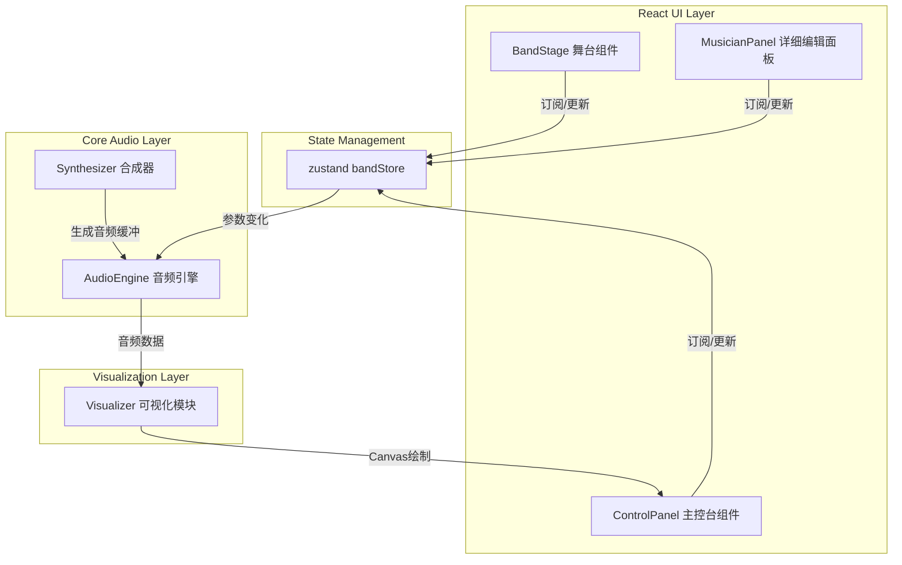

## 1. 架构设计



## 2. 技术描述

- **前端框架**：React 18 + TypeScript
- **构建工具**：Vite 5
- **状态管理**：zustand
- **音频处理**：Web Audio API（原生）
- **可视化**：Canvas 2D API
- **样式方案**：CSS Modules / 内联样式（霓虹效果需动态计算）
- **图标方案**：SVG 内联乐手剪影

### 核心模块职责

| 模块 | 文件 | 职责 |
|-----|------|------|
| 音频引擎 | `src/core/AudioEngine.ts` | 管理 AudioContext、增益节点、分析器节点、多轨混音、播放控制 |
| 合成器 | `src/core/Synthesizer.ts` | 根据乐手参数生成音频缓冲，封装振荡器、滤波器、包络 |
| 可视化 | `src/core/Visualizer.ts` | 从 AnalyserNode 获取数据，绘制波形和频谱 |
| 状态管理 | `src/store/bandStore.ts` | 存储4个乐手参数、BPM、播放状态、选中乐手 |
| 舞台组件 | `src/components/BandStage.tsx` | 渲染乐队舞台、乐手图标、状态面板、选择交互 |
| 主控台 | `src/components/ControlPanel.tsx` | 播放控制、BPM、总音量、波形+频谱 Canvas |

## 3. 数据模型

### 乐手类型定义

```typescript
type MusicianType = 'drummer' | 'bassist' | 'guitarist' | 'keyboardist';
type MusicGenre = 'blues' | 'funk' | 'rock' | 'reggae';
type ChordType = 'major' | 'minor' | 'seventh' | 'minor7' | 'major7';
type TimeSignature = '4/4' | '3/4' | '6/8';

interface MusicianConfig {
  id: MusicianType;
  name: string;
  volume: number;          // 0-100
  rhythmShift: number;     // -50 到 50
  genre: MusicGenre;       // 曲风
  complexity: number;      // 1-5
  rhythmPattern: number;   // 0-5 共6种预设
  rootNote: string;        // 根音 C, C#, D, D#, E, F, F#, G, G#, A, A#, B
  chordType: ChordType;
  timeSignature: TimeSignature;
  solo: boolean;
}

interface BandState {
  musicians: Record<MusicianType, MusicianConfig>;
  selectedMusician: MusicianType | null;
  isPlaying: boolean;
  bpm: number;             // 60-180
  masterVolume: number;    // 0-100
}
```

## 4. 状态管理设计

使用 zustand create 函数创建 bandStore，包含：

- **getters**：获取乐手配置、播放状态、BPM等
- **actions**：
  - `selectMusician(id)` - 选中乐手
  - `updateMusician(id, patch)` - 更新乐手参数
  - `togglePlay()` - 播放/暂停
  - `setBpm(bpm)` - 设置BPM
  - `setMasterVolume(vol)` - 设置总音量
  - `toggleSolo(id)` - 切换独奏

## 5. 音频引擎设计

### AudioEngine

- 单例模式，全局一个 AudioContext
- 主增益节点（master gain）→ AnalyserNode → destination
- 每个乐手一条音轨：振荡器/采样源 → 增益节点 → 低通滤波器 → 主增益
- 提供 `start()` / `stop()` / `updateParam()` 接口
- 使用 setInterval 或 requestAnimationFrame 调度音符事件
- 使用 ScriptProcessorNode 或 AudioWorklet 生成实时音频

### Synthesizer

- 鼓合成：噪声生成器 + 滤波器包络（kick/snare/hihat）
- 贝斯合成：锯齿波/方波 + 低通滤波 + ADSR 包络
- 吉他合成：脉冲波 + 混响模拟 + 弦拨包络
- 键盘合成：正弦波叠加 + 合唱效果

## 6. 可视化设计

### Visualizer

- `drawWaveform(canvas, analyser)` - 时域波形绘制
- `drawSpectrum(canvas, analyser)` - 频域频谱绘制（64条柱）
- 使用 requestAnimationFrame 循环更新
- 颜色按用户要求：波形 `#00ff88`，频谱蓝到红渐变
- 独立于 React 渲染循环，直接操作 Canvas

## 7. 性能优化策略

- 音频调度使用 Web Audio 内置时间系统，避免 JS 定时器抖动
- Canvas 绘制使用 requestAnimationFrame，与显示器刷新同步
- 可视化复用 TypedArray，避免频繁 GC
- Zustand 选择器避免不必要的重渲染
- 乐手组件 memo 化
