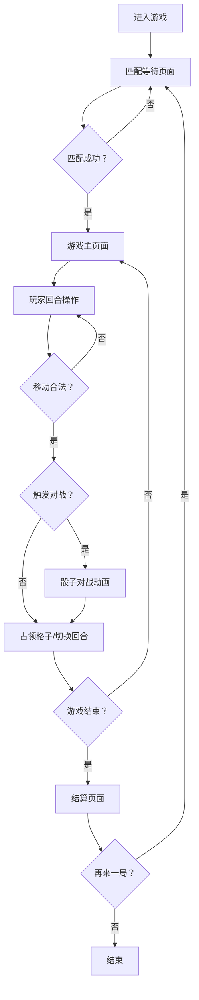

## 1. 产品概述

在线桌面对战模拟游戏，两名玩家在 5x5 网格棋盘上轮流移动棋子，通过策略和地形（陷阱、加速格）争夺占领区域，最终以占领格子数多者获胜。

- 目标用户：喜欢策略对战类小游戏的玩家
- 产品价值：提供快节奏、策略性强的双人对战体验

## 2. 核心功能

### 2.1 用户角色

| 角色 | 注册方式 | 核心权限 |
|------|----------|----------|
| 玩家 | 直接进入匹配 | 参与游戏对战、查看结算、重新匹配 |

### 2.2 功能模块

1. **匹配等待页面**：等待对手匹配、脉冲动画提示
2. **游戏主页面**：5x5 棋盘、玩家面板、回合倒计时、骰子对战动画
3. **结算页面**：双方得分、占领统计、胜者高亮、再来一局

### 2.3 页面详情

| 页面名称 | 模块名称 | 功能描述 |
|----------|----------|----------|
| 匹配等待页 | 等待动画 | 脉冲小圆点动画、"等待对手..."文字 |
| 匹配等待页 | 玩家信息 | 显示当前玩家昵称、头像 |
| 游戏主页 | 棋盘网格 | 5x5 网格、地形样式、棋子渲染、点击/拖拽移动 |
| 游戏主页 | 玩家面板 | 头像、昵称、已占领数、倒计时、回合得分动画 |
| 游戏主页 | 骰子对战 | 3D 旋转骰子动画、对战结果展示 |
| 结算页 | 得分展示 | 双方得分、占领格子数、地形利用统计 |
| 结算页 | 胜者动画 | 金色边框高亮、胜利动效 |
| 结算页 | 再来一局 | 重新匹配按钮 |

## 3. 核心流程

## 4. 用户界面设计

### 4.1 设计风格

- **主色调**：深蓝渐变 (#0a0e27 到 #1a237e)
- **辅助色**：银灰色 (#b0bec5)、橙红色 (#ff7043)、青蓝色 (#26c6da)、黄绿色 (#cddc39)
- **棋子**：玩家1 橙红色圆形带白边，玩家2 青蓝色圆形带白边
- **选中效果**：黄绿色光晕动画
- **地形**：陷阱格灰色带暗红边框，加速格蓝色带闪光动画
- **字体**：现代无衬线字体，倒计时粗体白色
- **布局**：桌面端棋盘+两侧面板，移动端单列布局

### 4.2 页面设计概览

| 页面名称 | 模块名称 | UI 元素 |
|----------|----------|---------|
| 匹配等待页 | 等待区域 | 脉冲圆点、渐变背景、居中布局 |
| 游戏主页 | 棋盘区域 | 5x5 网格、发光边框、地形样式、棋子动画 |
| 游戏主页 | 玩家面板 | 头像圆形、昵称文字、占领计数、倒计时条 |
| 结算页 | 得分卡片 | 渐变卡片、金色胜者边框、统计数据 |

### 4.3 响应式

- 桌面端 (769px+)：完整棋盘 + 左右面板并列布局
- 平板 (481-768px)：棋盘缩小，保持可点击
- 手机 (≤480px)：单列布局，棋盘在上，操作面板在下

### 4.4 动效设计

- 棋子移动：平滑过渡动画
- 选中棋子：黄绿色光晕呼吸效果
- 加速格：蓝色闪光脉动动画
- 骰子对战：3D Y 轴旋转 1.5 秒
- 倒计时：颜色从绿渐变到红
- 胜者：金色边框高亮脉冲
