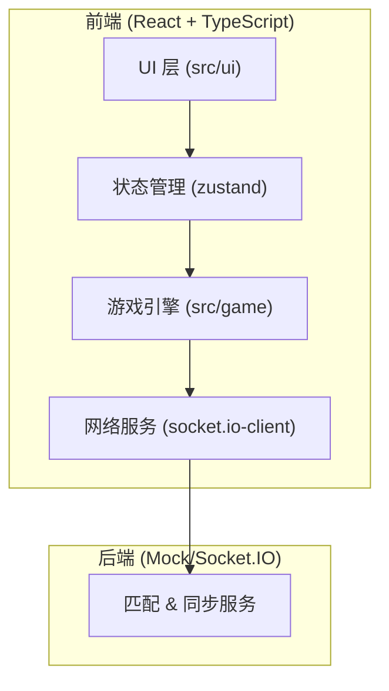

## 1. 架构设计



## 2. 技术说明

- **前端框架**：React 18 + TypeScript + Vite
- **状态管理**：zustand
- **网络通信**：socket.io-client
- **样式方案**：CSS Modules + 内联样式（动画）
- **构建工具**：Vite

## 3. 目录结构

```
src/
├── game/
│   ├── types.ts          # 类型定义
│   ├── gameEngine.ts     # 游戏核心逻辑
│   └── socketService.ts  # WebSocket 通信
├── ui/
│   ├── App.tsx           # 根组件
│   ├── GameBoard.tsx     # 棋盘组件
│   ├── PlayerPanel.tsx   # 玩家面板组件
│   └── ...               # 其他 UI 组件
└── store/
    └── useGameStore.ts   # zustand store
```

## 4. 核心数据模型

### 4.1 棋盘与地形

```typescript
type TerrainType = 'normal' | 'trap' | 'speed';

interface Cell {
  x: number;
  y: number;
  terrain: TerrainType;
  owner: PlayerId | null;
  piece: Piece | null;
}
```

### 4.2 玩家与棋子

```typescript
interface Player {
  id: string;
  name: string;
  color: string;
  pieces: Piece[];
  score: number;
  capturedCells: number;
  hasSpeedBonus: boolean;
}

interface Piece {
  id: string;
  playerId: string;
  x: number;
  y: number;
}
```

### 4.3 游戏状态

```typescript
interface GameState {
  board: Cell[][];
  players: Record<string, Player>;
  currentPlayerId: string;
  turnTimeLeft: number;
  gameStatus: 'waiting' | 'playing' | 'ended';
  winner: string | null;
  consecutiveNoOpTurns: number;
}
```

## 5. 游戏引擎设计

### 5.1 核心方法

- `initBoard()`: 初始化 5x5 棋盘，随机生成地形
- `validateMove(pieceId, targetX, targetY)`: 校验移动合法性
- `executeMove(pieceId, targetX, targetY)`: 执行移动
- `handleBattle(attacker, defender)`: 处理对战（骰子）
- `switchTurn()`: 切换回合
- `checkGameEnd()`: 检测游戏结束
- `calculateScore()`: 计算得分

### 5.2 发布/订阅模式

游戏引擎通过事件通知状态变更：
- `stateChange`: 游戏状态变化
- `turnChange`: 回合切换
- `battle`: 触发对战
- `gameEnd`: 游戏结束

## 6. 网络服务设计

### 6.1 事件列表

| 事件名 | 方向 | 说明 |
|--------|------|------|
| `join_queue` | C→S | 加入匹配队列 |
| `match_found` | S→C | 匹配成功 |
| `game_start` | S→C | 游戏开始（含初始棋盘） |
| `move_piece` | C→S | 移动棋子 |
| `move_result` | S→C | 移动结果广播 |
| `battle_result` | S→C | 对战结果 |
| `turn_timeout` | S→C | 回合超时 |
| `game_end` | S→C | 游戏结束 |
| `rematch` | C→S | 请求重玩 |

## 7. Socket.IO Mock 实现

由于题目未要求真实后端，使用本地 mock 模拟双人对战：
- 模拟玩家2（AI 或本地双人）
- 模拟网络延迟
- 保持接口与真实 socket.io-client 一致，便于后续接入真实服务
