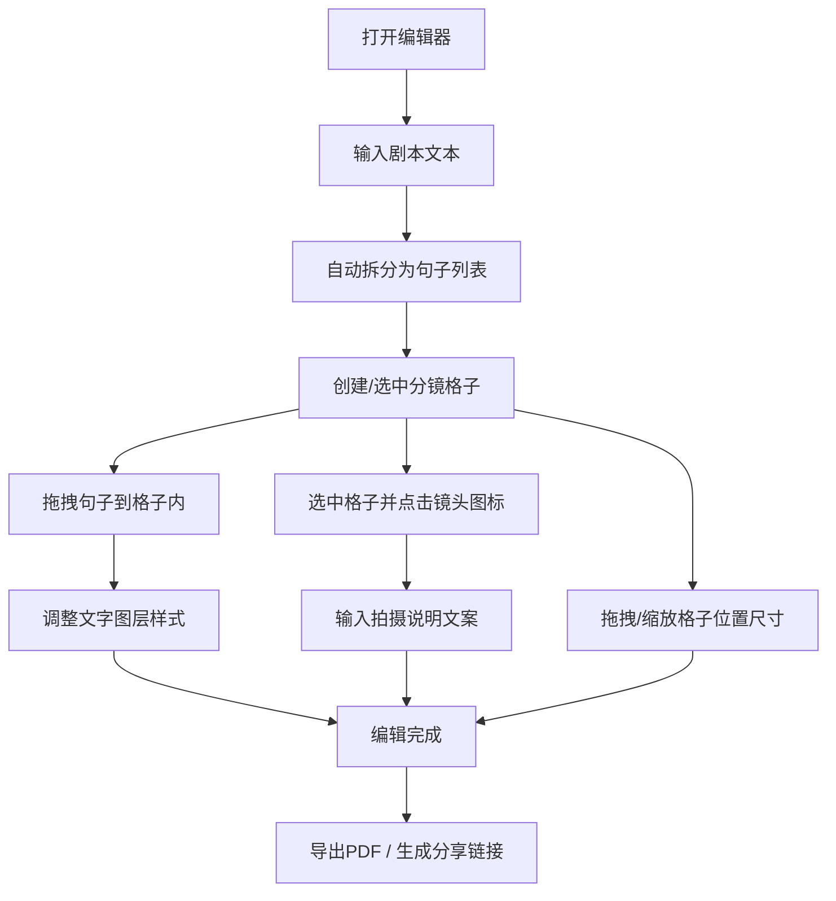

## 1. 产品概述

漫画分镜脚本编辑器与协作分享平台是一款面向漫画家、编剧和视觉创作者的在线工具，提供类似白板的无限画布，支持自由创建和编辑漫画分镜格子。用户可以在分镜内叠加多图层图像与文字，添加专业镜头语言标记，并将作品导出为PDF或生成分享链接进行协作。

## 2. 核心功能

### 2.1 用户角色
| 角色 | 注册方式 | 核心权限 |
|------|----------|----------|
| 创作者 | 无需注册（本地使用） | 创建分镜、编辑图层、导出PDF、生成分享链接 |
| 协作者 | 通过分享链接访问 | 查看分镜脚本内容（只读模式） |

### 2.2 功能模块
1. **画布模块**：无限滚动白板、分镜格子CRUD、拖拽吸附、批量调整属性
2. **剧本面板模块**：文本输入拆分、句子列表、拖拽生成文字图层
3. **镜头工具箱模块**：8种镜头图标、拍摄说明输入、格子标记渲染
4. **导航栏模块**：应用标题、导出PDF功能、生成分享链接功能

### 2.3 页面详情
| 页面名称 | 模块名称 | 功能描述 |
|----------|----------|----------|
| 编辑器主页 | 左侧剧本面板 | 输入框自动拆分句子为列表，支持拖拽句子到画布格子 |
| 编辑器主页 | 中间画布区域 | 无限滚动网格背景，分镜格子可拖拽缩放、支持多选批量编辑 |
| 编辑器主页 | 镜头工具箱 | 8个镜头类型图标按钮，选中格子后可标记镜头和输入拍摄说明 |
| 编辑器主页 | 顶部导航栏 | 应用Logo、导出PDF按钮、分享链接按钮 |

## 3. 核心流程

用户打开编辑器后，可在左侧输入剧本文本，系统自动按句子拆分为列表。用户拖拽句子到画布的分镜格子中，文字自动成为该格子内的独立图层，支持字体、字号、颜色、对齐方式、旋转和移动属性调整。画布上可自由创建分镜格子，拖拽过程中显示蓝色吸附辅助线，多个格子可批量调整尺寸和圆角。选中格子后，通过右上角工具栏选择镜头类型，格子显示对应图标并可输入拍摄说明文案。完成编辑后，点击导航栏的导出按钮生成A4横向PDF，或生成分享链接供协作者查看。

## 4. 用户界面设计

### 4.1 设计风格
- 主色调：浅灰色(#f0f0f0)背景 + 白色卡片 + 深灰色(#2d2d2d)文字
- 主按钮色：#4a90d9蓝色，悬浮#357abd，点击#286090
- 字体：思源黑体、思源宋体、站酷快乐体三种中文字体可选
- 按钮风格：扁平线性风格图标，圆角过渡按钮
- 图标：lucide-react扁平线性风格，镜头图标为简笔画风格
- 动画：CSS过渡 duration 0.2s ease
- 画布背景：#f0f0f0带半透明网格线#d0d0d0

### 4.2 页面设计概览
| 页面名称 | 模块名称 | UI元素 |
|----------|----------|--------|
| 编辑器主页 | 顶部导航栏 | 深灰#2d2d2d文字、蓝色按钮、左侧Logo、右侧操作按钮组 |
| 编辑器主页 | 左侧剧本面板 | 白色背景、固定宽度280px、输入框、可拖拽句子卡片列表 |
| 编辑器主页 | 画布区域 | 浅灰#f0f0f0网格背景、无限滚动、白色分镜格子、蓝色吸附线 |
| 编辑器主页 | 镜头工具箱 | 浮动面板、8个图标按钮网格、选中状态蓝色高亮 |
| 编辑器主页 | 属性面板 | 字号滑块、字体下拉、色环取色器、对齐按钮组、旋转滑块 |

### 4.3 响应式布局
- Desktop-first设计，主适配范围800px-1920px屏幕宽度
- 屏幕宽度 < 1024px：左侧剧本面板可折叠为图标抽屉
- 屏幕宽度 < 800px：镜头工具箱收纳为下拉菜单
- 画布区域始终自适应剩余空间，支持触摸板双指缩放平移

### 4.4 性能要求
- 分镜格子拖拽/缩放响应延迟 < 50ms
- PDF生成(A4横向)时间 < 3秒
- 画布同时支持至少50个分镜格子流畅操作
