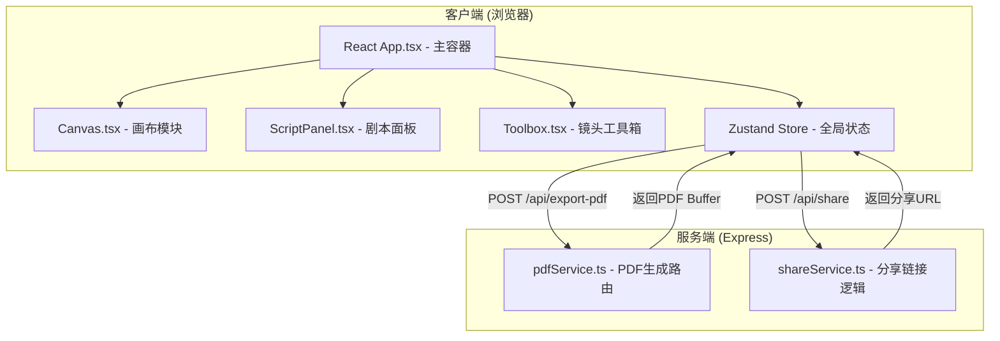
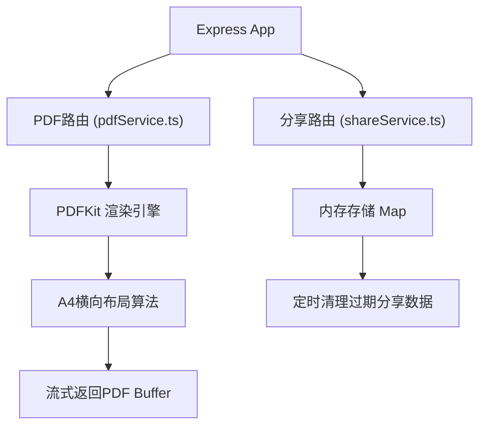
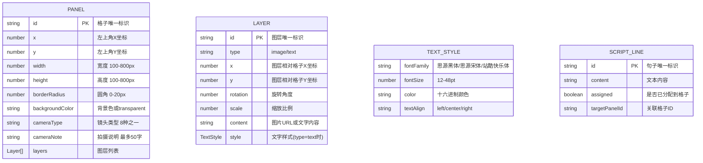

## 1. 架构设计



## 2. 技术描述

- **前端框架**: React 18 + TypeScript 5
- **构建工具**: Vite 5 + @vitejs/plugin-react
- **状态管理**: Zustand 4
- **图标库**: lucide-react
- **后端框架**: Express 4 + TypeScript
- **PDF生成**: PDFKit (Node.js服务端)
- **唯一标识**: uuid
- **跨域处理**: cors
- **样式方案**: 原生CSS + CSS变量，无Tailwind依赖
- **包管理器**: npm

## 3. 路由定义
| 路由 | 方法 | 用途 |
|------|------|------|
| / | GET | 编辑器主页 (Vite SPA) |
| /api/export-pdf | POST | 接收分镜数据生成并返回PDF文件 |
| /api/share | POST | 生成分享链接并存入临时存储 |
| /s/:token | GET | 通过分享链接查看只读版分镜脚本 |

## 4. API 定义

### 4.1 导出PDF接口
```typescript
// POST /api/export-pdf
interface ExportPdfRequest {
  panels: Panel[];
  scriptLines: ScriptLine[];
}

interface ExportPdfResponse {
  success: boolean;
  pdfUrl?: string;
  error?: string;
}
```

### 4.2 分享链接接口
```typescript
// POST /api/share
interface ShareRequest {
  panels: Panel[];
  scriptLines: ScriptLine[];
  expireHours?: number;
}

interface ShareResponse {
  success: boolean;
  shareUrl?: string;
  token?: string;
  error?: string;
}

// GET /s/:token
interface ShareViewResponse {
  valid: boolean;
  panels?: Panel[];
  scriptLines?: ScriptLine[];
  error?: string;
}
```

## 5. 服务器架构图



## 6. 数据模型

### 6.1 数据模型定义



### 6.2 Zustand Store 状态定义
```typescript
interface EditorState {
  // 分镜格子
  panels: Panel[];
  selectedPanelIds: string[];
  
  // 剧本句子
  scriptLines: ScriptLine[];
  scriptInput: string;
  
  // 选中的图层
  selectedLayerId: string | null;
  selectedPanelIdForCamera: string | null;
  
  // Actions
  addPanel: (panel: Partial<Panel>) => void;
  updatePanel: (id: string, updates: Partial<Panel>) => void;
  deletePanel: (id: string) => void;
  selectPanels: (ids: string[]) => void;
  batchUpdatePanels: (ids: string[], updates: Partial<Panel>) => void;
  
  addLayerToPanel: (panelId: string, layer: Layer) => void;
  updateLayer: (panelId: string, layerId: string, updates: Partial<Layer>) => void;
  removeLayer: (panelId: string, layerId: string) => void;
  
  setScriptInput: (text: string) => void;
  splitScriptToLines: () => void;
  assignScriptLineToPanel: (lineId: string, panelId: string) => void;
  
  setCameraType: (panelId: string, cameraType: string) => void;
  setCameraNote: (panelId: string, note: string) => void;
  
  exportPdf: () => Promise<void>;
  generateShareLink: () => Promise<string | null>;
}
```
