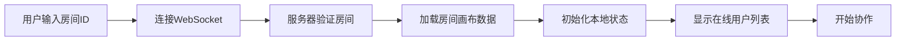

## 1. 产品概述

在线实时协作思维导图与脑暴白板应用，解决远程团队头脑风暴时想法记录零散、关联性难以可视化的问题，提供实时同步并自动整理思维脉络的白板式协作工具。

- 核心目标：让远程团队协作如同在同一白板前讨论一样自然高效
- 目标用户：产品经理、设计师、开发团队等需要远程头脑风暴的协作群体
- 市场价值：提升远程协作效率，可视化思维脉络，促进创意碰撞

## 2. 核心功能

### 2.1 用户角色

| 角色 | 加入方式 | 核心权限 |
|------|----------|----------|
| 协作者 | 通过房间ID加入 | 添加/编辑/删除节点、创建连线、导出导入画布 |

### 2.2 功能模块

1. **画布主页面**：思维导图画布、节点渲染、连线展示、语义聚合组
2. **节点管理**：节点创建、编辑、拖拽、删除、标签、备注
3. **连线系统**：贝塞尔曲线连线、箭头指示、拖拽创建、删除
4. **实时协作**：多用户同步、在线用户显示、光标位置追踪
5. **语义聚合**：关键词匹配分组、组框拖拽、整体移动
6. **导入导出**：JSON格式导出、导入还原画布
7. **画布操作**：缩放、平移、快捷键支持

### 2.3 页面详情

| 页面名称 | 模块名称 | 功能描述 |
|-----------|-------------|---------------------|
| 画布主页 | 顶部工具栏 | 导出、导入、清空画布功能按钮 |
| 画布主页 | 在线用户栏 | 显示当前在线用户头像列表 |
| 画布主页 | SVG画布区域 | 节点、连线、聚合组的渲染与交互 |
| 画布主页 | 节点组件 | 显示标题、标签、备注图标，支持双击编辑、拖拽移动 |
| 画布主页 | 连线组件 | 贝塞尔曲线连接，箭头方向指示，高亮选中 |
| 画布主页 | 语义聚合组 | 半透明灰色背景组框，支持整体拖拽移动 |

## 3. 核心流程

### 3.1 用户加入房间流程

### 3.2 节点创建与同步流程

### 3.3 语义聚合分组流程

## 4. 用户界面设计

### 4.1 设计风格

- **主色调**：极简白 #FAFAFA
- **节点默认色**：浅蓝 #E3F2FD
- **节点选中边框**：深蓝 #1565C0
- **连线默认色**：灰色 #BDBDBD
- **连线选中色**：蓝色 #2196F3
- **节点样式**：柔和圆角矩形，border-radius: 12px
- **字体**：标题 14px Roboto Medium，备注 12px Roboto Regular 灰色
- **阴影**：节点拖拽时 box-shadow: 0 4px 12px rgba(0,0,0,0.15)
- **过渡动画**：transition: all 0.2s ease
- **交互反馈**：拖拽时微缩放 transform: scale(1.05)

### 4.2 页面设计概览

| 页面名称 | 模块名称 | UI元素 |
|-----------|-------------|-------------|
| 画布主页 | 顶部工具栏 | 左侧固定，导入/导出/清空按钮，圆角设计，hover效果 |
| 画布主页 | 在线用户栏 | 左上角头像堆叠显示，悬停显示用户名 |
| 画布主页 | 节点组件 | 圆角矩形，标题文字，标签胶囊，备注图标 |
| 画布主页 | 连线组件 | 贝塞尔曲线，末端箭头，选中高亮蓝色 |
| 画布主页 | 语义聚合组 | 半透明灰色背景，圆角边框，组标题 |

### 4.3 响应式设计

- Desktop-first设计，画布最小宽度800px
- 工具栏固定在画布顶部左侧，始终可见
- 画布区域支持缩放手势（Ctrl+滚轮）和平移（空格+拖拽）
- 节点和连线基于画布坐标系，不受屏幕尺寸影响

### 4.4 交互细节

- 双击画布空白处弹出输入框创建节点，自动聚焦
- 从节点右下角拖拽到另一节点左上角创建连线
- 拖拽过程中显示半透明蓝色虚线预览
- 右键点击连线可删除
- 节点碰撞时自动弹开（弹性动画）
- 组框可整体拖拽移动组内所有节点
