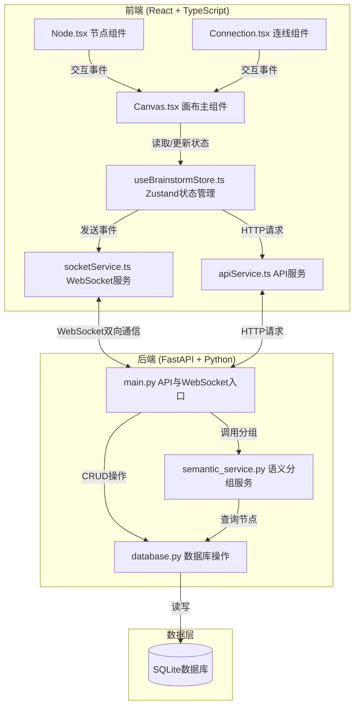
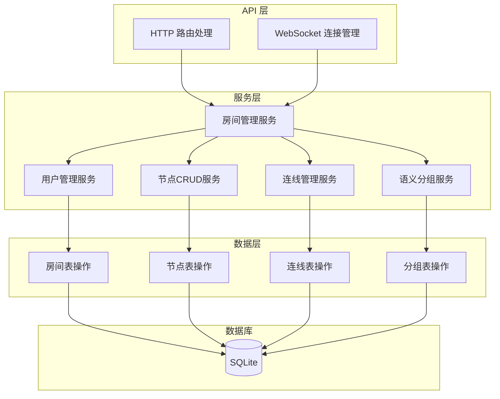

## 1. 架构设计



## 2. 技术栈说明

- **前端框架**：React 18 + TypeScript
- **构建工具**：Vite (开启HMR)
- **状态管理**：Zustand
- **路由**：React Router DOM
- **数据请求**：Axios + TanStack Query
- **实时通信**：Socket.IO Client
- **画布渲染**：SVG
- **后端框架**：FastAPI
- **数据库**：SQLite
- **后端实时通信**：WebSocket (FastAPI原生)

## 3. 路由定义

| 路由 | 用途 |
|-------|---------|
| / | 首页/房间入口 |
| /room/:roomId | 思维导图画布房间 |

## 4. API 定义

### 4.1 数据类型定义

```typescript
interface BrainstormNode {
  id: string;
  roomId: string;
  title: string;
  note: string;
  tags: string[];
  x: number;
  y: number;
  width: number;
  height: number;
  groupId?: string;
  createdAt: string;
  updatedAt: string;
}

interface Connection {
  id: string;
  roomId: string;
  fromNodeId: string;
  toNodeId: string;
  createdAt: string;
}

interface SemanticGroup {
  id: string;
  roomId: string;
  keyword: string;
  nodeIds: string[];
  x: number;
  y: number;
  width: number;
  height: number;
}

interface User {
  id: string;
  name: string;
  avatar: string;
  roomId: string;
  cursorX?: number;
  cursorY?: number;
}

interface RoomState {
  nodes: BrainstormNode[];
  connections: Connection[];
  groups: SemanticGroup[];
  users: User[];
}
```

### 4.2 HTTP API

| 方法 | 路径 | 描述 | 请求体 | 响应 |
|------|------|------|--------|------|
| POST | /api/rooms | 创建房间 | { roomName: string } | { roomId: string } |
| GET | /api/rooms/{roomId} | 获取房间状态 | - | RoomState |
| POST | /api/rooms/{roomId}/export | 导出画布JSON | - | JSON Blob |
| POST | /api/rooms/{roomId}/import | 导入画布JSON | form-data file | { success: boolean } |

### 4.3 WebSocket事件

| 事件名 | 方向 | 数据 | 描述 |
|--------|------|------|------|
| joinRoom | 客户端→服务器 | { roomId, userId, userName } | 加入房间 |
| roomState | 服务器→客户端 | RoomState | 房间完整状态 |
| nodeCreate | 客户端→服务器 | BrainstormNode | 创建节点 |
| nodeUpdate | 服务器→客户端 | BrainstormNode | 节点更新广播 |
| nodeMove | 客户端→服务器 | { id, x, y } | 节点移动 |
| nodeDelete | 客户端→服务器 | { id } | 删除节点 |
| connectionCreate | 客户端→服务器 | Connection | 创建连线 |
| connectionDelete | 客户端→服务器 | { id } | 删除连线 |
| connectionUpdate | 服务器→客户端 | Connection[] | 连线更新广播 |
| groupUpdate | 服务器→客户端 | SemanticGroup[] | 语义分组更新 |
| cursorUpdate | 客户端→服务器 | { x, y } | 光标位置更新 |
| userJoin | 服务器→客户端 | User | 用户加入通知 |
| userLeave | 服务器→客户端 | { userId } | 用户离开通知 |

## 5. 服务器架构图



## 6. 数据模型

### 6.1 数据模型ER图

```mermaid
erDiagram
    ROOMS ||--o{ NODES : contains
    ROOMS ||--o{ CONNECTIONS : contains
    ROOMS ||--o{ SEMANTIC_GROUPS : contains
    NODES ||--o{ CONNECTIONS : from
    NODES ||--o{ CONNECTIONS : to
    SEMANTIC_GROUPS ||--o{ NODES : groups
    
    ROOMS {
        string id PK
        string name
        datetime created_at
        datetime updated_at
    }
    
    NODES {
        string id PK
        string room_id FK
        string title
        string note
        string tags
        float x
        float y
        float width
        float height
        string group_id FK
        datetime created_at
        datetime updated_at
    }
    
    CONNECTIONS {
        string id PK
        string room_id FK
        string from_node_id FK
        string to_node_id FK
        datetime created_at
    }
    
    SEMANTIC_GROUPS {
        string id PK
        string room_id FK
        string keyword
        float x
        float y
        float width
        float height
        datetime created_at
        datetime updated_at
    }
```

### 6.2 DDL语句

```sql
-- 房间表
CREATE TABLE rooms (
    id TEXT PRIMARY KEY,
    name TEXT NOT NULL,
    created_at TEXT NOT NULL DEFAULT CURRENT_TIMESTAMP,
    updated_at TEXT NOT NULL DEFAULT CURRENT_TIMESTAMP
);

-- 节点表
CREATE TABLE nodes (
    id TEXT PRIMARY KEY,
    room_id TEXT NOT NULL,
    title TEXT NOT NULL,
    note TEXT DEFAULT '',
    tags TEXT DEFAULT '[]',
    x REAL NOT NULL DEFAULT 0,
    y REAL NOT NULL DEFAULT 0,
    width REAL NOT NULL DEFAULT 200,
    height REAL NOT NULL DEFAULT 80,
    group_id TEXT,
    created_at TEXT NOT NULL DEFAULT CURRENT_TIMESTAMP,
    updated_at TEXT NOT NULL DEFAULT CURRENT_TIMESTAMP,
    FOREIGN KEY (room_id) REFERENCES rooms(id),
    FOREIGN KEY (group_id) REFERENCES semantic_groups(id)
);

CREATE INDEX idx_nodes_room_id ON nodes(room_id);
CREATE INDEX idx_nodes_group_id ON nodes(group_id);

-- 连线表
CREATE TABLE connections (
    id TEXT PRIMARY KEY,
    room_id TEXT NOT NULL,
    from_node_id TEXT NOT NULL,
    to_node_id TEXT NOT NULL,
    created_at TEXT NOT NULL DEFAULT CURRENT_TIMESTAMP,
    FOREIGN KEY (room_id) REFERENCES rooms(id),
    FOREIGN KEY (from_node_id) REFERENCES nodes(id),
    FOREIGN KEY (to_node_id) REFERENCES nodes(id)
);

CREATE INDEX idx_connections_room_id ON connections(room_id);
CREATE INDEX idx_connections_from_node ON connections(from_node_id);
CREATE INDEX idx_connections_to_node ON connections(to_node_id);

-- 语义分组表
CREATE TABLE semantic_groups (
    id TEXT PRIMARY KEY,
    room_id TEXT NOT NULL,
    keyword TEXT NOT NULL,
    x REAL NOT NULL DEFAULT 0,
    y REAL NOT NULL DEFAULT 0,
    width REAL NOT NULL DEFAULT 400,
    height REAL NOT NULL DEFAULT 300,
    created_at TEXT NOT NULL DEFAULT CURRENT_TIMESTAMP,
    updated_at TEXT NOT NULL DEFAULT CURRENT_TIMESTAMP,
    FOREIGN KEY (room_id) REFERENCES rooms(id)
);

CREATE INDEX idx_groups_room_id ON semantic_groups(room_id);
```
