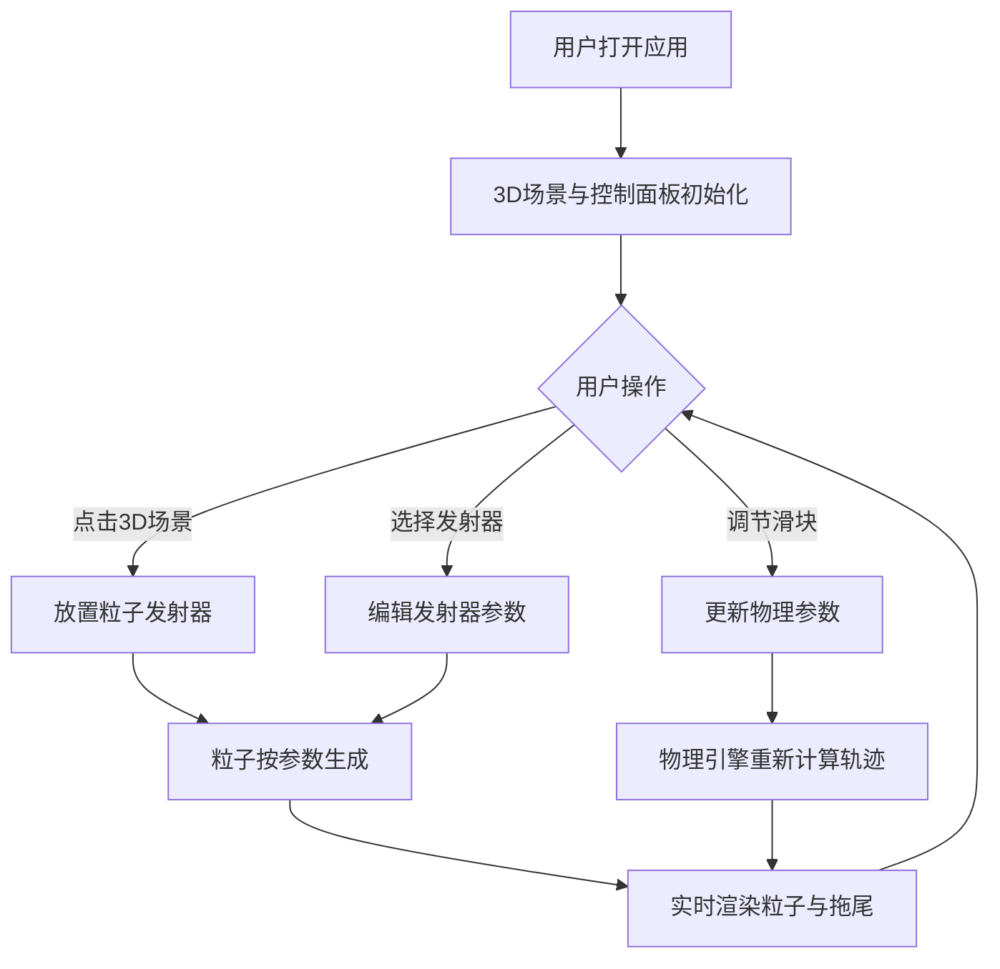

## 1. 产品概述

交互式粒子流体动力学模拟器——一款面向科普教育与游戏特效设计的3D粒子系统可视化工具。用户可在3D场景中放置多个粒子发射器，实时调节风场、涡流、粘滞系数等物理参数，直观观察粒子集群在不同流体动力学条件下的运动轨迹与形态变化。目标用户为科普工作者、物理教师及游戏特效设计师。

## 2. 核心功能

### 2.1 功能模块

1. **3D粒子场景页**：3D渲染主区域，支持点击放置发射器、粒子实时渲染与拖尾效果
2. **控制面板**：右侧参数调节面板，包含物理参数滑块与发射器设置

### 2.2 页面详情

| 页面名称 | 模块名称 | 功能描述 |
|----------|----------|----------|
| 3D粒子场景 | 粒子发射器 | 点击3D场景任意位置放置发射器（最多3个），每个发射器独立配置参数 |
| 3D粒子场景 | 粒子渲染 | 半透明渐变色球体渲染，0.5秒拖尾尾迹效果 |
| 3D粒子场景 | 物理模拟 | 风场、涡流、粘滞系数实时计算粒子轨迹 |
| 控制面板 | 全局物理参数 | 空气粘滞系数、重力、涡流频率与振幅的滑块调节 |
| 控制面板 | 发射器参数 | 生命周期、发射速率、初始速度矢量、颜色渐变、粒子大小 |
| 控制面板 | 风场控制 | 全局风向与强度调节 |

## 3. 核心流程

用户打开应用后看到暗色主题3D场景与右侧控制面板。点击3D场景放置粒子发射器，粒子按发射器参数实时生成并受物理场影响运动。通过右侧滑块调节全局物理参数，所有粒子运动轨迹立即响应并平滑过渡。可切换不同发射器独立调节其参数。

## 4. 界面设计

### 4.1 设计风格

- **主题**：暗色科幻/技术感（背景#1a1a2e，面板#16213e）
- **主色调**：深蓝灰为基底，#e94560（珊瑚红）至#0f3460（深蓝）渐变作为点缀
- **按钮/滑块样式**：彩色渐变条（#e94560 → #0f3460），圆角设计
- **字体**：JetBrains Mono 用于参数数值显示，Outfit 用于UI标签
- **布局**：左侧3D场景占主区域，右侧320px固定宽度控制面板
- **动画**：UI控件弹跳动画（spring，bounce=0.2），滑块悬停tooltip
- **图标风格**：线性图标，统一2px描边

### 4.2 页面设计概览

| 页面名称 | 模块名称 | UI元素 |
|----------|----------|--------|
| 3D粒子场景 | 场景区域 | 深色背景、半透明渐变粒子球体、拖尾效果、发射器位置标记 |
| 控制面板 | 全局物理参数组 | 滑块（渐变条）、数值tooltip、分隔线、组标题 |
| 控制面板 | 发射器参数组 | 色轮选择器、矢量XYZ输入、滑块、生命周期/速率控制 |
| 控制面板 | 风场控制组 | 风向XYZ滑块、强度滑块 |

### 4.3 响应式设计

- 桌面端（≥768px）：左侧3D场景 + 右侧320px控制面板
- 窄屏（<768px）：控制面板收起至屏幕底部，变为横向可滑动标签页，3D场景占满剩余高度
- 所有交互控件支持触摸操作

### 4.4 3D场景指引

- **环境**：无HDRI，纯暗色背景营造粒子发光效果
- **光照**：微弱环境光 + 点光源随发射器位置动态放置，粒子通过自发光材质渲染
- **相机**：透视相机，支持OrbitControls旋转/缩放/平移
- **粒子渲染**：Points几何体 + 自定义着色器实现渐变色与透明度衰减，尾迹通过保留历史帧位置实现
- **后处理**：可选的Bloom效果增强粒子发光感
- **性能预算**：15000粒子@30FPS，使用BufferGeometry与GPU端计算
