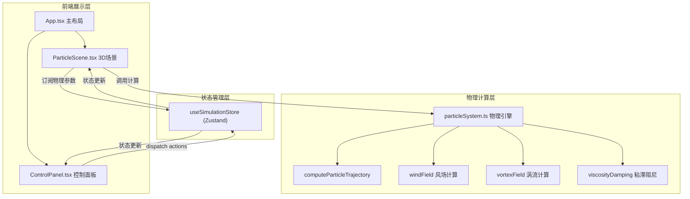

## 1. 架构设计



## 2. 技术说明

- **前端框架**：React 18 + TypeScript + Vite
- **3D渲染**：Three.js + @react-three/fiber + @react-three/drei
- **状态管理**：Zustand
- **样式方案**：CSS Modules + CSS Variables（暗色主题令牌系统）
- **初始化工具**：vite-init（react-ts模板）
- **后端**：无
- **数据库**：无

## 3. 路由定义

| 路由 | 用途 |
|------|------|
| / | 主页面，包含3D粒子场景与控制面板 |

## 4. 数据模型

### 4.1 Zustand Store 数据模型

```typescript
interface EmitterConfig {
  id: string;
  position: [number, number, number];
  lifetime: number;          // 1-8秒
  emitRate: number;          // 50-500粒子/秒
  velocity: [number, number, number]; // -10到10
  colorStart: string;        // 起始颜色
  colorEnd: string;          // 终止颜色
  particleSize: number;      // 1-6像素
  active: boolean;
}

interface PhysicsConfig {
  viscosity: number;         // 0.01-1.0
  gravity: number;           // -2到2
  vortexFrequency: number;   // 0.1-5.0
  vortexAmplitude: number;   // 0-10
  windDirection: [number, number, number];
  windStrength: number;
}

interface SimulationState {
  emitters: EmitterConfig[];
  physics: PhysicsConfig;
  activeEmitterId: string | null;
  // actions
  addEmitter: (position: [number, number, number]) => void;
  removeEmitter: (id: string) => void;
  updateEmitter: (id: string, partial: Partial<EmitterConfig>) => void;
  setActiveEmitter: (id: string | null) => void;
  updatePhysics: (partial: Partial<PhysicsConfig>) => void;
}
```

### 4.2 粒子数据结构

```typescript
interface Particle {
  position: [number, number, number];
  velocity: [number, number, number];
  age: number;
  lifetime: number;
  colorStart: [number, number, number];
  colorEnd: [number, number, number];
  size: number;
  trail: [number, number, number][];  // 最近0.5秒位置历史
}
```

## 5. 物理计算架构

### 5.1 computeParticleTrajectory 函数

```typescript
function computeParticleTrajectory(
  particles: Particle[],
  physics: PhysicsConfig,
  deltaTime: number
): void
```

每帧执行：
1. 遍历所有粒子，计算合力 = 重力 + 风场力 + 涡流力 + 粘滞阻尼
2. 更新速度：v += force * dt
3. 更新位置：pos += v * dt
4. 更新拖尾：将当前位置推入trail数组，移除超过0.5秒的旧位置
5. 更新年龄：age += dt，超过lifetime则标记为死亡

### 5.2 风场计算

```typescript
function windField(pos: Vec3, windDir: Vec3, windStrength: number): Vec3
```

全局均匀风场，返回力向量 = windDir.normalized * windStrength

### 5.3 涡流计算

```typescript
function vortexField(
  pos: Vec3,
  frequency: number,
  amplitude: number,
  time: number
): Vec3
```

基于Curl Noise的3D涡流场，使用正弦函数组合生成无散度速度场

### 5.4 粘滞阻尼

```typescript
function viscosityDamping(velocity: Vec3, viscosity: number): Vec3
```

速度衰减：v *= (1 - viscosity * dt)
