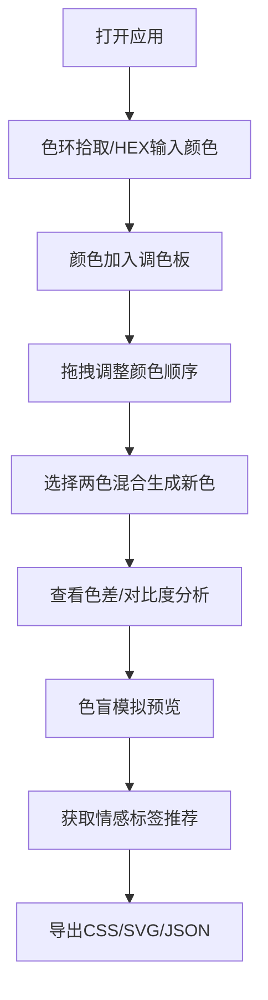

## 1. 产品概述
在线交互式颜色主题调色板生成与分析工具，帮助设计师和开发者通过拾取、混合和调整颜色创建自定义调色板，并提供专业的对比度、色盲友好度分析和情感标签推荐。
- 目标用户：UI/UX设计师、前端开发者、品牌视觉设计师
- 产品价值：一站式颜色工具，降低配色决策成本，提升设计工作效率

## 2. 核心功能

### 2.1 功能模块
1. **颜色拾取与混合模块**：HSV色环拾取器、亮度/饱和度滑块、HEX输入框、四种混合模式（正片叠底、滤色、叠加、柔光）
2. **调色板管理模块**：添加/删除/拖拽重排颜色、最多12个颜色槽位、颜色详情面板
3. **智能分析模块**：HSL色差计算、WCAG AA对比度检测、色盲模拟视图（红/绿/蓝色盲）
4. **情感标签推荐模块**：基于主色色相自动推荐3个情感标签
5. **导出与保存模块**：CSS变量导出、SVG色板导出、JSON数组导出、剪贴板复制

### 2.2 页面详情
| 页面名称 | 模块名称 | 功能描述 |
|-----------|-------------|---------------------|
| 主应用页面 | 顶部渐变装饰条 | 青色(#00b4d8)到紫色(#7209b7)渐变装饰 |
| 主应用页面 | 左侧调色板区 | 调色板预览行（横向色块条）、智能分析面板 |
| 主应用页面 | 右侧颜色拾取区 | HSV色环拾取器、颜色混合工具、颜色详情面板 |
| 主应用页面 | 情感标签区 | 调色板顶部标签徽章展示情感标签 |
| 主应用页面 | 导出工具栏 | CSS/SVG/JSON三种格式导出按钮 |

## 3. 核心流程
用户打开应用 → 通过色环拾取或HEX输入添加颜色 → 拖拽调整调色板顺序 → 选择两种颜色进行混合生成新色 → 查看色差警告和色盲模拟 → 获取情感标签推荐 → 导出调色板数据

## 4. 用户界面设计

### 4.1 设计风格
- **主色调**：青色(#00b4d8) + 紫色(#7209b7)渐变
- **背景色**：深色主题，背景#1a1a2e，卡片#16213e，文字#e0e0e0
- **按钮风格**：圆角4px，悬停0.2s缓动缩放+发光效果(box-shadow: 0 0 8px rgba(0,180,216,0.4))，点击回弹动画
- **字体**：现代无衬线字体，标题16px粗体，正文14px常规，小字12px
- **布局风格**：左右两栏卡片布局，顶部渐变装饰条

### 4.2 页面设计概述
| 页面名称 | 模块名称 | UI元素 |
|-----------|-------------|-------------|
| 主应用页面 | 渐变装饰条 | 线性渐变，高度4px，贯穿顶部 |
| 主应用页面 | 调色板预览行 | 横向色块80x80px，色值文字标签，拖拽半透明，目标槽高亮 |
| 主应用页面 | 色环拾取器 | 600x600px HSV色环，亮度滑块，HEX输入框 |
| 主应用页面 | 分析面板 | 色差矩阵、WCAG对比度卡片、色盲模拟小预览图 |
| 主应用页面 | 详情面板 | HEX/RGB/HSL值显示、调和色/互补色/三角色方案色块 |
| 主应用页面 | 情感标签 | 圆角徽章样式，渐变背景色，3个标签并排 |

### 4.3 响应式设计
- 桌面端（>768px）：左右两栏布局，色环600x600px
- 移动端（≤768px）：上下布局，色环缩小至400x400px，字体相应调小
- 触摸优化：色块点击区域≥44x44px，滑块触摸区域扩展

### 4.4 动效规范
- 悬停：0.2s ease缓动，缩放1.03，青色发光阴影
- 点击：scale(0.97)回弹，0.15s过渡
- 拖拽：被拖拽元素opacity:0.5，跟随鼠标，目标槽位青色边框高亮
- 颜色更新：色块背景色0.15s平滑过渡
