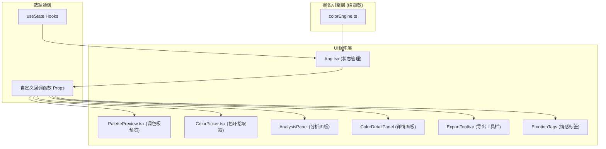

## 1. 架构设计


## 2. 技术描述
- **前端框架**：React@18 + TypeScript
- **构建工具**：Vite@5
- **样式方案**：原生CSS（CSS Modules风格内联+全局变量）
- **状态管理**：React useState（轻量级，无需额外库）
- **项目初始化**：Vite官方react-ts模板

## 3. 文件结构定义
```
d:\P\tasks\auto82\
├── package.json
├── index.html
├── tsconfig.json
├── vite.config.js
└── src/
    ├── main.tsx           (入口文件)
    ├── App.tsx            (主应用：状态管理、组件组合)
    ├── colorEngine.ts     (纯函数颜色计算引擎)
    ├── PalettePreview.tsx (调色板预览+拖拽排序)
    ├── ColorPicker.tsx    (色环拾取+混合工具)
    ├── AnalysisPanel.tsx  (色差/对比度/色盲分析)
    ├── ColorDetailPanel.tsx (颜色详情+调和方案)
    ├── ExportToolbar.tsx  (导出工具)
    ├── EmotionTags.tsx    (情感标签)
    └── index.css          (全局样式)
```

## 4. 核心类型定义

### 4.1 颜色类型
```typescript
type RGB = { r: number; g: number; b: number };
type HSL = { h: number; s: number; l: number };
type HSV = { h: number; s: number; v: number };
type ColorFormat = 'hex' | 'rgb' | 'hsl';

interface PaletteColor {
  id: string;
  hex: string;
  rgb: RGB;
  hsl: HSL;
}
```

### 4.2 颜色引擎接口
```typescript
// 色值转换
hexToRgb(hex: string): RGB
rgbToHex(rgb: RGB): string
rgbToHsl(rgb: RGB): HSL
hslToRgb(hsl: HSL): RGB
hsvToRgb(hsv: HSV): RGB
rgbToHsv(rgb: RGB): HSV

// 调色板算法
getMonochromatic(base: string, count: number): string[]
getComplementary(base: string, count: number): string[]
getTriadic(base: string): string[]

// 混合模式
blendMultiply(c1: string, c2: string): string
blendScreen(c1: string, c2: string): string
blendOverlay(c1: string, c2: string): string
blendSoftLight(c1: string, c2: string): string

// 分析计算
hslDistance(c1: string, c2: string): number
wcagContrast(c1: string, c2: string): number
simulateColorBlindness(hex: string, type: 'protanopia'|'deuteranopia'|'tritanopia'): string

// 情感标签
getEmotionTags(baseHue: number): string[]
```

### 4.3 组件Props接口
```typescript
// PalettePreview
interface PalettePreviewProps {
  colors: PaletteColor[];
  selectedId: string | null;
  onSelect: (id: string) => void;
  onReorder: (fromIdx: number, toIdx: number) => void;
  onRemove: (id: string) => void;
  maxColors: number;
}

// ColorPicker
interface ColorPickerProps {
  currentColor: string;
  paletteColors: PaletteColor[];
  onColorChange: (hex: string) => void;
  onBlendAdd: (hex: string) => void;
}
```

## 5. 性能优化策略
- **节流防抖**：色环mousemove使用requestAnimationFrame节流，60fps
- **纯函数缓存**：颜色转换结果使用Map缓存，避免重复计算
- **React优化**：useMemo缓存计算结果，useCallback稳定回调引用，React.memo包裹子组件
- **DOM优化**：Canvas绘制色环（600x600），避免大量DOM元素
- **懒计算**：分析面板数据仅在调色板变化时重新计算

## 6. WCAG对比度标准
- AA级正常文本：对比度≥4.5:1
- AA级大文本：对比度≥3:1
- AAA级正常文本：对比度≥7:1
- 检测对象：调色板颜色 vs #ffffff（白背景），调色板颜色 vs #000000（黑背景）

## 7. 色盲模拟算法
基于Brettel et al. 1997标准色盲模拟矩阵：
- Protanopia（红色盲）：L锥缺失
- Deuteranopia（绿色盲）：M锥缺失  
- Tritanopia（蓝色盲）：S锥缺失
