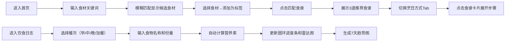

## 1. 产品概述

本项目是一个在线交互式食谱生成与营养可视化日志应用，帮助用户基于现有食材智能推荐食谱，并通过可视化图表跟踪每日饮食营养摄入情况，促进健康饮食习惯。

- 主要目的：解决用户"有什么食材能做什么菜"的痛点，同时提供科学的营养摄入追踪功能
- 目标用户：关注健康饮食、希望管理日常营养摄入的普通用户
- 产品价值：将食谱推荐 + 营养可视化一站式体验

## 2. 核心功能

### 2.1 功能模块
1. **食谱生成页面**：食材输入、模糊搜索、食谱推荐卡片、烹饪方式切换、步骤展开
2. **饮食日志页面**：三餐记录、份量输入、营养自动计算、圆环进度条
3. **营养可视化面板**：雷达图、7天趋势折线图

### 2.2 页面详情
| 页面名称 | 模块名称 | 功能描述 |
|-----------|-------------|---------------------|
| 食谱生成页 | 食材输入区 | 支持模糊搜索匹配50种常见食材，彩色标签展示，最多8种，可移除 |
| 食谱生成页 | 食谱推荐区 | 动态展示3道推荐食谱卡片，含名称、描述、食材、烹饪时间 |
| 食谱生成页 | 食谱详情 | 点击卡片展开分步步骤，含序号和倒计时进度条 |
| 食谱生成页 | 烹饪方式切换 | 顶部Tab切换煮/蒸/炒/烤/拌 |
| 饮食日志页 | 三餐记录区 | 早/中/晚/加餐四栏，输入食物名称和份量 |
| 饮食日志页 | 营养计算区 | 自动计算6项营养素并累计 |
| 营养可视化面板 | 圆环进度条 | 每餐各营养素与日推荐量占比 |
| 营养可视化面板 | 雷达图 | 六边形雷达图展示6项营养占比0-100% |
| 营养可视化面板 | 趋势图 | 过去7天总卡路里折线图，渐变填充，悬停弹窗 |

## 3. 核心流程

用户主流程：

## 4. 用户界面设计

### 4.1 设计风格
- **主色调**：珊瑚橙（#FF6B6B）和抹茶绿（#88B04B）双主色
- **辅助色**：珊瑚橙用于按钮和关键交互元素，抹茶绿用于营养标签和食物卡片点缀
- **按钮风格**：扁平化设计，圆角8px，hover时背景加深，点击有scale(0.95)缩放动画
- **字体**：使用现代无衬线字体，字号层级清晰（16px正文、20px小标题、28px大标题）
- **布局风格**：顶部固定导航栏 + 两栏主体布局（左60%/右40%），卡片式内容区
- **图标风格**：简洁线性图标
- **整体调性**：温暖清新、健康活力、扁平现代

### 4.2 页面设计概览
| 页面名称 | 模块名称 | UI元素 |
|-----------|-------------|-------------|
| 全局 | 导航栏 | 固定顶部，珊瑚橙logo，三个导航入口，白色背景下阴影 |
| 食谱生成页 | 食材输入区 | 大输入框带搜索图标，下拉候选列表，彩色标签（多色渐变） |
| 食谱生成页 | 食谱卡片 | 白色圆角卡片，hover阴影，抹茶绿标签点缀，烹饪时间图标 |
| 食谱生成页 | 步骤展开 | max-height动画，0.3s过渡，分步进度条 |
| 食谱生成页 | 烹饪Tab | 胶囊式Tab，珊瑚橙激活态 |
| 饮食日志页 | 三餐记录 | 四列卡片布局，输入框带份量单位选择 |
| 营养面板 | 圆环进度条 | 6个彩色圆环，百分比文字居中 |
| 营养面板 | 雷达图 | 六边形，珊瑚橙填充，顶点依次延迟弹出动画 |
| 营养面板 | 趋势图 | 折线+渐变填充，数据点流水绘制动画 |

### 4.3 响应式
- 桌面端：两栏布局（左60%右40%）
- 移动端（<768px）：右侧面板自动隐藏，左下角浮动按钮呼出
- 触摸优化：增大点击区域，最小44px×44px触控目标

### 4.4 动画与交互
- 按钮点击：scale(0.95)轻微缩放
- 卡片展开：max-height 0→500px，0.3s高度渐变
- 雷达图顶点：依次延迟0.1s弹出
- 趋势图数据点：右向左逐段流水绘制动画（1秒）
- 标签添加/移除：淡入淡出+缩放
- 输入框聚焦：珊瑚橙边框高亮
