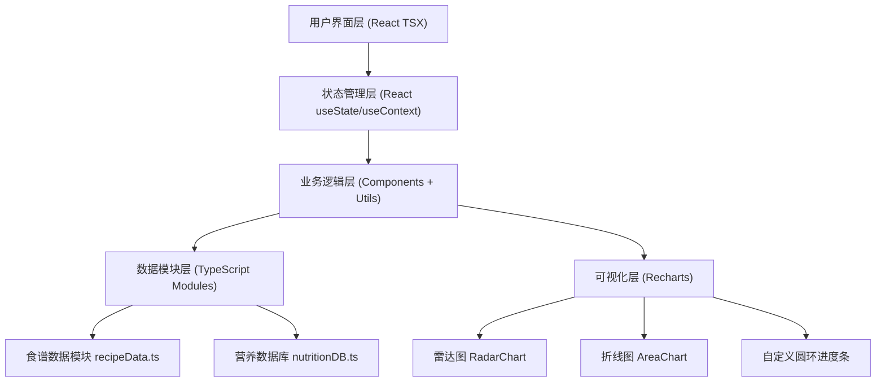

## 1. 架构设计



## 2. 技术描述

- **前端框架**：React 18 + TypeScript
- **构建工具**：Vite（最新稳定版）
- **图表库**：Recharts（雷达图、折线图）
- **CSS方案**：原生CSS + CSS Variables（无需Tailwind，保持简洁）
- **状态管理**：React内置useState + 组件props传递（无需Zustand等额外库）
- **后端**：无（纯前端项目，所有数据内置mock）
- **初始化方式**：使用vite-init创建react-ts模板

## 3. 路由定义

| 路由（内部状态路由） | 页面目的 |
|-------|---------|
| recipe | 食谱生成页面（默认首页） |
| logger | 饮食日志页面 |
| settings | 账号设置页面（占位） |

采用React内部分页状态而非react-router，保持依赖精简（用户未显式要求路由库）。

## 4. 核心文件结构与职责

| 文件路径 | 职责描述 |
|---------|---------|
| package.json | 项目依赖配置：react, react-dom, recharts, typescript, vite |
| index.html | HTML入口，挂载div#root |
| tsconfig.json | TypeScript严格模式配置 |
| vite.config.js | Vite基础配置 |
| src/App.tsx | 主应用组件：导航栏、页面路由状态、全局布局、两栏布局容器 |
| src/RecipeMatcher.tsx | 食谱生成组件：食材输入、模糊搜索、标签管理、食谱匹配与展示、步骤展开、烹饪Tab切换 |
| src/DietLogger.tsx | 饮食日志组件：三餐/加餐记录、份量输入、营养累计计算、餐次数据管理 |
| src/NutritionPanel.tsx | 营养可视化面板：6个圆环进度条、雷达图、7天趋势折线图（接收DietLogger数据） |
| src/utils/nutritionDB.ts | 营养数据库：导出lookupNutrition(name, grams)函数，内置常见食物的6项营养成分数据 |
| src/utils/recipeData.ts | 食谱数据模块：导出50种食材数组、预设食谱数据（含多种烹饪方式变体）、matchRecipes(ingredients, cookMethod)算法 |
| src/index.css | 全局样式：CSS变量（色板、字体、圆角）、动画keyframes、响应式断点 |
| src/main.tsx | React入口文件：ReactDOM.createRoot渲染App |

## 5. 数据模型定义

### 5.1 食材数据模型
```typescript
interface Ingredient {
  id: string;
  name: string;
  emoji: string;       // 用于标签图标
  color: string;       // 标签背景色
  category: 'protein' | 'vegetable' | 'grain' | 'seafood' | 'fruit' | 'dairy' | 'other';
}
```

### 5.2 食谱数据模型
```typescript
interface RecipeStep {
  order: number;
  description: string;
  durationSec: number; // 倒计时秒数
}

interface RecipeVariant {
  cookMethod: '煮' | '蒸' | '炒' | '烤' | '拌';
  steps: RecipeStep[];
  cookTimeMin: number;
}

interface Recipe {
  id: string;
  name: string;
  description: string;
  ingredients: string[];        // 食材名称数组（匹配用）
  variants: RecipeVariant[];    // 不同烹饪方式变体
  difficulty: '简单' | '中等' | '困难';
}
```

### 5.3 营养数据模型
```typescript
interface NutritionValue {
  calories: number;     // 千卡
  protein: number;      // 克
  fat: number;          // 克
  carbs: number;        // 克
  fiber: number;        // 克
  sodium: number;       // 毫克
}

interface NutritionDBEntry extends NutritionValue {
  name: string;
  aliases: string[];    // 别名，用于模糊匹配
}

interface DailyRecommended extends NutritionValue {} // 日推荐摄入量参考

type MealType = 'breakfast' | 'lunch' | 'dinner' | 'snack';

interface MealEntry {
  id: string;
  meal: MealType;
  foodName: string;
  amount: number;       // 份量
  unit: 'g' | '份';
  nutrition: NutritionValue;
}
```

## 6. 关键算法说明

### 6.1 食谱匹配算法（matchRecipes）
- 输入：用户选择的食材名称数组 + 当前烹饪方式
- 逻辑：
  1. 遍历所有食谱，计算每个食谱的"匹配分"
  2. 匹配分 = 命中食材数 / 食谱所需食材数（覆盖率）+ 命中食材数 / 用户食材数（利用率）
  3. 优先推荐支持当前烹饪方式的食谱
  4. 按匹配分降序取Top 3
- 性能：时间复杂度O(R×I)，R=食谱数(约30)，I=食材数(≤8)，远小于100ms

### 6.2 模糊搜索算法（fuzzySearchIngredient）
- 输入：用户输入的关键词
- 逻辑：
  1. 关键词小写化
  2. 遍历50种食材名称+别名，计算：
     - 前缀匹配（score=10）
     - 子串包含（score=5）
     - 编辑距离≤2（score=3）
  3. 按分数降序返回Top 5

### 6.3 营养累计逻辑
- 每次添加/删除饮食条目时，调用lookupNutrition()获取单位营养
- 按份量（克数或份数基准值）计算实际值
- 按餐次分组求和 → 得到每餐营养汇总
- 全部求和 → 得到每日汇总用于雷达图
- 历史7天数据使用mock预置值 + 当日实时值拼接用于趋势图
