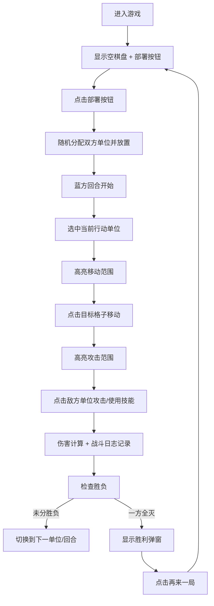
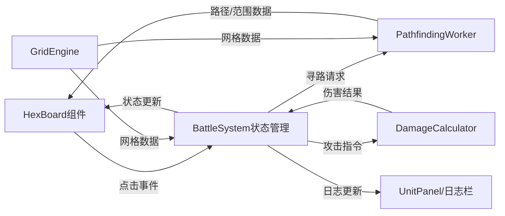

## 1. 产品概述

本产品是一款在线回合制战棋战斗沙盒应用，专为独立游戏开发者和战棋游戏爱好者设计，用于快速验证六边形网格回合制战斗机制的原型。玩家可在6x8六边形网格上部署两个阵营的单位，通过移动、攻击和释放技能进行回合制对战，系统自动计算伤害并管理战斗状态。

- **核心价值**：提供轻量级的浏览器端战棋战斗原型验证工具，无需复杂引擎环境即可测试单位移动、攻击范围及伤害计算的交互流程
- **目标用户**：独立游戏开发者、战棋游戏爱好者、游戏机制设计师

## 2. 核心功能

### 2.1 用户角色
本产品为单机对战模式，不涉及多用户角色区分。玩家同时操控蓝方和红方两个阵营进行轮流操作。

### 2.2 功能模块
1. **六边形网格系统**：网格生成、坐标转换、A星寻路（Web Worker异步计算）
2. **单位部署系统**：双阵营单位随机职业分配、棋子渲染与选中状态
3. **回合制战斗系统**：移动力计算、攻击范围判定、伤害计算、技能系统
4. **战斗日志系统**：操作记录、历史回溯、自动滚动
5. **游戏状态管理**：回合切换、胜负判定、重新开始

### 2.3 页面详情

| 页面名称 | 模块名称 | 功能描述 |
|-----------|-------------|---------------------|
| 主战斗界面 | 六边形网格棋盘 | 渲染6x8平顶六边形网格，显示单位棋子，处理点击交互，高亮移动/攻击范围 |
| 主战斗界面 | 单位属性面板 | 左侧展示选中单位的详细属性、技能列表、行动状态、技能冷却 |
| 主战斗界面 | 战斗日志栏 | 右侧展示战斗历史记录，最多30条，最新条目高亮，横向滚动 |
| 主战斗界面 | 部署/重开按钮 | 顶部控制区，一键部署单位，游戏结束后重新开始 |
| 主战斗界面 | 胜利弹窗 | 游戏结束时显示胜利阵营，提供"再来一局"按钮 |

## 3. 核心流程

### 3.1 游戏主流程

### 3.2 数据流向

## 4. 用户界面设计

### 4.1 设计风格
- **整体风格**：暗色游戏主题，沉浸式战棋氛围
- **主背景色**：#2c2c2c（深灰背景）
- **面板背景**：#383838（稍浅的深灰色）
- **主色调**：金色 #ffd700（选中高亮、胜利文字）
- **阵营色**：蓝色（蓝方）、红色（红方）
- **职业色**：战士-红色系、弓箭手-绿色系、法师-蓝色系
- **按钮风格**：圆角8px，白色背景深色文字，悬停浅灰
- **字体**：采用现代游戏感字体，清晰易读
- **布局风格**：三栏式布局（左面板 + 中央棋盘 + 右日志栏）
- **动效**：脉冲选中动画、伤害数字飘升动画、平滑过渡效果

### 4.2 页面设计概览

| 页面名称 | 模块名称 | UI元素 |
|-----------|-------------|-------------|
| 主战斗界面 | 六边形棋盘 | 48个六边形（填充#f0f0f0，边框#cccccc），彩色圆形棋子带职业文字，金色选中边框，淡蓝移动高亮，淡红攻击高亮 |
| 主战斗界面 | 左侧UnitPanel | 宽度280px，圆角12px，背景#383838，单位属性列表，技能按钮带冷却显示 |
| 主战斗界面 | 右侧日志栏 | 宽度220px，圆角12px，背景#383838，灰色日志文本#666，最新条目深色#222 |
| 主战斗界面 | 胜利弹窗 | 半透明黑遮罩rgba(0,0,0,0.6)，金色32px胜利文字，白色"再来一局"按钮 |
| 主战斗界面 | 响应式布局 | <768px时上下排列，日志栏折叠为底部抽屉 |

### 4.3 响应式设计
- **设计方式**：桌面端优先，移动端自适应
- **断点**：768px
- **桌面端**：三栏布局（左280px + 中央棋盘 + 右220px）
- **移动端**：上下布局（顶部面板 + 中央棋盘 + 底部可折叠日志抽屉）
- **触控优化**：增大点击区域，棋子和按钮适合触控操作

### 4.4 动效设计
- **选中脉冲**：1.2秒周期，scale在1.0到1.15之间循环
- **伤害数字**：500ms ease-out过渡，向上飘升50px并渐隐
- **悬停效果**：0.2s背景色平滑过渡
- **棋子阴影**：box-shadow: 0 2px 4px rgba(0,0,0,0.3)
- **选中放大**：放大至110%
